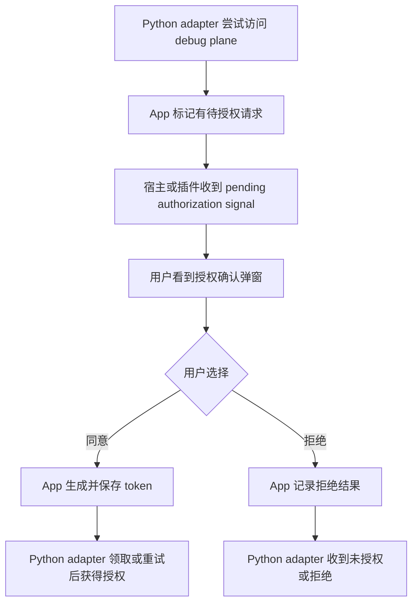
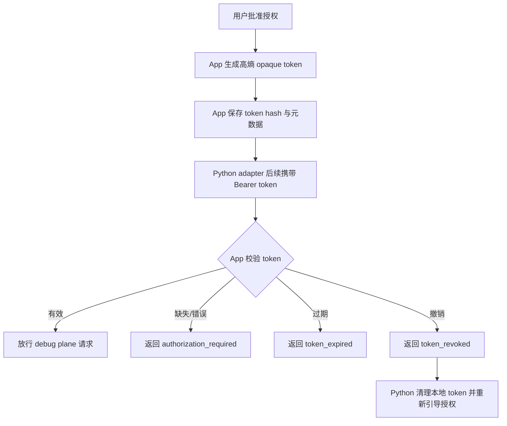
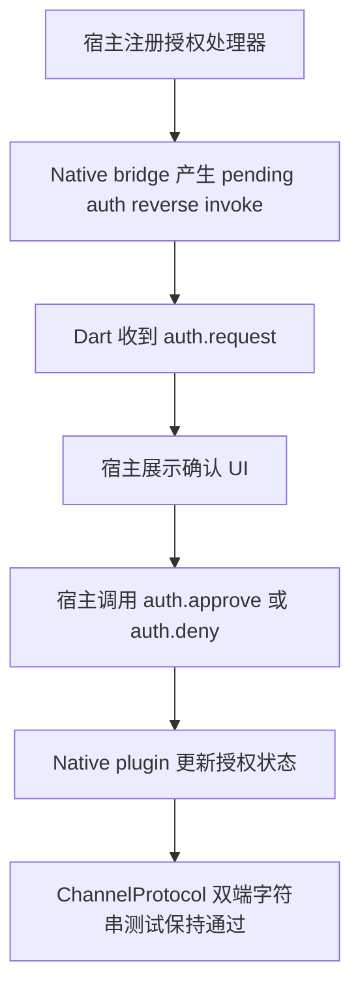

# Debug Plane App 授权桥接 Slice — 功能分析

## 概述

本 slice 分析 App/Flutter plugin 侧授权桥接：当 Python MCP adapter 访问 App debug plane 时，最终授权判定应由 App debug plane 执行；Flutter plugin/宿主负责用户同意弹窗、token 生成后的私有存储、撤销与 MethodChannel API 对齐。Kotlin core 必须保持纯 JVM，只能消费抽象授权能力或路由层结果，不应直接实现 Android UI、SharedPreferences、Flutter 页面或宿主业务授权策略。

现有代码事实：

- `flutter_debug_control_plane` 通过 `debug_control_plane/method` MethodChannel 桥接 Dart capability 到 Kotlin core。
- Dart/Kotlin channel 常量分别在 `lib/src/channel_protocol.dart` 与 `android/.../ChannelProtocol.kt`，由 Dart 与 Kotlin alignment tests 双向守卫。
- 当前 forward methods 只有 `plane.start`、`plane.stop`、capability 注册/注销、事件、状态、invoke result；当前 reverse invokes 只有 `capability.invoke`、`capability.state.pull`。
- `DebugControlPlaneFlutterPlugin` 负责 MethodCall 分发、`PlaneCarrier` 接入、fallback plane 生命周期；`NativeControlPlaneBridge` 负责 native -> Dart reverse invoke 的 reqId 关联。
- `ControlPlane.dispatch` 处理 `/hello`、`/state` 和 capability routes；`HttpSseTransport.serve` 对 `/events` 做 SSE 劫持，说明 HTTP auth gate 和 SSE auth gate 不完全在同一个函数入口。

## 一、交互链

### SCN-APP-AUTH-CONSENT：用户同意授权调试端

作为 App 使用者或开发调试者，我想在 App 上看到调试授权确认并明确同意，以便只有我认可的调试端可以访问当前 App 的调试能力。

交互要点：

- 未授权请求不应由 Kotlin core 直接弹窗；core 没有 Android UI 能力，也不能依赖宿主业务。
- 弹窗由宿主 App 或 Flutter plugin 暴露的 Dart API 驱动：native 侧只发出 pending signal，Dart/宿主决定 UI 文案、时机与展示容器。
- 为避免刷屏，重复未授权请求应合并到同一个 pending authorization，而不是每个 HTTP 请求都弹一次。
- 用户拒绝后应有可观察结果，Python adapter 不能无限等待，也不能继续访问敏感 endpoint。

### BF003：App 内 token 生命周期管理

作为调试授权的拥有者，我想让 App 记住、校验、过期和撤销调试 token，以便授权可以持续使用，也可以在运行中失效。

交互要点：

- token 在使用过程中可能过期或被撤销；不能只在 `/hello` 判断一次。
- `/state`、`/events`、capability resource、capability command 以及未来敏感 endpoint 都必须统一鉴权。
- `/hello` 可作为 bootstrap 特例：未授权时只返回最小信息和授权状态，不返回 capability 明细或 aggregate state。
- token 不走 query string；Python 后续请求使用 `Authorization: Bearer <token>`。

### FF001：Flutter channel/auth API 对齐

作为 Flutter 宿主开发者，我想通过稳定 Dart API 接收授权请求、批准/拒绝/撤销授权，以便宿主能接入自己的 UI 和私有存储策略。

交互要点：

- channel 新增 auth 方法时，Dart `channel_protocol.dart` 与 Kotlin `ChannelProtocol.kt` 必须逐字对齐。
- Dart API 应隐藏 raw MethodChannel 细节，给宿主暴露 `onAuthorizationRequest`、`approveAuthorization`、`denyAuthorization`、`revokeAuthorization` 这类语义方法。
- native -> Dart 的 pending signal 应复用 reqId/回填思路，但不能混入 capability invoke 的 reqId 池，避免把授权 UI 超时和业务 handler 超时耦合。

## 二、逻辑树

### 事件流：App 授权同意

| 时刻 | 事件 | 处理 | 产生的新事件 |
| --- | --- | --- | --- |
| T1 | 未授权 HTTP 请求到达 App debug plane | Auth gate 发现缺 token 或 token 无效，创建或复用 pending authorization | `auth.pending_created` |
| T2 | pending authorization 进入 Flutter/plugin 边界 | native bridge 通过 MethodChannel reverse invoke 通知 Dart | `auth.request` |
| T3 | Dart/宿主收到授权请求 | 宿主展示弹窗；若当前没有 UI 容器则保持 pending 并返回等待状态 | `auth.consent_presented` |
| T4a | 用户同意 | App 生成高熵 token，保存 hash/元数据到 App 私有存储，明文 token 只返回给领取方 | `auth.approved` |
| T4b | 用户拒绝 | App 记录拒绝状态，可设置短期冷却避免重复弹窗 | `auth.denied` |
| T5 | Python adapter 重试或 claim token | App 校验 pending 已同意后返回 token；拒绝则返回 401/403 语义错误 | `auth.claimed` 或 `auth.rejected` |

### 事件流：token 运行中失效

| 时刻 | 事件 | 处理 | 产生的新事件 |
| --- | --- | --- | --- |
| T1 | Python 携带 Bearer token 请求 `/state`、`/events` 或 capability route | App auth manager 对 token hash、过期时间、撤销状态做统一校验 | `auth.validated` 或 `auth.failed` |
| T2a | token 有效 | 请求进入原有 ControlPlane dispatch 或 SSE 建连 | `debug.request_allowed` |
| T2b | token 缺失或错误 | 返回 401 `authorization_required`；可触发 pending authorization | `auth.required` |
| T2c | token 过期 | 返回 401 `token_expired`；清理或标记旧 token 失效 | `auth.expired` |
| T2d | token 已撤销 | 返回 401 `token_revoked`；不得自动放行 | `auth.revoked` |
| T3 | Python 收到 401 | Python 清理本地缓存 token，提示用户回到 App 授权 | `client.reauth_required` |

### 状态流转

| 实体 | 触发事件 | 前状态 | 后状态 |
| --- | --- | --- | --- |
| AuthorizationRequest | 未授权请求首次触发 | absent | pending |
| AuthorizationRequest | 重复未授权请求 | pending | pending（复用，不重复弹窗） |
| AuthorizationRequest | 用户同意 | pending | approved |
| AuthorizationRequest | 用户拒绝 | pending | denied |
| DebugAuthToken | 用户同意授权 | absent | active |
| DebugAuthToken | 到达 expiresAt | active | expired |
| DebugAuthToken | 宿主调用 revoke | active/expired | revoked |
| DebugPlaneRequest | auth 校验通过 | received | allowed |
| DebugPlaneRequest | auth 缺失/错误/过期/撤销 | received | rejected |
| FlutterAuthBridge | 宿主注册 handler | unconfigured | configured |
| FlutterAuthBridge | engine detach/dispose | configured | detached |

异常流约束：

- Dart 授权 handler 未注册时，native 不能崩溃；应保持 pending 并向 Python 返回稳定 `authorization_required`，提示需要 App 侧授权能力接入。
- 用户长时间不响应时，pending request 应超时或保持可查询状态；不能阻塞 NanoHTTPD worker 或 capability reverse invoke。
- engine detach 时不得丢失已持久化 token；但未完成的 pending reverse invoke 应被取消或标记不可完成。
- SSE `/events` 第一版建议建连时校验；连接期间 token 过期可到下次重连生效，避免引入主动断线调度复杂度。

## 三、功能编号与网络定位

### 本次新增节点

| 编号 | 功能节点 | 前缀含义 | 简介 |
| --- | --- | --- | --- |
| BF003 | App auth token lifecycle | 后端基础 | App debug plane 侧 token 生成、hash 存储、校验、过期、撤销与 pending authorization 状态生命周期。虽然存储在 App 内，但它是资源服务端基础鉴权能力，不属于业务 UI。 |
| FF001 | Flutter channel/auth API alignment | 前端基础 | 扩展 Flutter MethodChannel 协议与 Dart API，使宿主可以接收 pending authorization signal，并调用 approve/deny/revoke 等授权桥接方法；保持 Dart/Kotlin channel 字符串对齐。 |

### UI 功能稳定标识预清单

| 功能编号 | 稳定标识预清单 | 说明 |
| --- | --- | --- |
| FF001 | `debug_auth.dialog.root`、`debug_auth.dialog.title`、`debug_auth.dialog.client_label`、`debug_auth.dialog.approve_button`、`debug_auth.dialog.deny_button` | 若插件提供默认授权弹窗或示例 UI，需要为用户可感知元素预留稳定标识；若完全由宿主实现，则这些标识作为宿主接入建议，不强制写入 core。 |

### 前置依赖

| 依赖节点 | 依赖方式 | 是否已有 |
| --- | --- | --- |
| Kotlin ControlPlane/Transport 路由入口 | App auth lifecycle 需要被 core auth gate 或 transport gate 消费；本 slice 只定义 App/Flutter 桥接职责 | 已有基础路由，auth gate 未实现 |
| `PlaneCarrier.mount` 宿主生命周期 | 授权状态与 plane 生命周期同属宿主/App 运行时，不能由 core 自动启动 | 已有 |
| Dart/Kotlin `ChannelProtocol` alignment tests | 新增 auth channel 字符串必须纳入双向对齐测试 | 已有测试机制，auth 常量未实现 |
| Python BridgeClient token 携带 | App 生成 token 后由 Python 保存并作为 Bearer token 发送 | 另一个 slice 负责 |
| PROTOCOL.md/fixtures | HTTP 401/403、`/hello` 最小 bootstrap、auth error body 需要跨语言协议同步 | 另一个 slice 负责 |

### 边界接口

| 接口/协议 | 定义方 | 消费方 | 敏感度 |
| --- | --- | --- | --- |
| `Authorization: Bearer <token>` | HTTP debug plane 协议 | Python BridgeClient、Kotlin/Dart HTTP transports | 高：明文 bearer token，只能走 header，不走 query |
| `auth.request` native -> Dart reverse invoke | Flutter plugin channel | Dart `NativeControlPlaneBridge`/宿主 handler | 中：包含 requestId、client label、requested endpoint、createdAt，不应包含 token 明文 |
| `auth.approve` Dart -> native | Flutter plugin channel | Native plugin/App auth manager | 高：触发 token 生成和授权通过 |
| `auth.deny` Dart -> native | Flutter plugin channel | Native plugin/App auth manager | 中：记录拒绝和 pending 终止 |
| `auth.revoke` Dart -> native | Flutter plugin channel | Native plugin/App auth manager | 高：运行中吊销 token |
| `auth.status` Dart -> native | Flutter plugin channel | 宿主/测试/Python claim 流程间接依赖 | 中：不得泄露 token 明文 |
| App 私有存储 token record | Flutter plugin/宿主 Android 层 | App auth manager | 高：建议保存 token hash、expiresAt、revokedAt、clientLabel，不保存明文 token |

建议 channel 字符串候选：

| 方向 | 方法名 | 参数 | 返回 |
| --- | --- | --- | --- |
| native -> Dart | `auth.request` | `{reqId, requestId, clientLabel?, endpoint?, method?, createdAt}` | `null`；实际结果由 approve/deny 回填 |
| Dart -> native | `auth.approve` | `{requestId, clientLabel?, ttlSeconds?}` | `{token, expiresAt}` 或 `null` 后由 claim endpoint 领取 |
| Dart -> native | `auth.deny` | `{requestId, reason?}` | `null` |
| Dart -> native | `auth.revoke` | `{tokenId?}` 或 `{all: true}` | `null` |
| Dart -> native | `auth.status` | `{requestId?}` | `{status, expiresAt?, clientLabel?}`，不得返回 token 明文，除非明确是一次性 claim |

对齐要求：

- Dart `kMethodAuthRequest` 等常量与 Kotlin `ChannelProtocol.AUTH_REQUEST` 等常量必须逐字一致。
- Dart `channel_protocol_alignment_test.dart` 与 Kotlin `ChannelProtocolAlignmentTest.kt` 要覆盖所有新增 auth 方法与错误码。
- `NativeControlPlaneBridge` 的 capability reverse invoke pending 池不应直接复用为 auth pending 池；授权请求生命周期更长，且可被 UI 决定，不应受 30s capability invoke timeout 约束。

## 四、边界接口

### 与 Kotlin core 的边界

- core 保持纯 JVM：不 import Android `Context`、`SharedPreferences`、Flutter `MethodChannel`、UI dialog 或业务包。
- core 可在其他 slice 中新增 `DebugAuthProvider`、`AuthGate`、`AuthContext` 等纯接口；本 slice 只要求 Flutter/plugin/宿主能提供这些接口的运行时实现。
- `/events` 被 `HttpSseTransport` 提前劫持，因此 auth gate 设计不能只放在 `ControlPlane.dispatch`；App/plugin 提供的 auth manager 必须能被普通 HTTP 路由和 SSE 建连共同调用。
- `/hello` 未授权最小 bootstrap 是协议层特例，不应由 Flutter UI 侧决定字段集合；Flutter/App slice 只提供授权状态来源。

### 与 Flutter 宿主的边界

- 宿主负责授权 UI：插件可提供默认 helper，但不能假设固定页面、文案、Navigator、Activity 或业务登录态。
- 宿主负责选择 token 存储实现：插件可提供 Android 私有存储默认实现；如果宿主要求更高安全级别，可替换为加密存储或自定义 store。
- 授权弹窗应由 pending signal 驱动，用户 approve/deny 后通过 Dart API 回传；native 不直接持有 UI。
- revoke API 必须可由宿主调起，至少支持 debug 构建中清除当前授权。

### 与 Python adapter 的边界

- Python 是 App debug plane 的 HTTP client，不是最终授权判定方。
- Python 获得 token 的方式由 auth claim/approve 流程决定，但后续所有敏感请求都只携带 Bearer token。
- Python 收到 `authorization_required`、`token_expired`、`token_revoked` 时应清理缓存并提示用户在 App 授权；App 侧不需要知道 MCP host 的内部实现。

## 五、结论

- 开发顺序建议：先定义跨语言 auth 协议和 Kotlin core 纯接口，再实现 Flutter/plugin 的 auth bridge 与 token store，最后接 Python token 携带与 401/403 翻译。
- 本 slice 的核心结论是：授权弹窗、approve/deny/revoke、token 私有存储属于 Flutter plugin/宿主运行时职责；Kotlin core 只能消费抽象，不直接实现 UI/storage。
- 复杂度集中在三个点：`/events` SSE 劫持需要共享 auth 校验、pending authorization 不能重复刷屏、channel auth 常量必须与现有 alignment 机制同步。
- 第一版建议使用 opaque 高熵 token，App 侧保存 hash 和元数据；不做 OAuth、JWT、scope、账号体系。
- `/hello` 可未授权访问但只能返回最小 bootstrap/auth 状态；所有敏感 debug plane 请求必须每次统一鉴权，因为 token 运行中可能过期或撤销。
- 暂不实现完整 MCP Streamable HTTP server；当前 Python MCP adapter 模式保留，更贴合项目已有跨语言 debug HTTP/SSE 协议。
