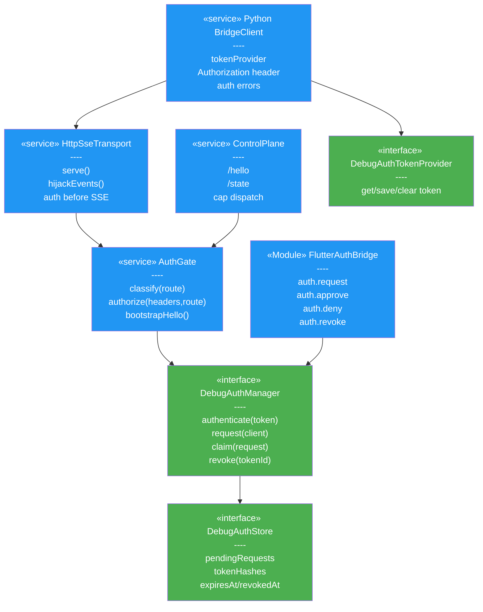
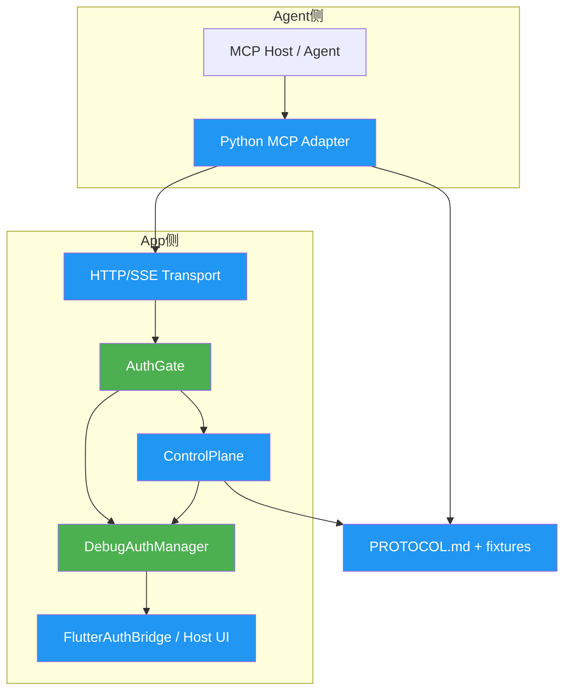
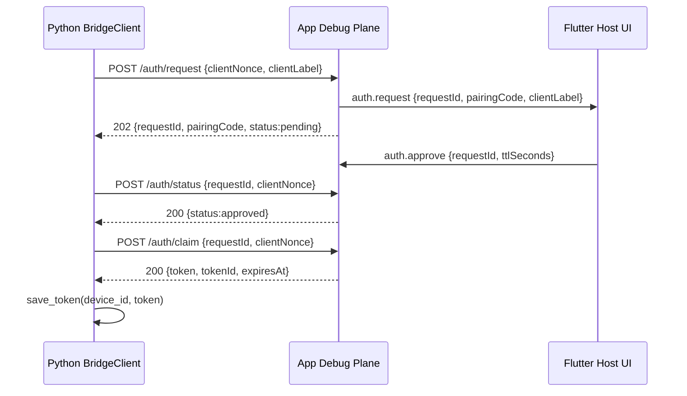
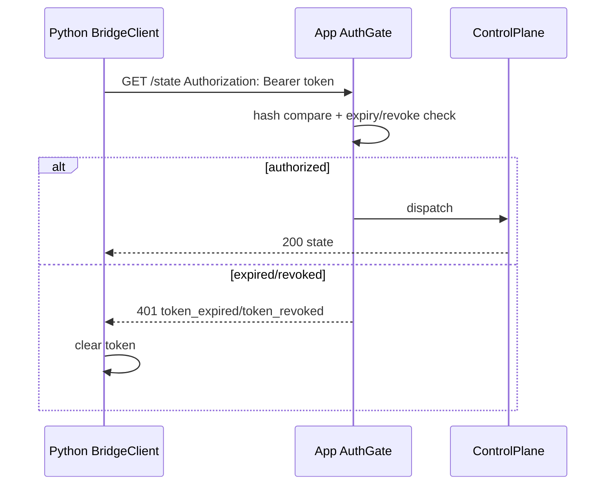
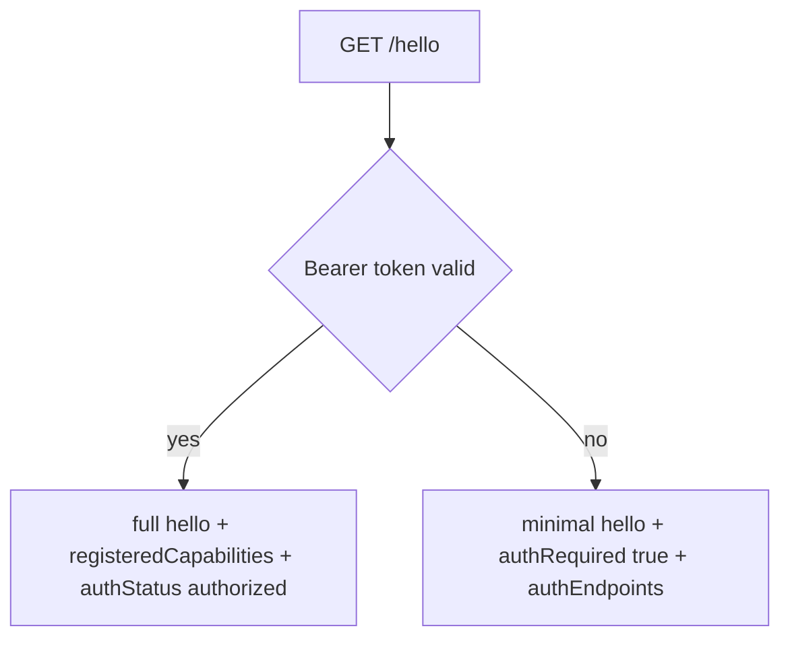

# Debug Plane 自身鉴权 — 方案设计

> 关联设计：[测试设计 v1](2026-08-20--debug-plane-auth-test.md)

## 1. 目标

- BF001：在 App debug plane HTTP/SSE 入口增加统一 AuthGate，保护 `/state`、`/events`、capability resource/command。
- BF002：扩展协议契约，定义 Bearer header、`/hello` 未授权 bootstrap、auth request/claim 端点和 401/403 错误码。
- BF003：提供 App 内 pending authorization、token 生成、hash 存储、过期、撤销生命周期。
- BF004：Python BridgeClient 按设备注入 token，并在 token 过期/撤销时清理缓存。
- BB001：MCP tool 将 App 401/403 翻译为可操作错误，不把未授权误报为设备离线。
- FF001：Flutter plugin 暴露授权 pending signal 与 approve/deny/revoke/status API；宿主负责 UI。

## 2. 现状分析

已有能力：

- Kotlin/Dart `ControlPlane` 已集中处理 `/hello`、`/state` 和 capability 路由。
- Kotlin `HttpSseTransport` 在 dispatch 前劫持 `/events`，可在建连前短路返回 401。
- Flutter plugin 已有 MethodChannel 常量双端对齐测试，可扩展 auth 方法。
- Python `BridgeClient` 集中处理 `invoke/read/hello/events` 出站 HTTP 请求。

需要改造的卡点：

- `/events` 不能只靠 `ControlPlane.dispatch` 鉴权，必须在 transport hijack 前校验。
- `/hello` 当前会返回 state 和 `registeredCapabilities`，未授权时需要脱敏。
- `CapabilityMirror.refresh` 当前把 HTTP error degrade 为 static tools，auth error 需要显式 surfaced。
- `DevicePool` 持久化是 identity-only，不能混入 token。

不需要改的文件/方向：

- 不把 App 改成完整 MCP HTTP server。
- 不引入 OAuth、JWT、RBAC、refresh token。
- 不让 Python 自己判定最终授权有效性。

## 3. 方案总览

### 项目结构

- 🔵 `PROTOCOL.md` / `fixtures/`：新增 auth wire contract 和 golden fixtures。
- 🔵 `kotlin/src/main/.../controlplane/`：新增 pure JVM auth 抽象、AuthGate、HTTP/SSE gate 接入。
- 🔵 `dart/lib/src/`：镜像协议字段、auth gate 抽象和 HTTP transport 行为。
- 🔵 `flutter_debug_control_plane/lib/src/`：新增 Dart 授权 API。
- 🔵 `flutter_debug_control_plane/android/src/main/.../flutter/`：新增 channel 常量、native auth bridge、宿主接入点。
- 🔵 `python/debug_control_plane/mcp_plane/`：新增 token provider、auth error taxonomy、BridgeClient header 注入。
- ⚪ `python/debug_control_plane/device_discovery/device_pool.py`：保持 identity-only，不存 token。

### 类图

### 模块依赖图

图例：🟢/绿色为新增抽象或模块，🔵/蓝色为改造，⚪/灰色为不变依赖。调用方向从 Agent 到 App 资源边界；最终授权判定只在 App 侧。

## 4. 数据模型与接口

### 数据模型

| 模型 | 字段 | 编号追溯 | 说明 |
|---|---|---|---|
| `DebugAuthTokenRecord` | `tokenId`、`tokenHash`、`createdAt`、`expiresAt`、`revokedAt?`、`clientLabel?` | BF003 | App 侧只存 hash/元数据，不存明文 token。 |
| `DebugAuthRequest` | `requestId`、`clientNonceHash`、`pairingCode`、`requestedMethod`、`requestedPath`、`status`、`expiresAt` | BF003/FF001 | pending 授权请求；重复请求复用，防弹窗刷屏。 |
| `DebugAuthTokenProvider` | `get_token(device_id)`、`save_token(device_id, token, metadata)`、`clear_token(device_id, reason)` | BF004 | Python 侧独立 token store，不进入 `DevicePool`。 |
| `AuthContext` | `status`、`tokenId?`、`failureCode?` | BF001 | 注入 `RouteContext`，供 future audit 使用；第一版 capability 可忽略。 |

### HTTP 协议

| METHOD / path | 鉴权 | 实现端编号 | 消费端编号 | 契约 |
|---|---|---|---|---|
| `GET /hello` | 可未授权 | BF002 | BF004 | 未授权返回最小 bootstrap；授权后返回现有完整 hello + auth 字段。 |
| `POST /auth/request` | 公开 bootstrap | BF003 | BF004 | body `{clientNonce, clientLabel?, requestedMethod?, requestedPath?}`；返回 `{requestId, pairingCode, status, expiresAt}` 并触发 App pending signal。 |
| `POST /auth/status` | 公开 bootstrap | BF003 | BF004 | body `{requestId, clientNonce}`；返回 pending/approved/denied/expired，不返回 token。 |
| `POST /auth/claim` | 公开 bootstrap | BF003 | BF004 | body `{requestId, clientNonce}`；仅 approved 且未 claim 时返回 `{token, tokenId, expiresAt}`。 |
| `GET /state` | Bearer 必须有效 | BF001 | BB001 | 失败 401/403；成功保持现有扁平 state。 |
| `GET /events` | Bearer 必须有效 | BF001 | BB001 | 建连前校验；失败 JSON 401，不写 SSE 首帧。 |
| capability `GET/POST` | Bearer 必须有效 | BF001 | BB001 | 失败短路，不调用 capability handler。 |

错误码：

| HTTP | code | 触发 | Python 行为 |
|---|---|---|---|
| 401 | `authorization_required` | 无 token/未授权 | 提示调用授权流程，不清有效 token。 |
| 401 | `invalid_token` | token 格式错误或 hash 不匹配 | 清该 token 并提示重新授权。 |
| 401 | `token_expired` | token 超过 `expiresAt` | 清 token 并提示重新授权。 |
| 401 | `token_revoked` | App/宿主撤销 | 清 token 并提示重新授权。 |
| 403 | `authorization_denied` | 用户拒绝 pending request | 不重试，提示用户已拒绝。 |
| 403 | `forbidden` | future scope/策略不足 | 不清 token，提示权限不足。 |

错误体第一版沿用 `{ok:false, code, message}`，不新增 `auth` 嵌套字段，避免扩大 `RouteResult.error` blast radius；auth 详情通过 `code` 稳定表达。

## 5. 核心流程

### 授权领取

### 敏感请求

### `/hello` bootstrap

## 6. 技术决策

| ID | Type | 决策 | Must Plan | Source | Blast Radius |
|---|---|---|---|---|---|
| DEC-R001-001 | protocol | token 使用 opaque random，App 只存 hash | 是 | BF002/BF003 | PROTOCOL、fixtures、Kotlin/Dart auth store、Python token provider |
| DEC-R001-002 | protocol | claim 使用 `requestId + clientNonce`，claim 只返回一次 token | 是 | BF003/BF004 | `/auth/*` 端点、Flutter pending auth、Python token save |
| DEC-R001-003 | compatibility | `/hello` 未授权返回 200 最小 bootstrap | 是 | BF001/BF002 | device discovery、CapabilityMirror、golden fixtures |
| DEC-R001-004 | protocol | auth bootstrap 端点统一使用 `POST /auth/*` JSON body | 是 | BF002 | Kotlin/Dart transport、Python BridgeClient |
| DEC-R001-005 | runtime | SSE 第一版只做建连鉴权，不主动断开存量连接 | 是 | BF001 | Kotlin/Dart SSE transport、Python events tests |
| DEC-R001-006 | compatibility | 错误体沿用 `{ok:false, code, message}`，不新增 auth 嵌套字段 | 是 | BF002/BB001 | RouteResult、fixtures、Python error parsing |
| DEC-R001-007 | compatibility | 未配置 auth manager 时保持裸用；宿主显式启用才强制鉴权 | 是 | BF001/BF003 | Kotlin/Dart/Flutter startup API、现有消费者 |

第三方依赖：不新增第三方依赖。Kotlin/Dart 使用标准随机数与 SHA-256；Python 继续使用现有 `httpx`。

影响范围：

- 协议与 fixture：新增 auth bootstrap 和错误 fixture；`protocolVersion` 不变。
- Kotlin/Dart core：新增可选 auth 抽象和 HTTP/SSE gate；现有未启用 auth 行为保持。
- Flutter plugin：新增 auth channel 常量和宿主接入 API；现有 capability channel 不变。
- Python：新增 token provider 和 auth error surfacing；`DevicePool` 持久化不变。
- CI：扩展现有 Kotlin/Dart/Flutter/Python 单测和 cross-language fixture tests。

## 7. 验收标准

| 编号 | 验收条件 | 验证方式 |
|---|---|---|
| BF001 | auth enabled 时 `/state`、capability route 无 token 返回 401，且 handler 不执行 | Kotlin/Dart 单元测试 |
| BF001 | `/events` 无 token 返回 JSON 401，且不写 `: connected` | Kotlin/Dart transport 测试 |
| BF002 | `/hello` 未授权不含 `registeredCapabilities` 和聚合 state | golden fixture 测试 |
| BF003 | approve 后生成 token，store 只保存 hash；revoke/expire 后请求 401 | Kotlin/Flutter plugin 单元测试 |
| FF001 | Dart/Kotlin auth channel 常量逐字一致 | 现有 alignment tests 扩展 |
| BF004 | Python 所有 `invoke/read/hello/events` 都注入 Bearer header | `httpx.MockTransport` 测试 |
| BB001 | Python 收到 auth 401/403 生成可操作 MCP error，`token_expired/revoked` 清 cache | Python server/bridge tests |
| 全链路 | mock App 返回 auth bootstrap/401/claim 时 MCP tool 行为符合预期 | Python e2e mock |

## 8. 暂不实现

- 不实现 OAuth 2.1、JWT、refresh token、RBAC/scope、多用户权限体系。
- 不把 App debug plane 改成完整 MCP Streamable HTTP server。
- 不在 Kotlin core 直接实现 Android UI、SharedPreferences、Keystore 或 Flutter 页面。
- 不主动断开已建立但中途过期的 SSE 连接。
- 不把 token 存入 Python `DevicePool` 的 `devices.json`。
