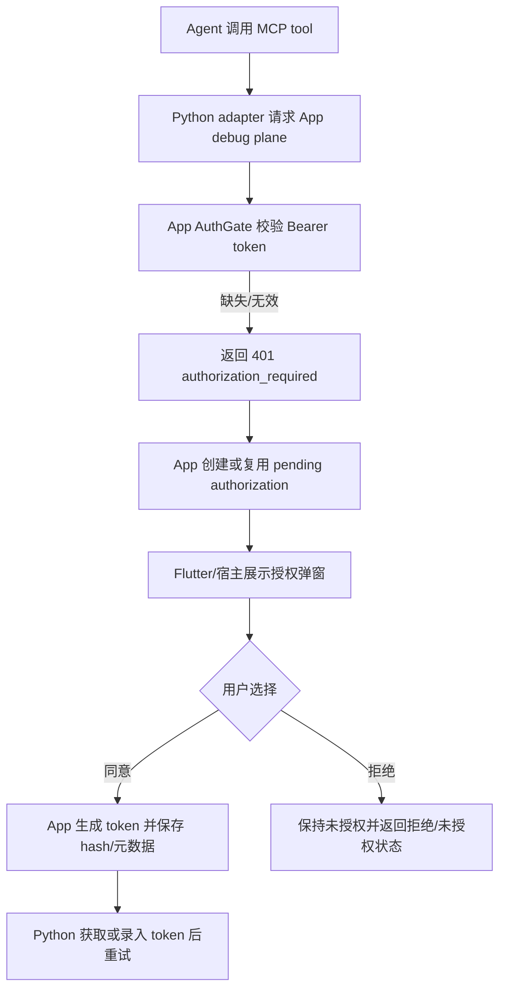
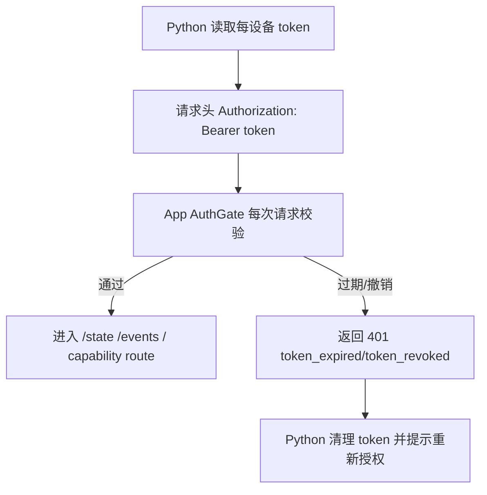
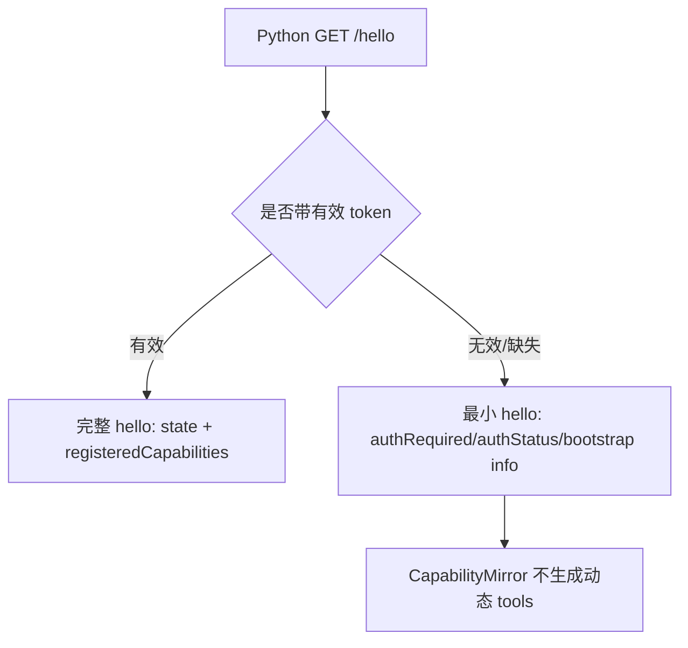

# Debug Plane 自身鉴权 — 集成分析

## 概述

本需求保留现有 Python MCP adapter 架构：Python 对上是 MCP stdio server adapter，对下是 App debug plane HTTP/SSE client；不把 App 改成完整 MCP server。真正的资源边界在 App debug plane，因此最终授权判定必须由 debug plane 自己执行。Python 只负责携带 token、处理 401/403、向 Agent 暴露可操作错误。

本次 analysis 按 3 个 slice 完成：

| Slice | Owner | 产物 |
|---|---|---|
| S01 server-auth | 服务端 auth gate / wire contract | `2026-08-20--debug-plane-auth-server-slice.md` |
| S02 app-auth | App 授权弹窗 / token 生命周期 / channel 对齐 | `2026-08-20--debug-plane-auth-app-slice.md` |
| S03 python-auth | Python token provider / header 注入 / MCP 错误呈现 | `2026-08-20--debug-plane-auth-python-slice.md` |

## 一、交互链

### 场景 A：首次未授权访问并触发 App 授权

作为 App 使用者，我想在调试端访问当前 App 调试能力时看到授权确认，以便只有我同意的调试端能继续使用 MCP 调试功能。

### 场景 B：已授权调试端正常访问

作为已授权调试端，我想所有 debug 请求都自动携带 token，以便 App 能持续校验本次请求仍然有效。

### 场景 C：设备发现 bootstrap

作为调试端，我想先发现设备和授权状态，以便在未授权时引导用户授权，而不是暴露完整调试能力。

## 二、逻辑树

### 事件流：统一授权链路

| 时刻 | 事件 | 处理 | 产生的新事件 |
|---|---|---|---|
| T1 | HTTP/SSE 请求进入 App debug plane | AuthGate 判断 route 是否敏感，并解析 `Authorization: Bearer` | `auth.check_requested` |
| T2 | 请求为未授权 `/hello` | 返回最小 bootstrap，不聚合 state，不返回 `registeredCapabilities` | `auth.bootstrap_returned` |
| T3 | 请求为 `/state`、capability resource/command | 每次校验 token；失败短路，成功才 dispatch | `debug.request_allowed/rejected` |
| T4 | 请求为 `/events` | 在 SSE hijack 前校验；失败返回 JSON 401，不写 `: connected` | `sse.connected/rejected` |
| T5 | 用户同意授权 | App 生成 opaque token，保存 hash/metadata，明文 token 只交给领取方 | `auth.token_issued` |
| T6 | token 过期或被撤销 | 下一次请求返回稳定 401 code；Python 清除缓存 | `client.reauth_required` |

### 状态流转

| 实体 | 触发事件 | 前状态 | 后状态 |
|---|---|---|---|
| AuthorizationRequest | 首次未授权敏感请求 | absent | pending |
| AuthorizationRequest | 重复未授权请求 | pending | pending（复用，防刷屏） |
| AuthorizationRequest | 用户同意 | pending | approved |
| AuthorizationRequest | 用户拒绝 | pending | denied |
| DebugAuthToken | 用户同意授权 | absent | active |
| DebugAuthToken | 到达 expiresAt | active | expired |
| DebugAuthToken | 宿主撤销 | active/expired | revoked |
| CapabilityMirror cache | 未授权 `/hello` bootstrap | any | static floor / auth required |
| 每设备 Python token cache | App 返回 `token_expired/token_revoked` | present | missing |

## 三、功能编号与网络定位

### 本次新增节点

| 编号 | 功能节点 | 前缀含义 | 简介 |
|---|---|---|---|
| BF001 | debug plane auth gate | 后端基础 | App debug plane 统一鉴权门，覆盖普通 HTTP route 与 `/events` SSE 建连。 |
| BF002 | auth wire contract | 后端基础 | `Authorization: Bearer`、`/hello` bootstrap、401/403 code、fixture/协议文档的跨语言契约。 |
| BF003 | App auth token lifecycle | 后端基础 | App 内 token 生成、hash 存储、校验、过期、撤销和 pending authorization 生命周期。 |
| BF004 | bridge token provider | 后端基础 | Python 每设备 token provider/cache，所有出站 debug plane 请求注入 Bearer token，并在过期/撤销时清理。 |
| BB001 | MCP auth error surfacing | 后端业务 | Python MCP adapter 把 App 401/403 转成可操作 MCP tool error，引导用户授权/重新授权。 |
| FF001 | Flutter channel/auth API alignment | 前端基础 | Flutter plugin/Dart API 暴露 pending auth、approve/deny/revoke/status，并保持 Dart/Kotlin channel 字符串对齐。 |

### UI 功能稳定标识预清单

| 功能编号 | 稳定标识预清单 | 说明 |
|---|---|---|
| FF001 | `debug_auth.dialog.root`、`debug_auth.dialog.title`、`debug_auth.dialog.client_label`、`debug_auth.dialog.approve_button`、`debug_auth.dialog.deny_button` | 如果插件提供默认授权 UI 或示例 UI，应覆盖核心可交互元素；若宿主完全自定义 UI，则作为接入建议。 |

### 前置依赖

| 依赖节点 | 依赖方式 | 是否已有 |
|---|---|---|
| `PROTOCOL.md` + `fixtures/` | BF002 必须扩展协议和 golden fixture | 已有，需更新 |
| Kotlin `HttpSseTransport.serve/hijackEvents` | BF001 必须覆盖 SSE dispatch 前劫持 | 已有 |
| Kotlin/Dart `ControlPlane.dispatch` | BF001 覆盖普通 system/capability route | 已有 |
| Flutter MethodChannel alignment tests | FF001 新增 channel 字符串必须双端一致 | 已有机制，需扩展 |
| Python `BridgeClient` | BF004 出站请求集中点 | 已有 |
| Python `CapabilityMirror.refresh` | BB001 需要避免授权错误被静默 degrade 为无能力 | 已有，需调整 |

### 边界接口

| 接口/协议 | 定义方 | 消费方 | 敏感度 |
|---|---|---|---|
| `Authorization: Bearer <token>` | BF002 | Kotlin/Dart transport、Python BridgeClient | 高 |
| `GET /hello` 未授权最小 bootstrap | BF002/BF001 | Python discovery/CapabilityMirror | 中 |
| `GET /state` | BF001 | Python `get_state` | 高 |
| `GET /events` | BF001 | Python `subscribe_events` | 高 |
| capability resource/command route | BF001 | Python `read_resource/invoke_command` | 高 |
| `401 authorization_required` | BF002 | Python/MCP error mapping | 高 |
| `401 invalid_token/token_expired/token_revoked` | BF002/BF003 | Python token provider | 高 |
| `403 forbidden` | BF002 | Python/MCP error mapping | 高 |
| `auth.request/auth.approve/auth.deny/auth.revoke/auth.status` channel | FF001 | Flutter plugin / Dart host | 高 |

## 四、集成结论

- 需求分类：`sliced`。它跨服务端协议、App/Flutter 授权桥接、Python adapter 三个 owner，且包含 token 生命周期、错误恢复、SSE 建连等独立异常链。
- 反向坍缩复验：6 个功能节点职责独立，均满足 trigger/responsibility/result/acceptance/independently_absent；不需要进一步拆分 RC。
- 推荐开发顺序：先落 BF002 wire contract，再落 BF001 auth gate；随后实现 BF003/FF001 App 授权桥接，最后实现 BF004/BB001 Python token 透传与 MCP 错误呈现。
- `/hello` 策略：允许未授权最小 bootstrap，授权后返回完整现有 shape；未授权时不得返回 `registeredCapabilities` 或聚合 state。
- 敏感端点策略：`/state`、`/events`、capability resource/command 全部每次鉴权；token 可能运行中过期/撤销，Python 必须处理 401。
- SSE 策略：第一版只在建连时校验；连接期间 token 过期不主动断开，下次重连生效。
- 不做范围：完整 MCP Streamable HTTP server、OAuth 2.1、JWT、refresh token、RBAC/scope、多用户权限体系不进入 R001。
- 需进入 design 的关键风险：token 领取/claim 的具体端点或 channel 流程、Kotlin core pure JVM 抽象边界、`RouteResult.error` 是否扩展 auth extra 字段、CapabilityMirror auth error 不被静默吞掉。
