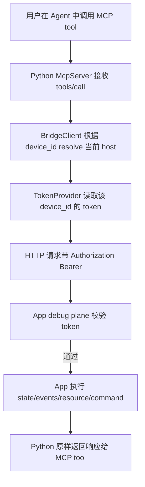
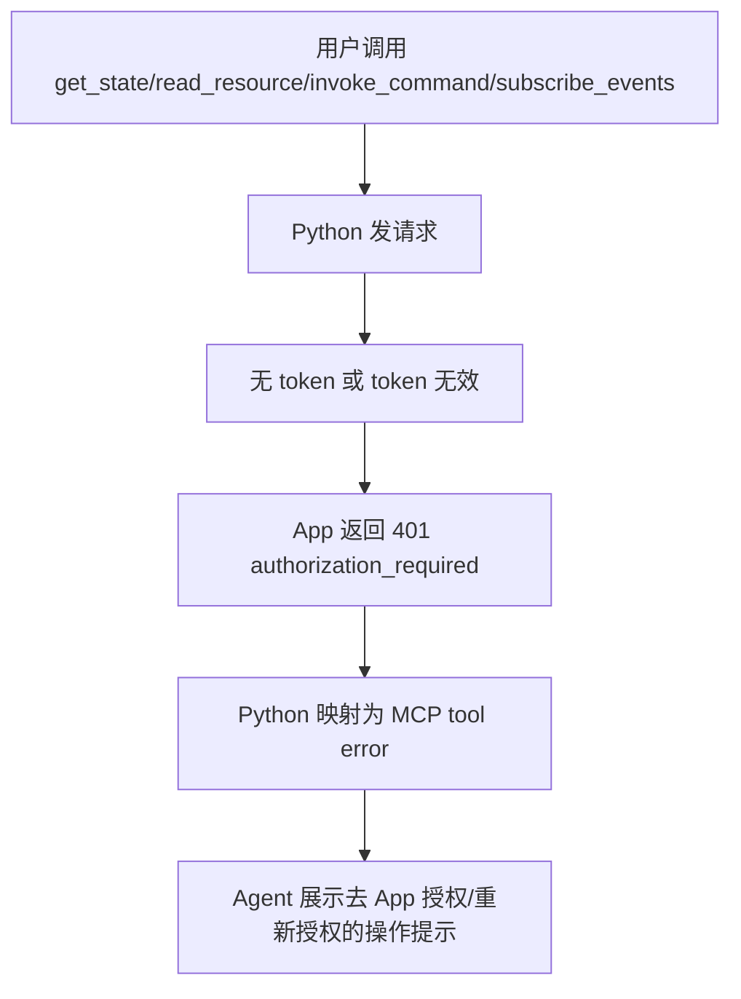
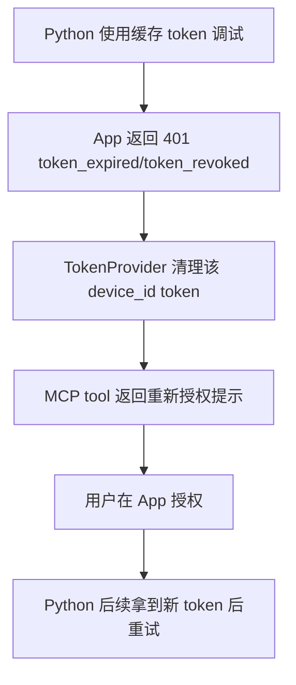
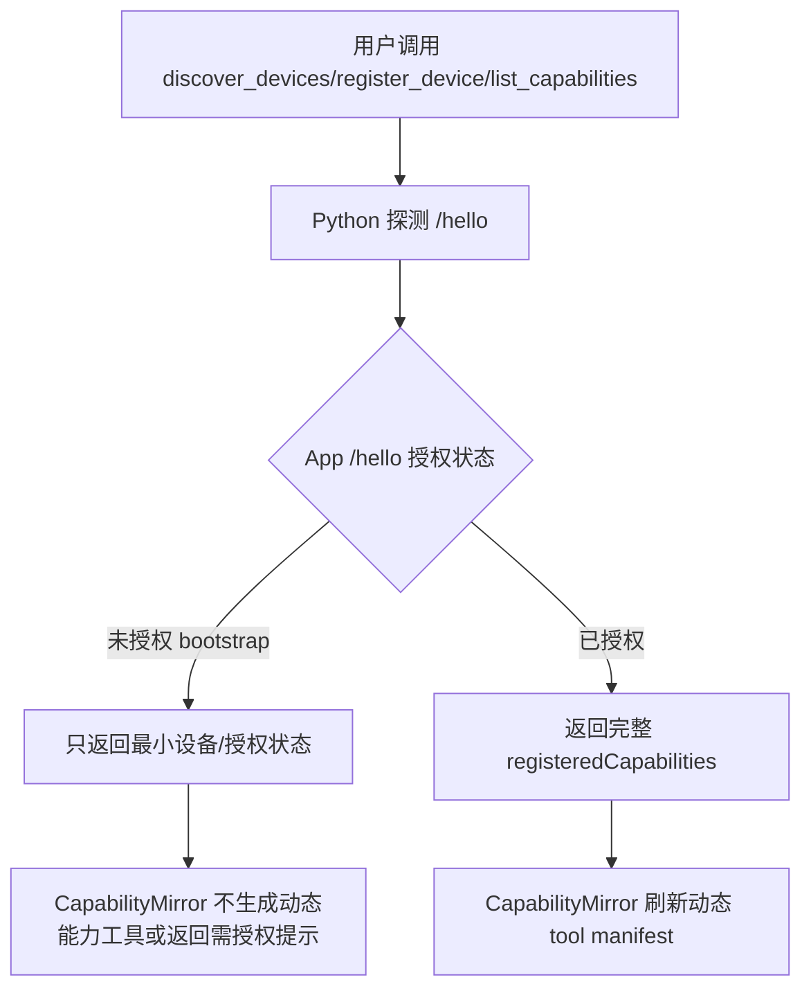

# Python MCP adapter/token 透传 slice — 功能分析

## 概述

本 slice 分析 Python MCP adapter 在 App debug plane 鉴权方案中的职责边界。当前 Python 对上是 MCP stdio server adapter，对下通过 `BridgeClient` 作为 HTTP client 访问 App debug plane；本需求不让 Python 自己判定授权有效性，而是由 App debug plane 作为真实资源边界校验 token。Python 侧新增能力应聚焦为：按设备保存/读取 token、对所有 debug plane 请求注入 `Authorization: Bearer <token>`、收到 `401/403` 后统一清理/保留 token 并向 MCP tool 返回可操作错误，引导用户去 App 授权或重新授权。

架构约束：`python/debug_control_plane/device_discovery/device_pool.py` 当前 `devices.json` 明确只持久化 `device_id/label/source/note`，IP 与 bridge runtime 字段不持久化；token 不能随意塞进该 identity-only store。建议单独定义 Python 侧 `DebugAuthTokenProvider`/store，作为 `BridgeClient` 的可选依赖，避免破坏 DevicePool 不变量。

## 一、交互链

### 场景 1：作为调试使用者，我想通过 MCP 调试已授权 App，以便正常读取状态和调用能力

### 场景 2：作为调试使用者，我想在未授权时得到明确提示，以便去 App 上完成授权

### 场景 3：作为调试使用者，我想在 token 过期或撤销后重新授权，以便恢复调试能力

### 场景 4：作为调试使用者，我想先发现设备，再决定是否授权，以便不泄露敏感调试能力

## 二、逻辑树

### 事件流：普通 MCP tool 调用

| 时刻 | 事件 | 处理 | 产生的新事件 |
| --- | --- | --- | --- |
| T1 | `McpServer.call_tool` 调用 `get_state/read_resource/invoke_command` | 现有 handler 仍委托 `BridgeClient.read/invoke`，不在 MCP 层判断 token 是否有效 | BridgeClient 出站请求 |
| T2 | BridgeClient 准备 HTTP 请求 | 每次请求先 `DevicePool.resolve_ip(device_id)`，再从 `DebugAuthTokenProvider.get_token(device_id)` 读取 token | 构造请求 headers |
| T3 | token 存在 | 注入 `Authorization: Bearer <token>`；不通过 query string 传递 | App debug plane 收到带凭证请求 |
| T4 | token 不存在 | 对敏感 endpoint 可不带 Authorization，让 App 返回标准 `401 authorization_required`；Python 不伪造通过 | App 返回未授权错误 |
| T5 | App 返回 2xx | BridgeClient 按现有 `_safe_body` 解析响应，MCP handler 正常返回 | Tool result |
| T6 | App 返回 `401 authorization_required` | BridgeClient 抛出 auth-specific HTTP error；Server 映射为可操作 MCP error，不清除本地 token或只清除空/未知状态 | 用户去 App 授权 |
| T7 | App 返回 `401 token_expired/token_revoked` | TokenProvider 清除该 device_id token；Server 映射为重新授权提示 | 用户重新授权 |
| T8 | App 返回 `403 forbidden` | 不自动清 token；Server 映射为权限不足，提示当前授权不包含该能力 | 用户更换授权或停止 |

### 事件流：`/hello` bootstrap 与 capability mirror

| 时刻 | 事件 | 处理 | 产生的新事件 |
| --- | --- | --- | --- |
| H1 | `CapabilityMirror.refresh(device_id)` 调 `BridgeClient.hello` | `/hello` 也走 token provider 注入，但允许 App 在未授权时返回最小 bootstrap | 获取 `NetworkTarget` 或 auth error |
| H2 | `/hello` 返回已授权完整 payload | `NetworkTarget.from_hello` 解析 `registeredCapabilities`，Mirror 更新 schema cache | `tools/list_changed` 可发出 |
| H3 | `/hello` 返回未授权 bootstrap 2xx | 需要在 `NetworkTarget` 增加 `auth_required/auth_status` 等字段；Mirror 不应把 capabilities 当作已授权能力暴露 | Tool manifest 保持 static floor 或追加授权提示 |
| H4 | `/hello` 返回 401 | Mirror 当前会把所有 `DeviceHttpError` 视为 degrade；本需求下应区分 auth failure，避免把“需要授权”误报为 offline | MCP 返回“需要授权”，而非“设备不可达” |

### 事件流：SSE `/events`

| 时刻 | 事件 | 处理 | 产生的新事件 |
| --- | --- | --- | --- |
| E1 | 用户调用 `subscribe_events` | `BridgeClient.events` 建连前注入 token | App 校验 SSE 建连请求 |
| E2 | 建连时 token 有效 | 维持现有 `_iter_sse` 解析与批量 drain 行为 | 返回事件 batch |
| E3 | 建连时 `401/403` | `events()` 在读取 stream status 后抛 auth-specific error；`McpServer` 映射为 tool error | 用户授权/重新授权 |
| E4 | 连接期间 token 后续过期 | 第一版不要求主动断开既有 SSE；下次重连时重新校验 | 行为与服务端策略对齐 |

### 状态流转

| 实体 | 触发事件 | 前状态 | 后状态 |
| --- | --- | --- | --- |
| 每设备 token cache | 用户完成 App 授权并由 Python 领取/录入 token | `missing` | `present(token, device_id)` |
| 每设备 token cache | App 返回 `401 token_expired` | `present` | `missing` |
| 每设备 token cache | App 返回 `401 token_revoked` | `present` | `missing` |
| 每设备 token cache | App 返回 `403 forbidden` | `present` | `present`，但本次能力不可用 |
| CapabilityMirror cache | `/hello` 已授权且 schema 改变 | `empty/old_schema` | `new_schema` |
| CapabilityMirror cache | `/hello` 未授权 | `any` | 建议清空动态 schema，保留 static floor，避免暴露敏感 capability |
| MCP tool result | BridgeClient 抛 auth error | `normal` | `isError=true`，message 含下一步操作 |

## 三、功能编号与网络定位

### 本次新增节点

| 编号 | 功能节点 | 前缀含义 | 简介 |
| --- | --- | --- | --- |
| BF004 | bridge token provider | 后端基础 | Python 侧每设备 token provider/cache，供 `BridgeClient` 在所有出站 debug plane HTTP/SSE 请求中注入 Bearer token，并在过期/撤销时清理 token。 |
| BB001 | MCP auth error surfacing | 后端业务 | `McpServer` 将 App debug plane 的 `401/403` 鉴权错误翻译成稳定、可操作的 MCP tool error，指导用户去 App 授权或重新授权。 |

### UI 功能稳定标识预清单

本 slice 不直接实现 App 授权弹窗 UI，也不定义前端稳定标识。App 端授权弹窗属于其他 slice；Python 只消费 App 返回的 token/error 协议。

### 前置依赖

| 依赖节点 | 依赖方式 | 是否已有 |
| --- | --- | --- |
| App debug plane AuthGate | Python 依赖其校验 Bearer token 并返回稳定 `401/403` 错误码 | 否，属于 App/server slice |
| Auth bootstrap/claim 协议 | Python 需要明确如何获取用户同意后生成的 token | 否，跨 slice 共享契约 |
| `BridgeClient` 出站统一入口 | `invoke/read/hello/events` 当前集中在单类，适合加 token 注入 | 是 |
| `McpServer` BridgeError 映射 | `_bridge_error_to_mcp` 已统一翻译 `DeviceHttpError` | 是，需要扩展 auth-specific 分支 |
| `DevicePool` identity store | 只保存设备身份，不能直接混入 token | 是，不建议修改其持久化语义 |

### 边界接口

| 接口/协议 | 定义方 | 消费方 | 敏感度 |
| --- | --- | --- | --- |
| `Authorization: Bearer <token>` | App debug plane auth 协议 | Python `BridgeClient` | 高，禁止 query string，日志不得打印明文 token |
| `GET /hello` 未授权 bootstrap | App debug plane | Python discovery/CapabilityMirror | 中，只能返回最小设备与授权状态，不暴露 capabilities/state |
| `GET /state` | App debug plane | Python `BridgeClient.read` / MCP `get_state` | 高，必须鉴权 |
| `GET /events` SSE | App debug plane | Python `BridgeClient.events` / MCP `subscribe_events` | 高，建连必须鉴权 |
| capability resource/command paths | App debug plane capability router | Python `read_resource/invoke_command` | 高，必须鉴权 |
| `401 authorization_required` | App debug plane | Python BridgeClient/McpServer | 高，提示去 App 授权 |
| `401 token_expired` | App debug plane | Python TokenProvider/McpServer | 高，清理 token 并提示重新授权 |
| `401 token_revoked` | App debug plane | Python TokenProvider/McpServer | 高，清理 token 并提示重新授权 |
| `403 forbidden` | App debug plane | Python McpServer | 高，不重试，提示权限不足 |

## 四、边界接口

### BF004 bridge token provider

- 建议新增 SDK 无关接口：`DebugAuthTokenProvider`，至少包含 `get_token(device_id) -> str | None`、`clear_token(device_id, reason)`，如本 RC 覆盖授权领取流程再增加 `save_token(device_id, token, metadata)`。
- `BridgeClient.__init__` 增加可选 `token_provider`，默认 `None` 保持旧行为兼容；配置后所有 `invoke/read/hello/events` 请求都通过同一 helper 构造 headers。
- `invoke` 当前直接调用 `_client.request(method, url, json=body/content=body)`；应抽出 `_auth_headers(device_id)`，在 json/content 两条分支均传入 `headers=`。
- `hello` 当前单独 `_client.get(url)`，也必须使用相同注入逻辑；未授权 bootstrap 需要 `NetworkTarget.from_hello` 增加 auth 字段，否则 Python 无法区分“未授权发现”和“完整能力发现”。
- `events` 当前 `_client.stream("GET", url, timeout=...)`，也必须注入 headers；建连 `401/403` 需要保留 body 后抛出可识别错误。
- token cache 不应放进 `DevicePool._flush()` 的 `devices.json`，因为该文件的核心不变量是 identity-only。建议单独文件，例如用户目录 `.debug-control-plane/auth-tokens.json`，或由调用方注入存储实现；无论哪种实现，日志与 MCP error 都不得输出明文 token。

### BB001 MCP auth error surfacing

- 当前 `_bridge_error_to_mcp(DeviceHttpError)` 只输出 `status=<code> body=<body>`；本需求需要识别 App auth error body 中的稳定 code。
- 建议在 `bridge_client.py` 增加 `DeviceAuthError(DeviceHttpError)` 或在 `DeviceHttpError` 增加稳定属性 `error_code`/`auth_status`。更清晰的是 auth-specific subclass，便于 `McpServer` 分支。
- `authorization_required` 的 MCP message 应包含：设备需要在 App 上授权、可尝试调用发现/授权引导工具或等待用户在 App 弹窗同意、不要提示 Python token 校验失败。
- `token_expired/token_revoked` 的 MCP message 应包含：已清除本地缓存 token、需要重新在 App 授权。
- `forbidden` 的 MCP message 应包含：当前授权不足或被 App 拒绝，不自动重试。
- `list_capabilities` 当前通过 `CapabilityMirror.refresh` degrade-only 捕获 `DeviceHttpError` 并返回空列表；对 auth error 应避免静默空列表，因为用户需要看到“未授权”而不是“没有能力”。可选实现：Mirror 记录 auth status，`h_list_capabilities` 返回结构化 `{authorized:false, code, nextAction}`；或让 auth error 穿透到 MCP error。推荐后者，行为更清楚。

### `/hello` unauthorized bootstrap

- 如果 App 设计为 `/hello` 未授权仍返回 2xx bootstrap，Python 应解析并保留 auth 状态，但不能根据未授权 payload 生成动态 capability tools。
- 未授权 bootstrap 只允许最小字段：`protocolVersion`、`deviceName/platform`、`eventsEndpoint`、`authRequired`、`authStatus`、可选 `authorizationRequestId` 或 `pairing` 提示；不应返回 `registeredCapabilities`、`state` 或 capability 明细。
- 如果 App 设计为 `/hello` 直接 401，Python 也必须把它映射成授权提示；但设备发现体验会弱于 bootstrap 2xx。

### 相关测试定位

- `python/tests/test_bridge_client.py`：新增 MockTransport 断言所有 `invoke/read/hello/events` 请求的 `Authorization` header；断言无 token 时不带 header；断言 401 `token_expired/token_revoked` 调用 token provider clear。
- `python/tests/test_server.py`：新增 `_bridge_error_to_mcp` 对 auth error 的 message/code 测试；新增 `get_state/subscribe_events/list_capabilities` auth error 映射测试。
- `python/tests/test_capability_mirror.py`：新增 `/hello` unauthorized bootstrap 不生成动态 tools、或 auth error 不被静默吞掉的测试。
- `python/tests/test_e2e_mock.py`：可在集成层补 mock phone 返回 401/403，验证 MCP tool 结果是可操作错误。

## 五、结论

- 开发顺序建议：先定义共享 auth error code 与 `/hello` bootstrap 字段；再实现 Python `DebugAuthTokenProvider` 接口和 `BridgeClient` header 注入；随后扩展 auth-specific error taxonomy；最后调整 `McpServer`/`CapabilityMirror` 的授权错误 surfacing。
- 复杂度集中在两个地方：`CapabilityMirror.refresh` 当前把 `/hello` HTTP 错误全部 degrade 为 static-only，这会吞掉授权提示；`DevicePool` 的 identity-only 持久化不能被 token cache 破坏。
- 暂不实现：Python 自行鉴权、OAuth、JWT、scope 细粒度授权、App 直连 MCP server。这些不属于本 slice，且与架构宪法中“最终授权判定必须由 debug plane 执行”不一致。
- 需求拆分建议：本 slice 只覆盖 Python adapter/token 透传与 MCP 错误呈现；App debug plane AuthGate、App 授权弹窗、授权领取/配对协议应由其他 slice 定义并在 integration 阶段合并为跨语言协议契约。
