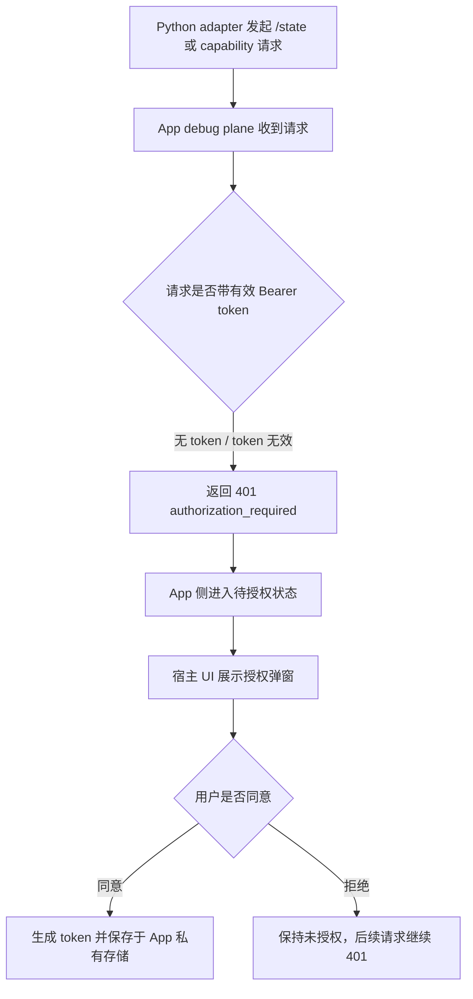
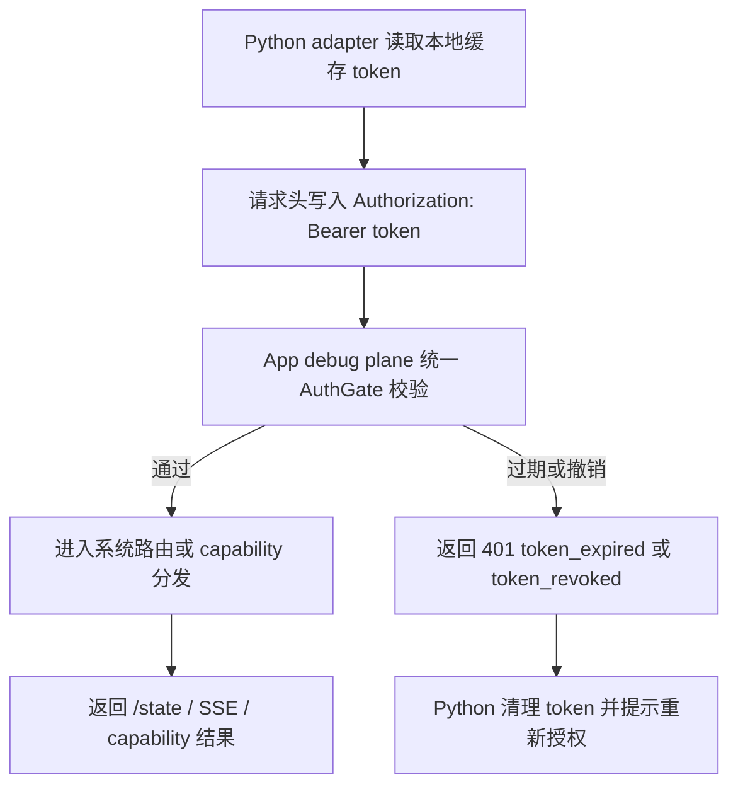
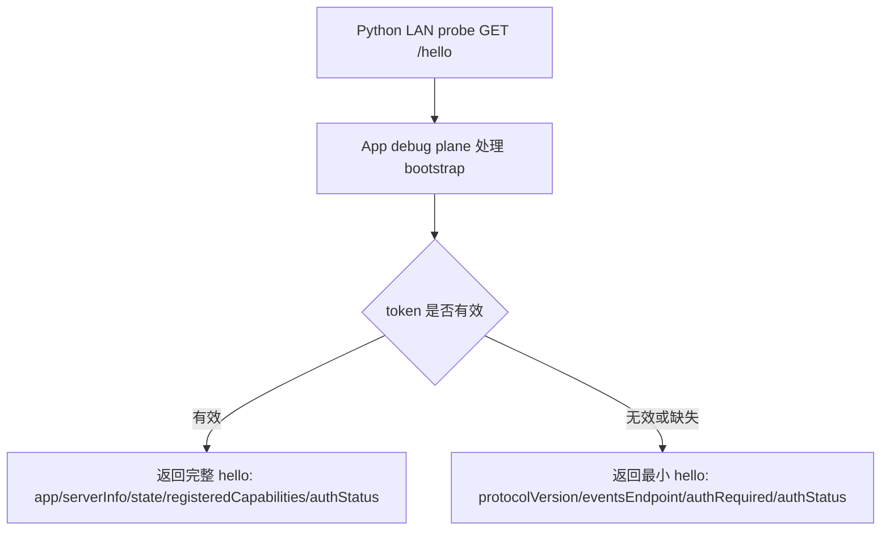

# Debug Plane 服务端鉴权协议 / Kotlin Core Slice — 功能分析

## 概述

本 slice 分析 App debug plane 服务端侧统一鉴权：目标不是把 App 改成完整 MCP server，而是在现有 HTTP/SSE debug plane 协议上增加资源侧授权门。Python MCP adapter 对 App debug plane 只是 HTTP/SSE client，只负责携带 `Authorization: Bearer <token>` 与翻译授权错误；最终是否允许访问 `/state`、`/events`、capability resource/command，必须由 App 内 debug plane 判定。Kotlin core 当前是纯 JVM 模块，负责 `ControlPlane`、`Transport`、`HttpSseTransport`、路由和 SSE，不得直接依赖 Android UI 或 Android storage；授权弹窗、token 持久化具体落点应由 Flutter plugin / Android 宿主侧接入，Kotlin core 只定义抽象协议和统一 auth gate。

## 一、交互链

### 场景 1：未授权调试端访问敏感 debug 能力

作为 App 使用者，我想在有调试端访问 App 调试能力时先看到授权确认，以便只有我同意的调试端能读取状态、订阅事件或调用 capability。

### 场景 2：已授权调试端正常使用 debug 能力

作为已获授权的调试端，我想在每次访问 debug plane 时携带 token，以便 App 能持续确认本次请求仍被允许。

### 场景 3：设备发现 bootstrap

作为调试端，我想先发现 App debug plane 是否存在以及是否需要授权，以便在未授权时能引导用户去 App 内确认，而不是直接暴露完整 capability 清单。

## 二、逻辑树

### 事件流：统一 AuthGate

| 时刻 | 事件 | 处理 | 产生的新事件 |
|---|---|---|---|
| T1 | HTTP 请求进入 `HttpSseTransport.serve` | 解析 method、segments、headers、POST body | 构造待鉴权请求上下文 |
| T2 | 请求命中 `GET /events` | 由于当前 `/events` 在 transport 层 dispatch 前 hijack，必须在 `hijackEvents()` 前执行同一 AuthGate | 鉴权通过才创建 SSE subscriber；失败直接 JSON 401，不写 `: connected` |
| T3 | 请求命中普通 HTTP 路由 | 进入 `ControlPlane.dispatch` 前或 dispatch 开始处执行 AuthGate | 鉴权通过后继续 system route / capability route |
| T4 | 请求为 `/hello` | 按 bootstrap 策略允许未授权，但输出最小信息；有有效 token 才输出完整能力镜像 | Python 可判断 `authRequired/authStatus` |
| T5 | 请求为 `/state`、capability resource、capability command | 必须校验 Bearer token | 通过则分发；失败返回 401/403 |
| T6 | token 运行中过期或撤销 | AuthGate 每次请求重新校验 store 中状态 | 返回 `token_expired` / `token_revoked`，Python 清理缓存 |

### 事件流：Kotlin core 与宿主 UI/storage 解耦

| 时刻 | 事件 | 处理 | 产生的新事件 |
|---|---|---|---|
| T1 | Kotlin core 需要判断 token | 调用纯接口，例如 `DebugAuthProvider.authorize(request)` | 得到 `Authorized` 或 `Denied` |
| T2 | 需要生成或撤销 token | Kotlin core 不直接弹窗、不直接写 Android storage；只暴露抽象管理接口或 pending 状态 | Android/Flutter 宿主实现 UI 与私有存储 |
| T3 | 用户在 App 弹窗同意 | 宿主侧调用 auth manager 生成 token、保存 token hash/metadata | 后续 Bearer token 可通过校验 |
| T4 | 用户撤销授权或 token 到期 | 宿主侧更新 auth store | 下一次请求统一返回 401 |

### 状态流转

| 实体 | 触发事件 | 前状态 | 后状态 |
|---|---|---|---|
| DebugAuthSession | 未授权敏感请求 | `absent` | `pending` |
| DebugAuthSession | 用户同意授权 | `pending` | `authorized` |
| DebugAuthSession | 用户拒绝授权 | `pending` | `denied` |
| DebugAuthSession | token 到期 | `authorized` | `expired` |
| DebugAuthSession | 用户撤销 | `authorized` | `revoked` |
| HTTP 请求 | 无 token 访问敏感路由 | `received` | `rejected_401_authorization_required` |
| HTTP 请求 | 有效 token 访问敏感路由 | `received` | `dispatched` |
| SSE 连接 | 有效 token 建连 | `received` | `connected_streaming` |
| SSE 连接 | 无效 token 建连 | `received` | `rejected_401_no_sse_frame` |

异常流补充：

- 鉴权失败必须在 capability handler 前短路，不能触发 `Capability.state()`、`handleResource()`、`handleCommand()` 或 SSE subscriber 注册。
- `/events` 鉴权失败时返回 JSON 错误体，不能先写 SSE 首帧；否则客户端会误判连接成功。
- 第一版 SSE token 到期策略建议只在建连时校验；连接期间 token 过期不主动断开，下次重连生效。严格主动断开可作为后续增强。

## 三、功能编号与网络定位

### 本次新增节点

| 编号 | 功能节点 | 前缀含义 | 简介 |
|---|---|---|---|
| BF001 | debug plane auth gate | 后端基础 | Kotlin core / debug plane 统一鉴权门，负责路由前 token 校验、敏感路由短路、SSE 建连鉴权，保持纯 JVM 抽象。 |
| BF002 | auth wire contract | 后端基础 | 跨语言 HTTP/SSE 鉴权协议字段、请求头、`/hello` bootstrap、401/403 错误语义与 fixture 对齐。 |

### UI 功能稳定标识预清单

本 slice 为服务端协议/Kotlin core，无 UI 稳定标识。授权弹窗属于 Android/Flutter 宿主 UI slice，Kotlin core 只能暴露 pending auth 状态或接口，不定义具体界面元素。

### 前置依赖

| 依赖节点 | 依赖方式 | 是否已有 |
|---|---|---|
| `PROTOCOL.md` HTTP/SSE 契约 | 鉴权字段和错误码必须写回协议真相源，并同步 fixtures | 已有协议，需扩展 |
| `ControlPlane.dispatch` | 普通 HTTP system/capability 路由统一分发点 | 已有 |
| `HttpSseTransport.serve` / `hijackEvents` | `/events` dispatch 前劫持点，SSE 鉴权必须覆盖此处 | 已有 |
| `RouteResult.error` | 401/403 错误体需复用 `{ok:false, code, message}` 形状 | 已有，但当前不支持 extra auth 字段 |
| Android/Flutter 宿主 token store/UI | token 生成、保存、弹窗、撤销 | 未在 Kotlin core 中存在，需其他 slice 提供 |
| Python BridgeClient token 携带 | 请求头注入、401/403 处理、缓存清理 | 非本 slice，需客户端 slice 对齐 |

### 边界接口

| 接口/协议 | 定义方 | 消费方 | 敏感度 |
|---|---|---|---|
| `Authorization: Bearer <token>` | BF002 auth wire contract | Python BridgeClient、Kotlin/Dart/Flutter debug plane | 高：认证凭证，不得走 query string |
| `GET /hello` bootstrap 最小响应 | BF002 auth wire contract | Python device discovery / capability mirror | 中：未授权可访问，但不得泄露完整 state/capability 明细 |
| `GET /state` | ControlPlane system route | Python MCP adapter | 高：必须鉴权 |
| `GET /events` SSE | HttpSseTransport | Python MCP adapter | 高：建连必须鉴权 |
| capability `GET` resources | ControlPlane capability dispatch | Python MCP adapter | 高：必须鉴权 |
| capability `POST` commands | ControlPlane capability dispatch | Python MCP adapter | 高：必须鉴权 |
| `DebugAuthProvider` / `DebugAuthStore` 抽象 | Kotlin core | Android/Flutter 宿主实现 | 高：保存 token hash/状态，不落 Android API 到 pure JVM core |
| `RouteResult.error(401/403, code, message)` | Kotlin core | Python BridgeClient、fixtures、Dart/Flutter mirrors | 中：跨语言错误语义必须稳定 |

## 四、结论

- `/hello` bootstrap 策略：推荐允许未授权访问，但只返回最小发现与授权状态字段，例如 `protocolVersion`、`eventsEndpoint`、`authRequired: true`、`authStatus: unauthorized`，必要时保留非敏感 `serverInfo` 以维持发现链路；未授权时不得返回 `registeredCapabilities` 和聚合 state。携带有效 token 时返回现有完整 `/hello` shape，并追加授权状态字段。该新增字段属于向后兼容扩展，但 fixture 和 Python 解析需要同步。
- `/state`、`/events`、capability routes 鉴权策略：全部敏感调试能力必须统一经过 AuthGate；`/state`、capability resource、capability command 每次请求都校验 token；`/events` 必须在 SSE 建连前校验，未通过时不能注册 subscriber、不能写 `: connected` 首帧。
- 401/403 错误语义：无 token、token 无效、token 过期、token 撤销均使用 HTTP 401，code 建议分别为 `authorization_required`、`invalid_token`、`token_expired`、`token_revoked`；未来 scope 不足或授权主体无权访问某类能力时使用 HTTP 403 `forbidden`。错误体保留现有 `{ok:false, code, message}` 形状；如需 `auth` extra 字段，需先扩展 `RouteResult.error` 与跨语言 fixture。
- SSE 建连鉴权：当前 Kotlin `/events` 在 `HttpSseTransport.serve` 中 dispatch 前 hijack，因此仅在 `ControlPlane.dispatch` 加 gate 会漏掉 SSE。设计上需要让 transport 能调用同一 auth checker，或把 `/events` hijack 前的鉴权判断下沉到 transport 可访问的 auth policy。第一版建议只在建连时校验，连接中 token 到期不主动断开。
- Kotlin pure JVM 约束：Kotlin core 不得直接依赖 Android UI、SharedPreferences、Keystore 或 Activity。core 应定义 auth policy/store/manager 抽象与 wire-level gate；Android/Flutter plugin 或宿主实现弹窗、token 持久化、撤销入口和 pending 授权 UI。这样保持零业务依赖和多产品复用边界。
- 开发顺序建议：先在 BF002 明确 PROTOCOL/fixtures 的 auth wire contract，再实现 BF001 Kotlin core auth gate；随后由 Android/Flutter UI/storage slice 和 Python BridgeClient slice 对齐。复杂度集中在 `/hello` 未授权脱敏兼容、`/events` transport 层劫持鉴权、以及 token 领取/弹窗流程与 core 抽象边界。
- 暂不实现部分：完整 MCP OAuth 2.1、App 直接实现 MCP server、scope/RBAC、refresh token、多用户权限不进入第一版；这些不是当前 adapter 架构保护真实资源边界的必要条件。
