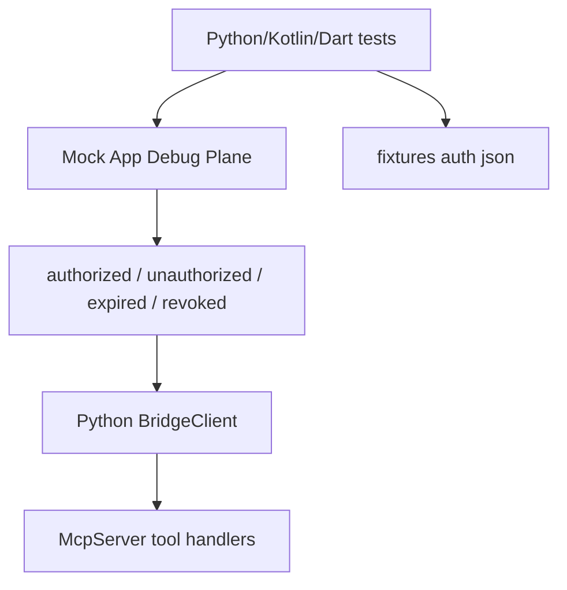

# Debug Plane 自身鉴权 — 测试设计

> 关联设计：[后端/桥接设计 v1](2026-08-20--debug-plane-auth-design.md)

## 1. 测试策略

- unit.android/kotlin：覆盖 AuthGate、token lifecycle、`HttpSseTransport` SSE 建连鉴权、`ControlPlane` 普通路由鉴权。
- unit.flutter：覆盖 Dart API、MethodChannel auth 常量、native bridge 行为和 alignment tests。
- unit.backend/python：覆盖 BridgeClient token 注入、auth error taxonomy、MCP error surfacing、CapabilityMirror 未授权行为。
- integration.cross_stack：用 fixtures 和 mock phone 验证 Kotlin/Dart/Python 协议一致。
- 覆盖率目标：新增 auth 分支 unit 覆盖 ≥80%；关键安全链路 100% 覆盖正常/无 token/过期/撤销/拒绝。

## 2. 测试场景矩阵

| 层 | 场景 | 正常 | 异常/边界 | 安全断言 |
|---|---|---|---|---|
| Kotlin/Dart core | `/hello` bootstrap | 有 token 返回完整 hello | 无 token 返回最小 hello | 未授权不含 state/capabilities |
| Kotlin/Dart core | `/state` | 有 token 返回原扁平 state | 无 token/expired/revoked 返回 401 | capability state 不被调用 |
| Kotlin/Dart core | capability route | 有 token 分发 handler | invalid token 返回 401 | handler 不执行 |
| Kotlin transport | `/events` | 有 token 首帧 `: connected` | 无 token 返回 JSON 401 | 不注册 subscriber |
| App auth | `/auth/request/status/claim` | approve 后 claim 一次 token | denied/expired/重复 claim | token 不走 query，store 只存 hash |
| Flutter plugin | channel auth API | request/approve/deny/revoke/status 常量对齐 | engine detach/pending 超时 | 不泄露 token 到 auth.request |
| Python BridgeClient | header 注入 | token 存在时所有请求带 Bearer | token 缺失不带 header | 日志/error 不含 token |
| Python MCP | auth error surfacing | 2xx 正常返回 | 401/403 映射可操作 error | expired/revoked 清 token |
| CapabilityMirror | 未授权 `/hello` | authorized 生成动态 tools | unauthorized 不生成动态 tools | 不把 auth error 误报 offline |

## 3. 验收标准

| 编号 | 标准 | 命令/操作 |
|---|---|---|
| BF001/BF002 | Kotlin/Dart auth fixtures 与协议字段一致 | `./gradlew build`、`cd dart && fvm flutter test` |
| BF003/FF001 | Flutter plugin auth channel 双端对齐 | `cd flutter_debug_control_plane && fvm flutter test`，插件 Android unit tests |
| BF004/BB001 | Python BridgeClient/MCP auth 行为正确 | `cd python && ${PYTHON_BIN:-python3} -m pytest tests -q --no-header` |
| 全量 | 无业务依赖、协议版本和发布守卫仍通过 | `bash ci/ci-check-all.sh` |

## 4. 集成测试方案

- Mock phone 用 `httpx.MockTransport` 和 Kotlin fake transport 覆盖 HTTP body/header/status。
- 不要求真实 Android UI 自动化；Flutter/plugin unit tests 验证 channel、pending signal 和 approve/deny/revoke 状态机。
- Cross-stack 先用 fixtures 固化协议，再由 Python mock e2e 验证 MCP adapter 行为。

## 5. 测试数据与 Mock 实现策略

- 新增 fixtures：`hello-auth-required.json`、`hello-auth-authorized.json`、`error-401-authorization-required.json`、`error-401-token-expired.json`、`error-403-authorization-denied.json`、`auth-claim-approved.json`。
- token 测试值统一用明显假值，例如 `test-token-plain`；断言持久化内容只出现 hash，不出现明文。
- Python `FakeTokenProvider` 记录 `get/save/clear` 调用，便于断言 expired/revoked 清理。
- Kotlin/Dart fake auth manager 提供 deterministic token 和 clock，避免时间不稳定。

## 6. 暂不测试

- 不做真实 OAuth/JWT/RBAC 测试，因为 R001 不实现这些能力。
- 不做真实局域网窃听/中间人安全测试；当前协议仍是本地/内网 debug HTTP，不提供传输加密。
- 不做 SSE 连接中途过期主动断开测试；第一版只保证建连鉴权。
- 不做宿主自定义 UI 视觉验收；R001 只提供 channel/API 和示例稳定标识建议。
