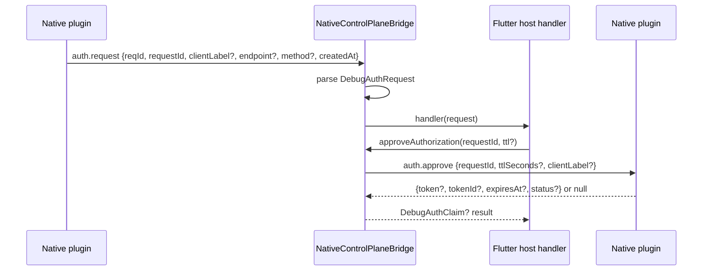
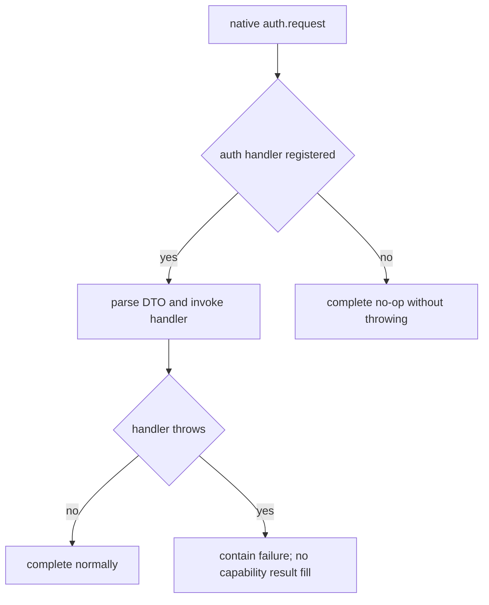
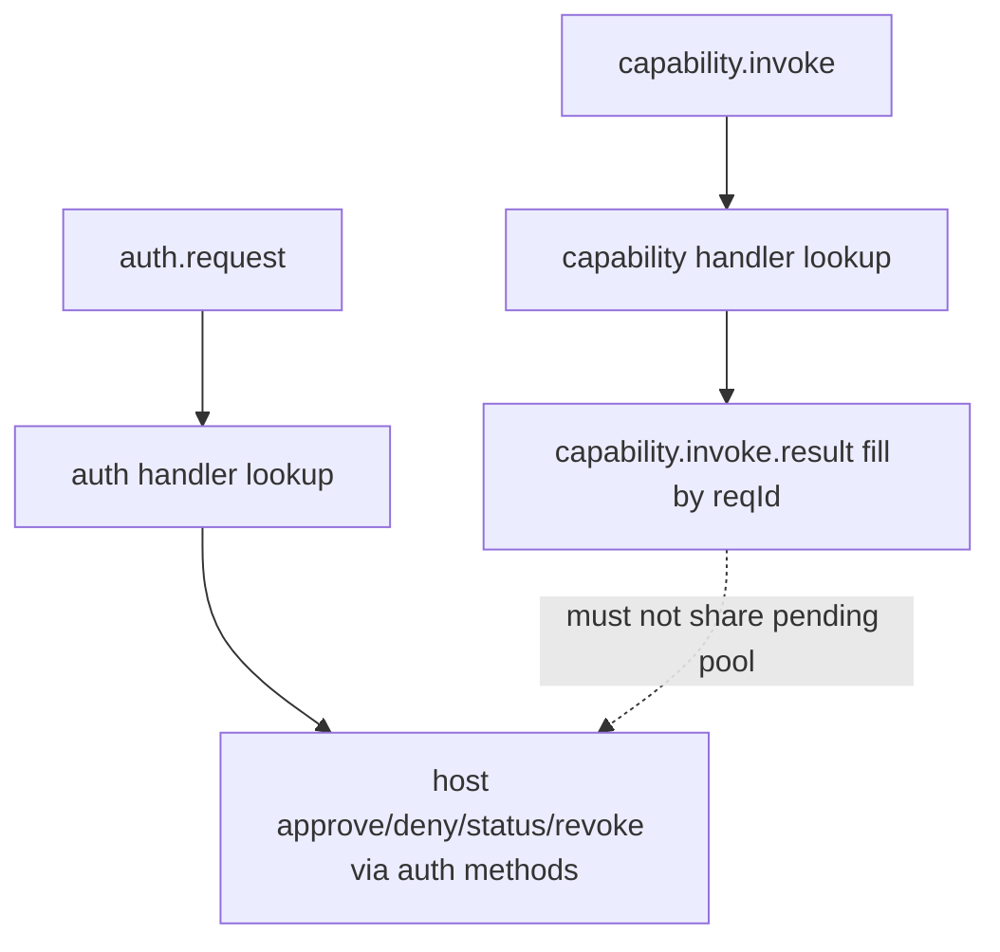

# Sprint Contract: R001-FF002

## Implementation Scope

Expose the Flutter Dart-side host authorization bridge API over the existing
`NativeControlPlaneBridge`, so a Flutter host can receive pending authorization
signals from native and call semantic approve/deny/revoke/status methods without
manually constructing raw MethodChannel payloads.

In scope:
- Add Dart DTOs for authorization bridge payloads:
  - `DebugAuthRequest`
  - `DebugAuthStatus`
  - `DebugAuthClaim` for approve results that return token claim data.
- Add a Dart authorization pending handler API, for example:
  - `typedef DebugAuthRequestHandler = Future<void> Function(DebugAuthRequest request);`
  - `setAuthorizationHandler(DebugAuthRequestHandler? handler)` or equivalent.
- Handle native -> Dart `auth.request` as an auth-specific reverse invoke.
- Add Dart -> native MethodChannel APIs for:
  - `approveAuthorization(String requestId, {Duration? ttl, String? clientLabel})`
  - `denyAuthorization(String requestId, {String? reason})`
  - `revokeAuthorization({String? tokenId, bool all = false})`
  - `authorizationStatus({String? requestId})`
- Parse MethodChannel payloads into DTOs with stable, typed fields and safe
  optional handling.
- Preserve existing capability registration, capability reverse invoke, state
  pull, event pump, attach, and dispose behavior.

Out of scope:
- No Android native dispatcher implementation.
- No Android token store, token hash storage, token generation, expiry engine, or
  pending request lifecycle implementation.
- No default authorization UI, dialog, screen, widget, Navigator usage, or
  AcceptanceSpec visual component.
- No OAuth, JWT, RBAC, refresh token, scope model, account system, TLS, or full
  MCP HTTP server.
- No Python BridgeClient or MCP adapter changes.
- No Kotlin core debug auth changes.

## Target Files

Primary implementation file:
- `flutter_debug_control_plane/lib/src/native_control_plane_bridge.dart`

Supporting public API/export file if required:
- `flutter_debug_control_plane/lib/flutter_debug_control_plane.dart`

Existing protocol constants:
- `flutter_debug_control_plane/lib/src/channel_protocol.dart`

Required tests:
- `flutter_debug_control_plane/test/native_control_plane_bridge_test.dart`

Evidence:
- `.dev-flow/R001/evidence/R001-FF002-unit-flutter-test.log`

## Required API Shape

DTOs:
- `DebugAuthRequest`
  - `requestId: String`
  - `reqId: int?`
  - `clientLabel: String?`
  - `endpoint: String?`
  - `method: String?`
  - `createdAt: DateTime?`
  - Constructible from MethodChannel map payload.
  - Does not contain token plaintext.
- `DebugAuthStatus`
  - `status: String`
  - `requestId: String?`
  - `expiresAt: DateTime?`
  - `clientLabel: String?`
  - Constructible from native status reply maps.
  - Must not require token fields and must not expose token by default.
- `DebugAuthClaim`
  - `token: String?`
  - `tokenId: String?`
  - `expiresAt: DateTime?`
  - `status: String?`
  - Constructible from `auth.approve` reply maps.
  - Nullable return from approve is allowed when native returns `null`.

Auth pending:
- `auth.request` is native -> Dart reverse invoke.
- It must use independent auth pending/handler semantics, not the capability
  `capability.invoke` path.
- It must not use or depend on the capability reverse invoke 30s timeout pool.
- If no authorization handler is registered, the bridge must not crash the app;
  it may return `null` to native or otherwise complete the channel call with a
  stable no-op result.
- Handler failures must be contained so capability handlers and capability fill
  result behavior are not affected.

Dart -> native method calls:
- `approveAuthorization` calls `kMethodAuthApprove` / `auth.approve`.
- `denyAuthorization` calls `kMethodAuthDeny` / `auth.deny`.
- `revokeAuthorization` calls `kMethodAuthRevoke` / `auth.revoke`.
- `authorizationStatus` calls `kMethodAuthStatus` / `auth.status`.
- All calls must use existing `MethodChannel` and must keep auth channel method
  strings from `channel_protocol.dart`.

## Flow Requirements

Normal authorization request flow:

No handler / detached-safe flow:

Separation flow:

## Visual Verification Contract

This is a `domain: ui` task because it exposes Flutter host API, but it does not
create or modify any visible UI component.

Visual verification is `not_applicable` only if independent visual-verify
evidence confirms all of the following:
- No default dialog, widget, screen, layout, image, animation, or visual state is
  added.
- No AcceptanceSpec visual baseline, screenshot target, Figma frame, device
  profile, stable visual identifier, or visual assertion exists for this task.
- The implementation only adds Dart API, DTO parsing, MethodChannel calls, and
  unit tests.

Required visual evidence:
- `.dev-flow/R001/evidence/R001-FF002.md` records
  `visual_verify_status: not_applicable`.
- Independent subagent evidence includes:
  - isolation: independent_context
  - provider: direct_subagent
  - subagent_role: xlfoundry-visual-verify
  - execution_id
  - reason matching the no-default-UI scope above.

## Acceptance Criteria

1. Dart API exposes an auth pending handler and approve/deny/revoke/status
   methods through `NativeControlPlaneBridge` or an equivalent exported Dart API.
2. `DebugAuthRequest`, `DebugAuthStatus`, and `DebugAuthClaim` DTOs parse native
   MethodChannel maps and expose typed fields.
3. `auth.request` is handled as native -> Dart reverse invoke with auth-specific
   handler semantics.
4. Auth pending handling does not reuse capability invoke handler lookup,
   capability `reqId` result fill, or the native 30s capability timeout pool.
5. `approveAuthorization` sends `auth.approve` with request id and optional ttl,
   and maps a non-null reply to `DebugAuthClaim`.
6. `denyAuthorization` sends `auth.deny` with request id and optional reason.
7. `revokeAuthorization` sends `auth.revoke` with token id or all-token request.
8. `authorizationStatus` sends `auth.status` and maps reply to
   `DebugAuthStatus`.
9. No default UI is provided; visual-verify is independently recorded as
   `not_applicable`.
10. Existing capability reverse invoke, state pull, event pump, attach, dispose,
    register, and unregister tests still pass.

## Test Expectations

Required Flutter unit tests:
- Handler registration:
  - `setAuthorizationHandler` receives native `auth.request`.
  - Removing the handler makes later `auth.request` complete without calling old
    handler.
- Payload parsing:
  - `DebugAuthRequest` parses `reqId`, `requestId`, `clientLabel`, `endpoint`,
    `method`, and `createdAt`.
  - Missing optional fields are accepted.
  - Malformed required `requestId` fails predictably or is ignored with an
    explicit tested behavior.
- Dart -> native calls:
  - approve sends `kMethodAuthApprove` with `requestId` and `ttlSeconds` when
    provided.
  - approve returns `DebugAuthClaim?` for map/null replies.
  - deny sends `kMethodAuthDeny` with `requestId` and `reason` when provided.
  - revoke sends `kMethodAuthRevoke` with `tokenId` or `all`.
  - status sends `kMethodAuthStatus` and returns `DebugAuthStatus`.
- Capability separation:
  - `auth.request` does not emit `capability.invoke.result`.
  - capability reverse invoke behavior remains unchanged.
  - Auth handler state does not alter `registeredIds` or capability registry.

Evidence command:
- Preferred: `cd flutter_debug_control_plane && fvm flutter test`
- At minimum, targeted evidence must include
  `flutter_debug_control_plane/test/native_control_plane_bridge_test.dart`.
- If `fvm` is unavailable, use the available Flutter equivalent and record the
  substitution explicitly in the evidence log.

## Hard Gates

| Gate ID | Requirement | Pass Condition |
|---|---|---|
| unit_test_pass | Flutter unit tests pass | Evidence log has `status: pass` and passed count > 0. |
| test_coverage | Required auth bridge scenarios covered | Tests cover handler, DTO parsing, approve/deny/revoke/status calls, and capability pending separation. |
| integration_test_pass | Integration for this task | N/A; Android dispatcher and token lifecycle are out of scope. |
| simplify_pass | Post-implementation simplification completed | Independent simplify subagent passes. |
| architecture_md_consistency | Architecture constraints preserved | No business deps, no default UI, no Android storage, no Python changes, app debug plane remains final auth boundary. |
| visual_check_passed | Visual verification | N/A only with independent visual-verify `not_applicable` evidence matching this contract. |
| stable_identifiers_present | Stable UI identifiers | N/A because no UI element is introduced; independent visual evidence must confirm no AcceptanceSpec applies. |
| state_consistency | UI state consistency | N/A because no UI state/rendering is introduced. |
| acceptance_criteria_met | Task acceptance satisfied | All contract acceptance criteria pass with code/test evidence. |

## UI Scored Criteria

| Dimension | Weight | Threshold | Evaluation Focus |
|---|---:|---:|---|
| Functionality | 30 | 4/5 | Host can receive auth pending requests and call approve/deny/revoke/status through semantic Dart API. |
| API correctness | 25 | 4/5 | DTO fields, MethodChannel method names, payload keys, nullable reply handling, and directionality match design. |
| Separation of concerns | 20 | 5/5 | Auth pending flow is separate from capability invoke pending/result behavior and does not introduce UI/storage/native dispatcher responsibilities. |
| Error handling | 10 | 4/5 | Missing handler, malformed payload, null native replies, and handler exceptions have stable tested behavior. |
| Test coverage | 15 | 4/5 | Required Flutter unit scenarios are deterministic and cover both normal and boundary cases. |

## SubagentExecutionEvidence

- isolation: independent_context
- provider: direct_subagent
- subagent_role: xlfoundry-contract-negotiate-implementer
- execution_id: contract-impl-R001-FF002-20260824T081100Z
- isolation: independent_context
- provider: direct_subagent
- subagent_role: xlfoundry-contract-negotiate-evaluator
- execution_id: contract-eval-R001-FF002-20260824T081300Z
