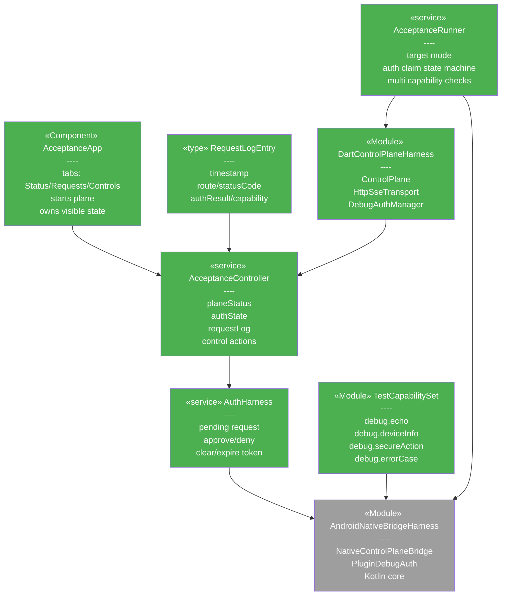
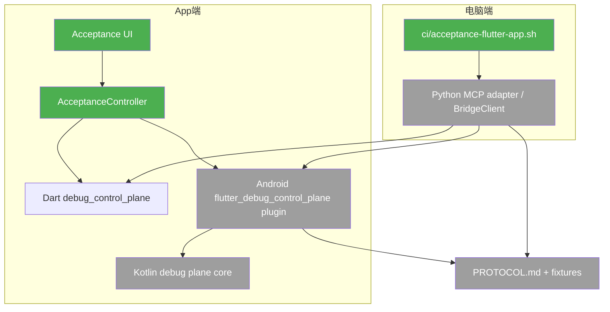
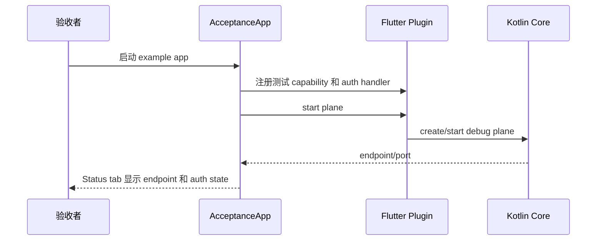
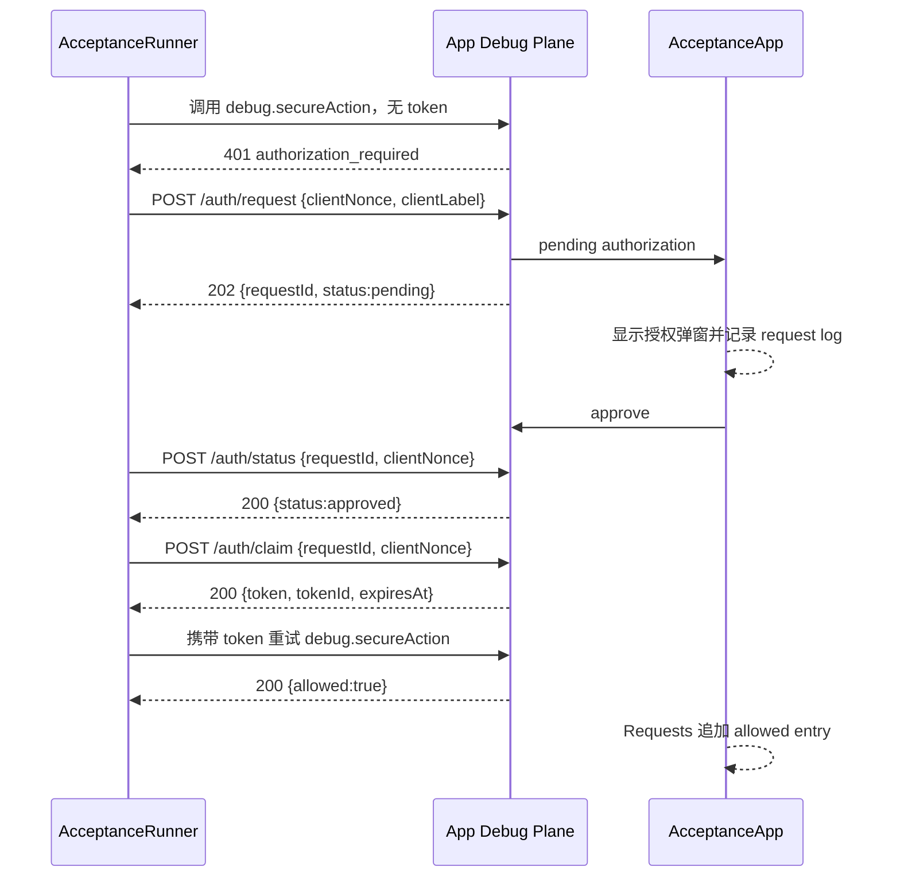
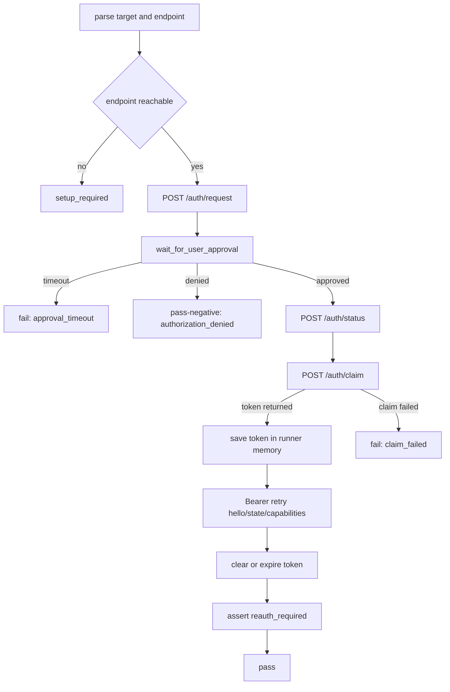
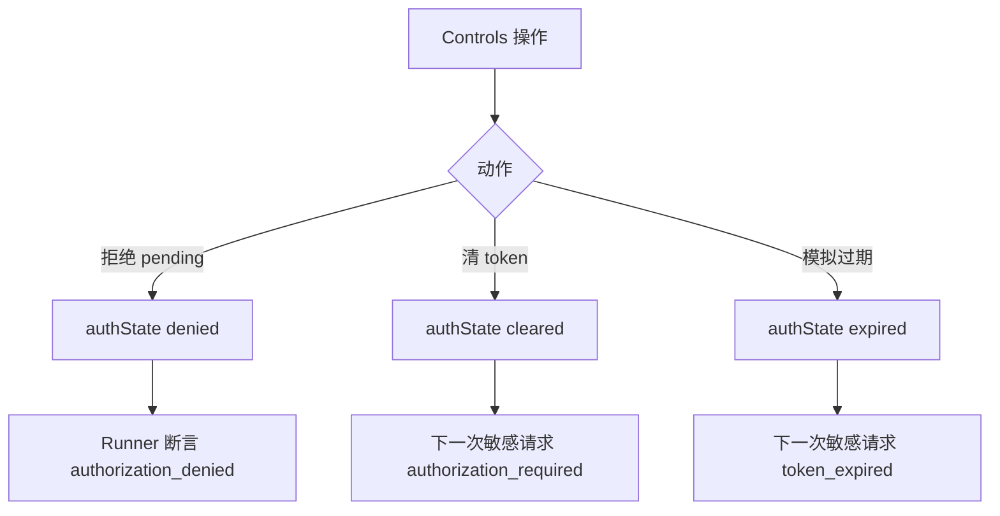

# Flutter 鉴权验收 App — 方案设计

> 关联设计：[测试设计 v1](2026-08-24--flutter-auth-acceptance-app-test.md) / [AcceptanceSpec v1](2026-08-24--flutter-auth-acceptance-app-acceptance-spec.yaml)

## 1. 目标

- FF002：在 `flutter_debug_control_plane/example/` 新增最小真实宿主 App，iOS 模拟器使用 Dart plane，Android 真机使用 plugin/native bridge，启动 debug plane 并注册固定测试 capability。
- FB001：提供 App 内授权验收流，包括授权弹窗、同意/拒绝、清 token、模拟过期和请求日志。
- BF005：新增独立 acceptance runner 边界，电脑端通过真实 endpoint 验证 R001 鉴权链路。
- BF006：定义验收可观察契约，包括状态字段、请求日志 entry 和固定 capability 返回 shape。

## 2. 现状分析

已有能力：

- `flutter_debug_control_plane` 已有 Android Flutter plugin、Dart API、native bridge 和 channel alignment tests；当前没有 iOS plugin platform 声明或 Swift/ObjC native 实现。
- Dart `debug_control_plane` 已有 `ControlPlane`、`HttpSseTransport` 和 auth manager 抽象，可作为 iOS 模拟器阶段的 App 内 debug plane。
- R001 已实现 debug plane 自身鉴权、token 生命周期、Python Bearer 注入和 auth error surfacing。
- Python 测试已覆盖 mock/fixture 级 MCP adapter 行为。
- `ci/ci-check-all.sh` 是稳定主 CI gate。

需要改造的卡点：

- 当前没有真实 Flutter 宿主 App 验证授权弹窗、token 存储、Python 连接真实 App endpoint，以及 Android MethodChannel/Kotlin core 的闭环。
- 现有自动化主要覆盖 mock App，不足以证明真实设备/模拟器上的 App debug plane 可被 Python MCP adapter 连接。
- 真机/模拟器验收环境不稳定，第一版不能直接塞入主 CI。

不需要改的文件/方向：

- 不改 R001 鉴权协议和 token 语义。
- 不引入产品业务页面或业务依赖。
- 不把 example app 设计成复杂 showcase。
- 不在 R002 中实现 iOS native plugin bridge；iOS 模拟器阶段使用 Dart plane 验证 App 宿主授权闭环。

## 3. 方案总览

### 项目结构

- 🟢 `flutter_debug_control_plane/example/`：新增真实宿主验收 App，包含 iOS simulator 和 Android device 两种运行模式。
- 🟢 `flutter_debug_control_plane/example/lib/`：App 状态、测试 capability、请求日志和授权 UI。
- 🟢 `flutter_debug_control_plane/example/integration_test/`：Flutter 侧集成测试入口。
- 🟢 `ci/acceptance-flutter-app.sh`：独立人工/发布前验收脚本入口，支持 `--target ios-simulator|android-device`。
- 🔵 `python/tests/`：接入真实 endpoint 的 acceptance 测试，第一版通过脚本参数或环境变量启用。
- ⚪ `ci/ci-check-all.sh`：保持主 CI 稳定，不默认依赖真机/模拟器。

### 类图

### 模块依赖图

图例：绿色为 R002 新增，灰色为既有依赖；本 RC 无删除节点，既有内部类只在图中保留关键边界。调用方向从验收者和 runner 指向真实 App debug plane；R002 不改变鉴权事实边界，最终授权仍由 App debug plane 执行。iOS 模拟器路径走 Dart plane，Android 真机路径走 plugin/native bridge。

## 4. 数据模型与接口

### App 状态模型

| 模型 | 字段 | 编号追溯 | 说明 |
|---|---|---|---|
| `AcceptancePlaneStatus` | `isRunning`、`endpoint`、`port`、`deviceLabel?` | FF002/BF006 | Status tab 展示 debug plane 是否可连接。 |
| `AcceptanceAuthState` | `status`、`requestId?`、`clientLabel?`、`tokenPresent`、`expiresAt?`、`lastFailureCode?` | FB001/BF006 | 授权弹窗和状态展示的单一来源。 |
| `AcceptanceRequestLogEntry` | `timestamp`、`method`、`route`、`capability?`、`authResult`、`statusCode`、`message?` | BF006 | 人工验收和脚本断言的可观察事实。 |
| `AcceptanceSnapshot` | `planeStatus`、`authState`、`lastRequests[]`、`registeredCapabilities[]` | BF006 | runner 可读取的稳定 JSON shape。 |

### 固定测试 capability

| capability | 类型 | 实现端编号 | 消费端编号 | 返回契约 |
|---|---|---|---|---|
| `debug.echo` | command | FF002 | BF005 | 返回输入 payload 和 `ok:true`。 |
| `debug.deviceInfo` | resource | FF002 | BF005 | 返回 fixture app 名称、平台、debug plane endpoint。 |
| `debug.secureAction` | command | FF002 | BF005 | 只用于验证敏感 command 必须鉴权；返回 `allowed:true`。 |
| `debug.errorCase` | command | FF002 | BF005 | 返回稳定业务错误，用于区分 auth error 与 capability error。 |

### Acceptance runner 接口

| 接口/命令 | 定义方 | 消费方 | 编号追溯 | 契约 |
|---|---|---|---|---|
| `ci/acceptance-flutter-app.sh --target ios-simulator --endpoint URL` | BF005 | 维护者 | BF005 | 手动传入 iOS 模拟器 App endpoint，输出 pass/fail/setup_required。 |
| `ci/acceptance-flutter-app.sh --target android-device --endpoint URL` | BF005 | 维护者 | BF005 | 手动传入 Android 真机 App endpoint，验证 plugin/native bridge 链路。 |
| `ACCEPTANCE_APP_ENDPOINT` | BF005 | 脚本/Python 测试 | BF005 | 环境变量形式传入 endpoint。 |
| `python -m pytest tests/test_acceptance_flutter_app_auth.py` | BF005 | shell script | BF005 | 有 endpoint 时运行真实连接断言；无 endpoint 时明确 skip/setup_required；断言 R001 auth request/status/claim 链路。 |
| `GET /hello`、capability route、auth 错误 | R001 | BF005 | BF005/R001 | R002 只消费 R001 协议，不重新定义。 |

## 5. 核心流程

### App 启动与可观察状态

### 未授权到同意授权

### Acceptance runner 状态机

Runner 不持久化 token；每次 acceptance run 只在进程内保存 claim 到的 token。`authorization_denied` 是负向用例通过，`approval_timeout`、`claim_failed`、敏感 capability 未带 Bearer 仍成功都属于失败。

### 过期和拒绝路径

## 6. 技术决策

| ID | Type | 决策 | Must Plan | Source | Blast Radius |
|---|---|---|---|---|---|
| DEC-R002-001 | structure | 验收 App 放在 `flutter_debug_control_plane/example/` | 是 | FF002 | Flutter plugin 目录、README、测试脚本 |
| DEC-R002-002 | testing | iOS 模拟器和 Android 真机验收独立为 acceptance gate，不进入主 CI | 是 | BF005 | CI 脚本、项目能力配置后续可扩展 |
| DEC-R002-003 | protocol | R002 只消费 R001 auth 协议，不新增鉴权 wire contract | 是 | BF005/BF006 | Python acceptance test、App fixture capability |
| DEC-R002-004 | observability | App 内请求日志是人工验收和脚本诊断的共同事实源 | 是 | BF006 | UI、snapshot、测试断言 |
| DEC-R002-005 | scope | iOS simulator 先走 Dart plane，Android device 再走 plugin/native bridge | 是 | FF002 | example 工程、验收脚本 |

第三方依赖：不新增业务依赖。Flutter example 使用现有 Flutter SDK 和 plugin path dependency；Python acceptance 复用现有 pytest/http client 能力。

## 7. 验收标准

| 编号 | 验收条件 | 验证方式 |
|---|---|---|
| FF002 | example app 在 iOS 模拟器可启动 Dart plane，Status 展示 endpoint、running 状态和注册 capability | Flutter test 或人工启动 |
| FF002 | example app 在 Android 真机可启动 plugin/native bridge plane | Android 设备验收 |
| FB001 | 未授权请求产生授权弹窗；同意后后续敏感 capability 成功 | Flutter integration/manual acceptance |
| FB001 | 拒绝、清 token、模拟过期都能让下一次敏感请求失败并显示原因 | Flutter integration/manual acceptance |
| BF005 | `ci/acceptance-flutter-app.sh --target ios-simulator --endpoint URL` 能驱动 iOS 模拟器 endpoint 并输出稳定 pass/fail/setup_required | 本地脚本 |
| BF005 | runner 复用 R001 `/auth/request/status/claim`，claim token 后 Bearer 重试 | Python acceptance |
| BF006 | 请求日志包含 route、capability、authResult、statusCode，能区分 auth error 与 capability error | Flutter test + Python acceptance |
| 联合验收 | R001 + R002 覆盖未授权拒绝、同意放行、token 过期重新授权、多 capability 全经过鉴权 | 手动 release gate |

## 8. 暂不实现

- 不实现 iOS native plugin bridge；iOS 模拟器只验证 Flutter App + Dart plane。
- 不实现 iOS 真机验收。
- 不实现自动创建/启动 Android 设备的完整设备管理。
- 不把真机验收强制加入 `ci/ci-check-all.sh`。
- 不做产品级视觉设计，不引入业务页面。
- 不改变 R001 auth 协议和 token 生成/校验逻辑。
