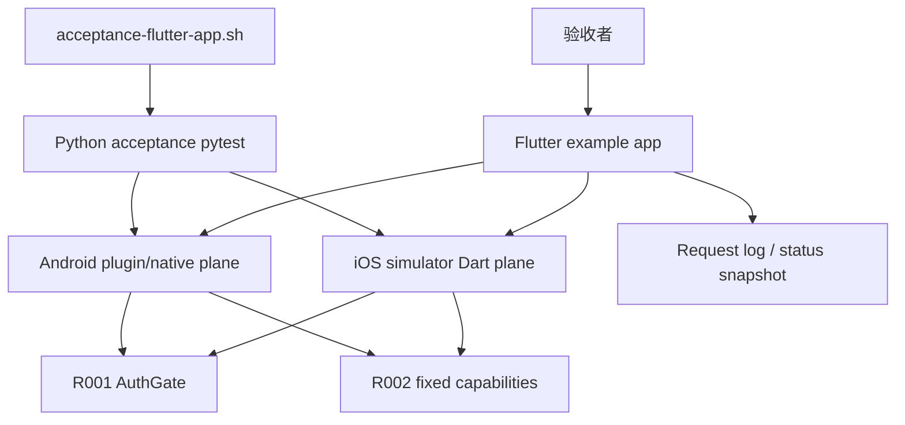

# Flutter 鉴权验收 App — 测试设计

> 关联设计：[主设计 v1](2026-08-24--flutter-auth-acceptance-app-design.md) / [AcceptanceSpec v1](2026-08-24--flutter-auth-acceptance-app-acceptance-spec.yaml)

## 1. 测试策略

- unit.flutter：覆盖验收 App controller、请求日志模型、测试 capability 返回 shape、授权状态控制。
- integration.flutter：优先覆盖 iOS 模拟器上的 App 内授权弹窗、同意/拒绝、清 token、模拟过期的 UI 状态流。
- unit.backend/python：新增可跳过的真实 endpoint acceptance 测试，endpoint 缺失时输出 setup_required/skip。
- acceptance.manual/device：先通过 `ci/acceptance-flutter-app.sh --target ios-simulator --endpoint URL` 驱动 iOS 模拟器 App debug plane；之后用 `--target android-device` 驱动真实 Android 设备。
- 主 CI 策略：第一版不把真机/模拟器验收并入 `ci/ci-check-all.sh`；headless Flutter test 可纳入现有 plugin test 命令。

覆盖目标：验收 App 新增 Dart 逻辑 unit 覆盖 ≥80%；R001 联合验收关键链路 100% 覆盖正常、拒绝、过期、缺 token、多 capability。

## 2. 测试场景矩阵

| 层 | 场景 | 正常 | 异常/边界 | 安全断言 |
|---|---|---|---|---|
| Flutter unit | `AcceptanceController` | plane running/auth approved/log append | clear/expire/deny 状态切换 | token 明文不进入请求日志 |
| Flutter unit | fixed capability | echo/deviceInfo/secureAction 返回稳定 JSON | errorCase 返回稳定业务错误 | secureAction 不应绕过 R001 auth gate |
| Flutter integration | 授权弹窗 | pending 后 approve，状态变 approved | deny 后状态 denied | 弹窗按钮 stable identifiers 存在 |
| Flutter integration | Controls | clear token / expire token 更新状态 | 重复点击不破坏状态 | 下一次请求必须重新鉴权 |
| Python acceptance | auth bootstrap/claim | `/auth/request -> approve -> /auth/status -> /auth/claim` 后 Bearer 请求成功 | denied/timeout/重复 claim | token 只在 runner 进程内保存，不进日志 |
| Python acceptance | 多 capability | echo/deviceInfo/secureAction 全成功 | errorCase 不被误判为 auth error | 所有敏感请求带 Bearer |
| iOS simulator | R001+R002 App 宿主验收 | Dart plane 同意后放行 | 拒绝/过期/伪造 token 失败 | App 请求日志显示 rejected/allowed |
| Android real device | R001+R002 native bridge 验收 | plugin/native bridge 同意后放行 | 拒绝/过期/伪造 token 失败 | App 请求日志显示 rejected/allowed |

## 3. 验收标准

| 编号 | 标准 | 命令/操作 |
|---|---|---|
| FF002/FB001 | App 侧状态、弹窗、controls、请求日志测试通过 | `cd flutter_debug_control_plane/example && fvm flutter test` |
| BF005 | endpoint 缺失时 acceptance 脚本明确 setup_required，不误报 pass | `bash ci/acceptance-flutter-app.sh` |
| BF005/BF006 | iOS 模拟器 endpoint 存在时 Python acceptance 覆盖 auth request/status/claim、授权后、过期、多 capability | `bash ci/acceptance-flutter-app.sh --target ios-simulator --endpoint URL` |
| BF005/BF006 | Android 真机 endpoint 存在时 Python acceptance 覆盖 plugin/native bridge 链路 | `bash ci/acceptance-flutter-app.sh --target android-device --endpoint URL` |
| 回归 | R001/R002 不破坏既有跨语言全量测试 | `PYTHON_BIN=python3 bash ci/ci-check-all.sh` |

## 4. 集成测试方案

环境拓扑：

- 第一阶段 App 运行在 iOS 模拟器，使用 Dart `debug_control_plane` 启动本机 HTTP/SSE debug plane。
- 第二阶段 App 运行在真实 Android 设备，使用 `flutter_debug_control_plane` plugin 经过 native bridge 启动 debug plane。
- 电脑端通过手动传入 endpoint 或后续设备发现连接 App debug plane。
- 脚本输出三类结果：`pass`、`fail`、`setup_required`；等待人工授权超时输出 `fail: approval_timeout`。

真实 vs Mock 边界：

- R002 的价值是验证真实 App 宿主，不用 mock 代替最终验收。
- 单元测试可 mock plugin/native bridge，保证 controller 与 UI 可快速回归。
- Python endpoint acceptance 没有 endpoint 时必须 skip/setup_required，不能伪造成功。
- token 领取必须走 R001 `/auth/request/status/claim` 或 BridgeClient 等价封装；测试不能直接预置 token 后只测 Bearer 成功。

故障注入：

- App Controls 提供清 token、模拟过期。
- Python acceptance 使用缺失 token、伪造 token、过期后重试，并断言 denied/expired 时清理 token 或进入重新授权。
- `debug.errorCase` 用于证明 capability 业务错误不会被 auth error taxonomy 吞掉。

## 5. 测试数据与 Mock 实现策略

- 固定 capability 返回使用稳定 JSON：`fixtureApp: "flutter-auth-acceptance-app"`、`capability`、`ok`、`timestamp?`。
- `timestamp` 只用于日志展示，不进入 golden 断言；脚本断言用 `authResult/statusCode/capability`。
- Flutter unit 使用 fake auth manager 和 fake plane bridge，不依赖真实设备。
- Python acceptance 使用环境变量 `ACCEPTANCE_APP_ENDPOINT` 或 `--endpoint`，并把 endpoint 缺失视为 setup_required。
- 请求日志最多保留最近 50 条，测试断言只读取最近若干条，避免长时间运行导致列表膨胀。

## 6. 暂不测试

- 不做 iOS native plugin bridge 验收。
- 不做 iOS 真机验收。
- 不做自动拉起 Android 设备和安装 APK 的完整流水线。
- 不做云端设备农场。
- 不做产品级视觉像素 golden；只验证稳定标识、关键布局不遮挡和交互状态。
- 不重复测试 R001 已覆盖的 token hash 算法内部细节，R002 只验证真实宿主接入结果。
