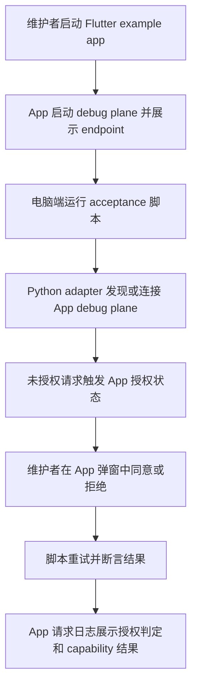
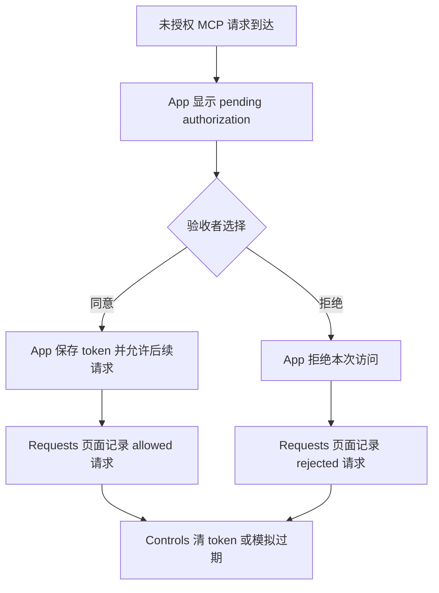
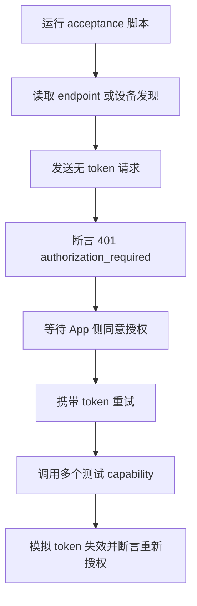

# Flutter 鉴权验收 App — 功能分析

## 概述

本需求新增一个专门用于集成测试和人工验收的 Flutter 宿主 App。它不是产品 App，而是真实 App 宿主夹具，用于补齐当前 mock/fixture 无法覆盖的 App 接入链路：Python MCP adapter 连接模拟器或真实设备上的 debug plane，触发 App 内授权弹窗，验证 token 保存、过期、拒绝和多 capability 统一鉴权。

验收分两段推进：第一段在 iOS 模拟器上通过 Flutter App + Dart `debug_control_plane` 跑通 App 宿主授权闭环；第二段在真实 Android 设备上通过 `flutter_debug_control_plane` plugin 覆盖 Android native bridge 与 Kotlin core。当前 plugin 是 Android-only，R002 不假设已有 iOS native plugin。

R002 依赖 R001 的 debug plane 自身鉴权能力。R001 验证鉴权本体，R002 验证真实宿主接入与验收闭环；两个需求可以在最终人工验收阶段合并执行。

## 一、交互链

### SCN-APP-ACCEPTANCE-HARNESS：开发者运行验收 App 并验证真实授权链路

作为项目维护者，我想启动一个最小真实 Flutter 宿主 App，并从电脑端发起 MCP/debug 请求，以便确认鉴权功能在真实 App 接入场景下可用。

验收 App 第一版只承担测试夹具职责，不承载业务逻辑，也不引入业务依赖。UI 只需要让验收状态可见、可重置、可复现。

### FB001：App 内授权验收流

作为验收者，我想在 App 中看到授权弹窗、授权状态和请求日志，以便判断 MCP 请求是否真的经过 App 侧授权门。

关键点：

- 授权 UI 必须由真实 Flutter App 驱动，不使用 Python 端伪造成功。
- 验收者需要能看见 plane 状态、授权状态、最近请求和拒绝原因。
- token 过期或清除后，下一次 MCP 请求必须重新进入未授权路径。

### BF005：电脑端验收脚本

作为维护者，我想用一个明确的脚本从电脑端驱动验收，以便把人工操作和自动断言连接起来。

第一阶段不把真机/模拟器 E2E 强制并入 `ci/ci-check-all.sh`。R002 需要新增独立 acceptance 入口，供本地人工验收或 release gate 使用；稳定后再考虑将 headless 子集并入主 CI。

## 二、逻辑树

### 事件流：真实宿主 App 接入验收

| 时刻 | 事件 | 处理 | 产生的新事件 |
|---|---|---|---|
| T1 | 验收 App 启动 | Flutter example 初始化 plugin，注册固定测试 capability，启动 debug plane | `plane.started` |
| T2 | Python 发起未授权请求 | App auth gate 返回稳定未授权错误，并创建或复用 pending authorization | `auth.pending` |
| T3 | Flutter 层收到 pending authorization | App 展示授权弹窗，同时 Status/Requests 页面更新可观察状态 | `auth.dialog_presented` |
| T4a | 验收者同意 | App 保存 token 元数据，脚本获取或使用约定通道重试 | `auth.approved` |
| T4b | 验收者拒绝 | App 记录 denied，脚本断言 401/403 语义 | `auth.denied` |
| T5 | 脚本调用测试 capability | debug plane 对每个请求统一校验 token，通过后调用固定 handler | `capability.allowed` |
| T6 | 验收者清 token 或模拟过期 | App 标记 token invalid，脚本下一次请求必须失败并触发重新授权 | `auth.reauth_required` |

### 状态流转

| 实体 | 触发事件 | 前状态 | 后状态 |
|---|---|---|---|
| AcceptanceApp | App 启动 | stopped | running |
| DebugPlane | 启动成功 | stopped | listening(endpoint, port) |
| AuthorizationState | 未授权请求 | idle | pending |
| AuthorizationState | 用户同意 | pending | approved(token_active) |
| AuthorizationState | 用户拒绝 | pending | denied |
| AuthorizationState | 清 token / 模拟过期 | approved | expired 或 cleared |
| RequestLog | 任意 MCP/debug 请求 | unchanged | append(entry: route, authResult, statusCode, capability) |
| AcceptanceScript | 等待人工授权 | waiting_for_user | passed 或 failed |

### 异常流

| 场景 | 处理要求 | 验收结果 |
|---|---|---|
| App 未启动或 endpoint 不可达 | acceptance 脚本应输出明确 setup failure，不伪造通过 | failed/setup_required |
| 用户拒绝授权 | 脚本断言拒绝语义，App 记录 denied | passed-negative |
| token 缺失、伪造、过期 | 所有敏感 endpoint 统一失败，不只覆盖 `/hello` | passed-negative |
| 某个 capability 绕过 auth | Requests 日志与脚本断言必须失败 | failed |

## 三、功能编号与网络定位

### 本次新增节点

| 编号 | 功能节点 | 前缀含义 | 简介 |
|---|---|---|---|
| FF002 | Flutter acceptance fixture app | 前端基础 | 在 `flutter_debug_control_plane/example/` 提供真实宿主 App，启动 debug plane、注册测试 capability、展示状态与请求日志。 |
| FB001 | app-hosted auth acceptance flow | 前端业务 | 提供授权弹窗、同意/拒绝、清 token、模拟过期等验收操作，支撑真实用户交互路径。 |
| BF005 | acceptance runner boundary | 后端基础 | 新增独立 acceptance 脚本/说明，连接 Python MCP adapter 与真实 App endpoint，覆盖授权和多 capability 断言。 |
| BF006 | acceptance observability contract | 后端基础 | 定义验收 App 可观察日志、状态字段、固定测试 capability 返回 shape，保证人工验收与脚本断言稳定。 |

### UI 功能稳定标识预清单

| 功能编号 | 稳定标识预清单 | 说明 |
|---|---|---|
| FF002 | `acceptance.status.endpoint_text`、`acceptance.status.auth_state_text`、`acceptance.requests.list`、`acceptance.controls.clear_token_button`、`acceptance.controls.expire_token_button` | 验收 App 的状态、日志和控制入口。 |
| FB001 | `acceptance.auth_dialog.root`、`acceptance.auth_dialog.title`、`acceptance.auth_dialog.approve_button`、`acceptance.auth_dialog.deny_button` | 授权弹窗核心元素，用于人工和 Flutter integration test 定位。 |

### 前置依赖

| 依赖节点 | 依赖方式 | 是否已有 |
|---|---|---|
| R001 debug plane auth | R002 验收 App 要验证 R001 鉴权链路 | 已实现，待联合验收 |
| `flutter_debug_control_plane` plugin | example app 作为真实宿主接入 plugin | 已有 |
| Dart `debug_control_plane` | iOS 模拟器先通过 Dart plane 验证 App 宿主授权闭环 | 已有 |
| Android Flutter plugin bridge | Android 真机阶段通过 native bridge 覆盖 Kotlin core | 已有 |
| Python MCP adapter / BridgeClient | acceptance 脚本从电脑端驱动真实 App | 已有 |
| `ci/ci-check-all.sh` | 主 CI 保持稳定，acceptance 脚本独立新增 | 已有 |

### 边界接口

| 接口/协议 | 定义方 | 消费方 | 敏感度 |
|---|---|---|---|
| `flutter_debug_control_plane/example/` | FF002 | 维护者、Flutter tooling、release gate | 低 |
| 固定测试 capability：`debug.echo`、`debug.deviceInfo`、`debug.secureAction`、`debug.errorCase` | BF006/FF002 | Python acceptance script | 中 |
| 请求日志 entry：route、method、authResult、statusCode、capability、timestamp | BF006/FF002 | 验收者、测试断言 | 中 |
| acceptance 脚本入口 | BF005 | 维护者、本地 release gate | 中 |
| 授权状态 controls | FB001 | 验收者 | 高 |

## 四、结论

- 需求分类：`single`。本需求虽然涉及 Flutter App、Python 脚本和验收说明，但交付目标是一个最小真实宿主验收夹具，核心场景紧密，功能节点 4 个，不需要拆分 RC。
- 开发顺序建议：先建立 Flutter example app 骨架和固定 capability，再补授权状态/日志 UI，最后补电脑端 acceptance 脚本与文档。
- 复杂度集中点：iOS 模拟器与 Android 真机运行链路不同；iOS 阶段验证 App 宿主 + Dart plane，Android 阶段验证 plugin native bridge。
- 暂不实现：iOS native plugin bridge、完整自动安装/启动 Android 设备流程、云端设备农场、完整产品级 UI。
- 联合验收建议：R001 与 R002 一起验收，重点验证真实 App 中“未授权拒绝、同意后放行、token 过期重新授权、多 capability 全覆盖”。
