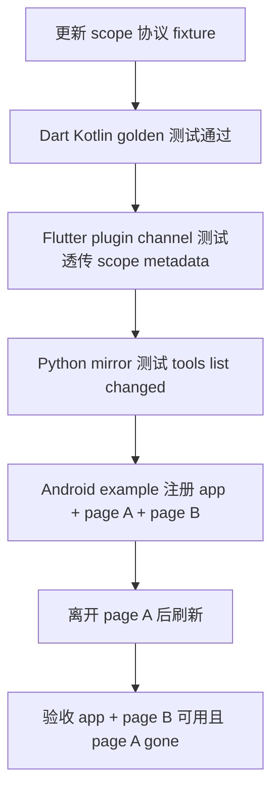

# S05 验收回归切片：Capability Scope Split

## 概述

本切片覆盖 R003 的验收与回归网络，owner IDs 为 `SCN-SCOPE-ACCEPTANCE`、`BF007`、`BF008`。目标不是定义新的 scope 数据模型本身，而是约束它落地后的跨语言一致性、MCP tool 列表刷新语义，以及 Flutter Android 真实运行验收场景。

已确认需求边界：

- scope 分为应用级 `app` 与页面级 `page`；未声明 scope 的旧 capability 默认视为 `app`。
- 允许多个 active page scope 同时存在，以覆盖嵌套路由、tab、弹窗、多 Navigator 等并发页面上下文。
- `pageId` 可由业务传入；`pageName` 可作为 MCP 展示辅助信息，但 tool id 不强制改为页面名称。
- 页面进入时注册 page capability，页面离开时解除注册；Python MCP 不能长期暴露已离开页面的 capability。
- Android 生命周期仍归宿主；debug plane 不自动启动，不引入业务依赖。

现有验收基线：

- `ci/ci-check-all.sh` 已串联 Kotlin build/test、Dart test、Flutter plugin test、Android JVM test、Python pytest、零业务依赖、协议版本守卫与发布前置检查。
- `dart/test/golden_fixture_test.dart` 与 `kotlin/src/test/kotlin/com/pantas/debug/controlplane/GoldenFixtureTest.kt` 已把 `fixtures/` 定义为协议真相源。
- `python/tests/test_capability_mirror.py` 与 `python/tests/test_server.py` 已覆盖 MCP static floor、dynamic tools、schema grow/shrink change detection、offline degrade、auth error 不静默降级。
- `flutter_debug_control_plane/example/integration_test/acceptance_integration_test.dart` 与 example tests 已有 Android native plane、stable identifiers、固定 capability 注册/解除注册的验收框架。

## 交互链

### SCN-SCOPE-ACCEPTANCE：控制端看到正确的 app/page 能力

作为发布验收者，我想用同一组跨语言 fixture 和 Android 集成场景验证 app/page capability 生命周期，以便确认 R003 不是单端字段漂移。



1. 宿主启动 debug plane 并注册未声明 scope 的旧 capability。
2. 控制端或 MCP 客户端刷新 `/hello` / `list_capabilities`。
3. 返回结果中旧 capability 被视为 `scope=app`，不需要调用方提供 `pageId`。
4. 用户进入页面 A，业务层用传入的 `pageId=A` 注册 page capability，可选携带 `pageName`。
5. 用户进入页面 B 或弹出页面上下文，业务层注册第二组 page capability，页面 A 与 B 可同时活跃。
6. MCP tools/list 或 list_capabilities 刷新后可区分 app capability 与多个 page capability；展示层可使用 `pageName` 辅助识别。
7. 用户离开页面 A，业务层 unregister 页面 A 的 capability。
8. 再次刷新后页面 A capability 不再出现在 tools/capabilities；页面 B 与 app capability 仍可用。
9. 若客户端调用已离开页面 A 的能力，返回稳定 gone/expired 类错误，并触发或引导重新刷新 capability 列表。

### BF007：跨语言协议 fixture/单测回归

1. 开发者更新 scope 协议 fixture，描述 app 默认值、page metadata、多页面并发、页面离开后的清单变化。
2. Kotlin 与 Dart golden 测试读取同一 fixture，断言 `/hello` 的 `registeredCapabilities` 投影一致。
3. Flutter plugin Dart/API 与 Android JVM 桥接测试断言 MethodChannel 注册参数保留 scope metadata。
4. Python mirror 测试用 fixture 形状构造 `NetworkTarget.registered_capabilities`，断言 schema 缓存、tool 构建、刷新变化检测与错误映射一致。
5. `bash ci/ci-check-all.sh` 作为跨语言总入口，任何一端字段漂移、默认值缺失、路径/错误码不一致都应失败。

### BF008：Flutter Android 真机/集成验收

1. Android example 以 native plane 模式启动，宿主显式 start。
2. 启动后注册全局 app capability，页面进入后注册 page capability。
3. 测试在真实 Android runtime 中驱动页面切换或模拟页面生命周期，观察 capability 计数、scope 展示和 request log。
4. 页面离开后执行 unregister，验证 native channel 发送对应解除注册调用，HTTP/MCP 侧刷新后不再暴露离开的 page capability。
5. 测试覆盖多个 page scope 同时活跃的场景，确保 unregister 页面 A 不误删页面 B 或 app capability。
6. 验收结束调用 stop，确认所有 app/page capability 清理，channel handler 释放，plane endpoint 归空。

## 逻辑树

### 事件流：跨语言回归与 Android 验收

| 时刻 | 事件 | 处理 | 产生的新事件 |
|---|---|---|---|
| T1 | 新增 scope fixture | fixture 描述 app 默认、page metadata、多 page 并发和 schema shrink | Dart/Kotlin golden 读取同一真相源 |
| T2 | Dart/Kotlin core 测试 | 断言 `/hello.registeredCapabilities` scope 字段、默认值、错误码一致 | core 层回归通过或失败 |
| T3 | Flutter channel 测试 | 注册 payload 带 `scope/pageId/pageName`，unregister 使用 scope-aware identity | plugin bridge 回归通过或失败 |
| T4 | Python mirror 测试 | 解析 schema grow/shrink，旧 page 调用触发 gone/expired 与 refresh | MCP tools/list_changed 回归通过或失败 |
| T5 | Android 集成验收 | example 启动 plane，进入 page A/page B，离开 page A | 真机 evidence 记录能力清单变化 |
| T6 | CI 总入口 | `ci/ci-check-all.sh` 聚合可本地运行测试 | 字段漂移或错误码不一致时 fail |

### 状态流转

| 实体 | 触发事件 | 前状态 | 后状态 |
|---|---|---|---|
| Protocol fixture | R003 fixture 更新 | 仅 app/global schema | 包含 app 默认、page metadata、gone/expired |
| Cross-language tests | fixture 消费 | 未覆盖 scope | 覆盖 Dart/Kotlin/Flutter/Python |
| Android example page A | 页面进入 | inactive | active，page capability registered |
| Android example page B | 页面进入 | inactive | active，page capability registered |
| Android example page A | 页面离开 | active | gone，capability unregistered |
| MCP exposed tools | page A gone 后 refresh | 包含 page A tool | 移除 page A tool，保留 app/page B |

```text
Capability Scope 验收回归
├─ 协议一致性
│  ├─ scope 缺省：旧 capability => app
│  ├─ page scope：scope=page + pageId 必须跨语言保真
│  ├─ pageName：可选展示字段，不参与 tool id 强制拼接
│  └─ 多 active page：同一 app 下允许多个 pageId 同时存在
├─ 生命周期一致性
│  ├─ app capability：随宿主注册周期存在
│  ├─ page capability：页面进入注册
│  ├─ page capability：页面离开解除注册
│  └─ stop：清理所有 app/page capability 与 channel handler
├─ MCP 列表与调用语义
│  ├─ refresh 识别 schema grow/shrink/scope metadata 变化
│  ├─ tools/list 不长期暴露已离开页面的 capability
│  ├─ pageName 只用于展示辅助
│  └─ stale page 调用返回稳定 gone/expired 错误并提示刷新
├─ 回归守卫
│  ├─ Kotlin/Dart golden fixture 同源
│  ├─ Flutter plugin channel protocol alignment
│  ├─ Python CapabilityMirror/McpServer 单测
│  └─ ci/ci-check-all.sh 全量守卫
└─ 非目标
   ├─ 不实现业务页面 SDK
   ├─ 不引入业务包依赖
   ├─ 不要求 MCP tool id 包含 pageName
   └─ 不改变 Android plane 启停归宿主的架构约束
```

## 功能编号与网络定位

### BF007：跨语言协议 fixture/单测回归

- Owner：`BF007`
- 类型：后端基础 / 协议回归基础设施
- 网络位置：`fixtures/` 真相源 → Kotlin golden tests → Dart golden tests → Flutter plugin channel alignment tests → Python mirror/server tests → `ci/ci-check-all.sh`
- 业务语义：为 R003 提供可执行验收契约，保证 app/page scope 字段、默认值、多页面并发和离开页面后的 shrink 语义不会跨语言漂移。
- 关键断言：
  - 旧 fixture 或旧注册 API 未声明 scope 时，跨语言输出统一等价于 `scope=app`。
  - page capability 的 `scope`、`pageId`、可选 `pageName` 在 Kotlin、Dart、Flutter Android bridge、Python `CapabilitySchema` 中保真。
  - 多 page scope 同时活跃时，刷新结果包含多个不同 `pageId`，且 capability id 不需要因页面上下文改名。
  - 页面 unregister 后 schema shrink 被 Python mirror 识别为 list changed。
  - gone/expired/stale page 调用错误在 Python MCP 映射中稳定、可测试、不吞成空列表，且不破坏 offline degrade 与 auth error 既有行为。
- 现有测试落点：
  - `dart/test/golden_fixture_test.dart`
  - `kotlin/src/test/kotlin/com/pantas/debug/controlplane/GoldenFixtureTest.kt`
  - `flutter_debug_control_plane/test/channel_protocol_alignment_test.dart`
  - `flutter_debug_control_plane/android/src/test/kotlin/com/pantas/debug/controlplane/flutter/DartCapabilityRegistryTest.kt`
  - `flutter_debug_control_plane/android/src/test/kotlin/com/pantas/debug/controlplane/flutter/ChannelProtocolAlignmentTest.kt`
  - `python/tests/test_capability_mirror.py`
  - `python/tests/test_server.py`

### BF008：Flutter Android 真机/集成验收场景

- Owner：`BF008`
- 类型：后端基础 / 跨栈验收夹具
- 网络位置：Flutter example controller/native plane → Android MethodChannel → Kotlin core registry → HTTP `/hello`/capability routes → Python MCP refresh/list/call 验收
- 业务语义：验证页面级 capability 在真实 Android 生命周期中按页面进入/离开注册和解除注册，且控制端不会继续暴露已离开页面的能力。
- 关键断言：
  - native mode start 后 app capability 常驻，页面 capability 随页面生命周期变化。
  - 支持同时注册 page A 与 page B；离开 A 后 B 与 app capability 保持可用。
  - `pageId` 可由 example/controller 传入；`pageName` 可显示在验收 UI 或 MCP description 中，但 tool id 不强制变化。
  - stop 后所有注册都被 unregister，channel handler 释放，endpoint 置空。
  - Android 真机/集成测试可复用既有 stable identifier 与 screenshot/evidence 输出机制，但新增断言聚焦 scope 生命周期，不把 UI 文案当协议真相。
- 现有测试落点：
  - `flutter_debug_control_plane/example/test/android_native_plane_test.dart`
  - `flutter_debug_control_plane/example/test/acceptance_app_test.dart`
  - `flutter_debug_control_plane/example/test/acceptance_controller_test.dart`
  - `flutter_debug_control_plane/example/integration_test/acceptance_integration_test.dart`
  - `flutter_debug_control_plane/example/integration_test/acceptance_pytest_driver_test.dart`

## 边界接口

### 输入边界

- 来自 scope 模型/API 切片的 capability declaration 必须至少能表达：
  - `scope`: `app` 或 `page`
  - `pageId`: page scope 必填，业务可传入
  - `pageName`: page scope 可选展示名
- 旧 capability declaration 未携带 scope metadata 时，验收侧按 `app` 默认值断言，不要求调用方迁移所有旧 API。
- Flutter Android bridge 必须能在 `capability.register` 与 `capability.unregister` 相关调用中定位页面级 capability 的身份，避免只按裸 capability id 误删并发页面能力。

### 输出边界

- `/hello` / capability manifest 输出应让控制端区分 app/page scope，并能表达多个 active page。
- MCP `tools/list` / `list_capabilities` 应反映最新 manifest；pageName 可进入 description 或结构化 metadata，但 tool id 不强制改。
- 对已解除注册 page capability 的调用应返回稳定错误，而不是命中旧 handler、静默成功或永久保留旧 tool。
- CI 输出以 `bash ci/ci-check-all.sh` 为总验收入口；需要真 Android 设备的验收可作为明确标注的 integration/evidence 场景，不应伪装成纯 unit 覆盖。

### 不变量

- 不读取、不依赖业务包；scope 验收使用中性 stub capability。
- 不破坏未授权发现的最小 bootstrap 能力。
- 不通过 query string 传 token；既有 auth 错误路径与 offline degrade 路径继续保持当前测试语义。
- 不改变 Android plane 的宿主生命周期归属。

## 结论

R003 至少需要两个验收回归功能节点：

- `BF007` 建立跨语言协议 fixture 与单测回归网络，把 app 默认值、page metadata、多页面并发、schema shrink 和 stale page 错误纳入 Kotlin/Dart/Flutter/Python 同步验收。
- `BF008` 建立 Flutter Android 真机/集成验收场景，覆盖页面进入注册、页面离开解除注册、多个 active page scope 共存、MCP/HTTP 刷新后不暴露离开页面能力，以及 stop 清理。

这两个节点共同保证 capability scope split 不只是 API 字段变更，而是被协议真相源、MCP 投影、Android 生命周期和 CI 总入口同时约束。
