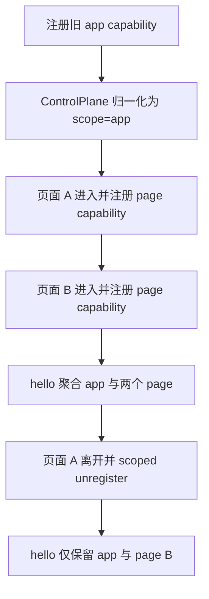

# S02 核心运行时切片：Scope Registry

## 概述

本切片 owner 为 `SCN-CORE-SCOPE-REGISTRY`，覆盖 Dart core 与 Kotlin core 中 capability 元数据、注册表键空间、解除注册语义、`/hello.registeredCapabilities` 聚合输出的变化。目标是让运行时同时支持应用级 `app` capability 与页面级 `page` capability，并保证旧 capability 在未声明 scope 时默认等价于 `app`。

现状代码事实：

- Dart `Capability` 只有 `id/resources/commands/events/state()`，`ControlPlane` 用 `Map<String, Capability>` 以 `id` 为唯一 registry key。
- Kotlin `Capability` 只有 `id/resources()/commands()/events()/state()`，`ControlPlane` 用 `LinkedHashMap<String, Capability>` 以 `id` 为唯一 registry key。
- Dart/Kotlin 的 `/hello` 都通过 `registeredCapabilities` 暴露 `{id, resources, commands}`，保留注册顺序；当前没有 scope、pageId、pageName 字段。
- Dart/Kotlin 已有 `register(cap)` 与 `unregister(id)`，页面进入/离开的生命周期可复用该入口，但现有 `id` 唯一键无法表达多个 active page scope 中同名 capability 的并存。

需求确认：

- 允许多个 active page scope 同时存在。
- `pageId` 可由业务传入。
- MCP 可展示 `pageName`，但 tool id 不强制改。
- 页面级 capability 在页面进入时注册，页面离开时解除注册。
- 旧 capability 未声明 scope 时默认 `app`。

## 交互链

### SCN-CORE-SCOPE-REGISTRY

作为 SDK 接入开发者，我想用同一套 ControlPlane registry 同时注册应用级能力和多个页面级能力，以便页面进入/离开时调试能力集合能准确变化。

1. App 启动或 debug plane 初始化时，业务注册未声明 scope 的旧 capability。
2. ControlPlane 将其解释为 `scope=app`，以应用级身份进入 registry，并继续出现在 `/hello.registeredCapabilities`。
3. 页面 A 进入时，业务注册页面级 capability，传入 `scope=page`、`pageId=A`，可选传入 `pageName`。
4. 页面 B、弹窗、tab 或嵌套路由同时进入时，可注册另一个 `scope=page` 且 `pageId=B` 的 capability；即使 capability `id` 与页面 A 相同，也不因单纯同名互斥。
5. 控制端调用 `/hello` 时，Dart/Kotlin 聚合当前所有 app/page capability；页面级条目带 scope metadata，控制端可据此刷新可用工具或展示页面名称。
6. 页面 A 离开时，业务调用 scoped unregister，ControlPlane 精确移除 `pageId=A` 下的页面级 capability，并取消该 capability 的事件订阅。
7. 页面 A 离开后，`/hello` 不再返回该页面能力；已缓存控制端若继续调用其路由，核心运行时按当前 registry 查找，未命中时返回现有 `404 not_found`。
8. App 停止时，现有 `stop()` 仍清空 registry 与事件订阅，覆盖 app/page 两类 capability。

## 逻辑树

### 事件流：Scope-aware registry

| 时刻 | 事件 | 处理 | 产生的新事件 |
|---|---|---|---|
| T1 | 旧 capability 调用 `register(cap)` | 读取不到 scope metadata，归一化为 `scope=app`，生成 key `(app,id)` | registry 新增 app capability，订阅 events |
| T2 | page capability 注册 | 校验 `scope=page` 且 `pageId` 非空，生成 key `(page,pageId,id)` | registry 新增 page capability，允许不同 pageId 同名 id 并存 |
| T3 | 重复 page key 注册 | 检测 `(page,pageId,id)` 已存在 | 抛重复注册错误，不覆盖旧 handler |
| T4 | `/hello` 请求 | 遍历 registry 当前快照，输出 `scope/pageId/pageName` metadata | 控制端获得 app/page 能力清单 |
| T5 | 页面离开 scoped unregister | 按 `(page,pageId,id)` 移除目标 capability，取消对应 event subscription | 下一次 `/hello` 不再包含该 page capability |
| T6 | scoped route 未命中或旧缓存调用 | registry 当前快照找不到目标 page identity | 返回稳定 gone/expired 或既有 not_found，由协议设计统一 |

### 状态流转

| 实体 | 触发事件 | 前状态 | 后状态 |
|---|---|---|---|
| CapabilityScope | 旧 capability 注册 | scope 未声明 | `scope=app,pageId=null,pageName=null` |
| RegistryKey | app capability 注册 | absent | `(app,id)` 已占用 |
| RegistryKey | page capability 注册 | absent | `(page,pageId,id)` 已占用 |
| RegistryKey | 同 page 重复注册 | `(page,pageId,id)` 已占用 | 不变，注册失败 |
| EventSubscription | capability 注册 | absent | active，绑定 scope-aware key |
| EventSubscription | scoped unregister | active | cancelled |
| Hello manifest | scoped unregister 后请求 | 包含目标 page entry | 不含目标 page entry |

- Capability metadata/API
  - 新增 scope 元数据模型，至少包含：
    - `scope`: `app` 或 `page`。
    - `pageId`: 当 `scope=page` 时必填，由业务传入。
    - `pageName`: 可选展示名，供 MCP 或其他控制端显示。
  - 旧 capability 不实现或不传 scope 时，ControlPlane 归一化为 `scope=app`。
  - `pageName` 只作为展示 metadata，不参与强制路由 id 或 tool id 生成。

- Scoped registry key
  - 现有 `id` 仍是业务可读 capability id，不强制拼接 `pageId`。
  - registry 的唯一键需要从单字段 `id` 升级为 scope-aware key：
    - app capability key: `scope=app + id`。
    - page capability key: `scope=page + pageId + id`。
  - 重复判断按 scope-aware key 执行，允许不同 `pageId` 下存在同名 page capability。
  - 同一 `pageId` 下相同 `id` 仍视为重复注册错误。

- Unregister
  - 保留旧 `unregister(id)` 对 app capability 的兼容行为。
  - 增加 scoped unregister 入口或参数化 unregister，使页面离开时可以按 `scope=page + pageId + id` 精确移除。
  - unregister 必须继续取消对应 event subscription，避免页面离开后事件流泄漏。
  - 对不存在的 scoped key 维持 no-op 语义。

- `/hello` 聚合
  - `registeredCapabilities` 保持数组、注册顺序、每项 `{id, resources, commands}` 的兼容形状。
  - 每个条目新增 scope metadata：
    - app 条目显式输出 `scope=app`，或至少在协议层定义缺省为 app；为跨语言一致建议显式输出。
    - page 条目输出 `scope=page`、`pageId`，有值时输出 `pageName`。
  - 聚合必须基于 registry 当前快照，页面 unregister 后下一次 `/hello` 不再包含该页面 capability。

- Dispatch 与状态聚合
  - 路由仍可保持当前平铺、前缀无关、按注册顺序 first-match-wins 的匹配模型。
  - 多页面同名 capability 若声明相同资源/命令路径，会在平铺路由中产生 first-match-wins 歧义；核心切片不通过强制改 tool id 解决，但必须把该风险暴露给后续协议/Python mirror 切片处理。
  - `/state` 仍是 capability state 的平铺聚合；多个 page capability 返回相同 state key 时，当前“后注册覆盖先注册”的规则会导致页面状态互相覆盖。核心运行时若不改变 `/state` 结构，需要在协议层明确限制页面 state key 冲突，或后续设计改为 scope-aware state 输出。

## 功能编号与网络定位

### BF003：Dart/Kotlin Capability metadata/API

- Owner：`SCN-CORE-SCOPE-REGISTRY`
- 类型：后端基础，跨语言 core API。
- 网络定位：
  - Dart：`dart/lib/src/capability.dart`
  - Kotlin：`kotlin/src/main/kotlin/com/pantas/debug/controlplane/Capability.kt`
- 能力范围：
  - 为 Capability 增加 scope metadata 表达。
  - 定义 `app/page` scope 枚举或等价稳定字段。
  - 定义 `pageId/pageName` 的必填与可选规则。
  - 保持旧实现默认 `app`，避免现有 app capability 注册代码破坏。
- 验收要点：
  - 未声明 scope 的旧 capability 仍可注册、dispatch、出现在 `/hello`。
  - page capability 缺少 `pageId` 时应在注册前或注册时失败，不能进入半有效 registry。
  - Dart/Kotlin 输出字段命名与默认规则一致。

### BF004：Scoped registry unregister 与 hello 聚合

- Owner：`SCN-CORE-SCOPE-REGISTRY`
- 类型：后端基础，运行时 registry 与系统路由聚合。
- 网络定位：
  - Dart：`dart/lib/src/control_plane.dart`
  - Kotlin：`kotlin/src/main/kotlin/com/pantas/debug/controlplane/ControlPlane.kt`
- 能力范围：
  - 将 registry 从单 `id` 键升级为 scope-aware key。
  - 支持多个 active page scope 并存。
  - 增加或扩展 unregister，使页面离开可以精确解除页面级 capability。
  - `/hello.registeredCapabilities` 聚合输出 scope metadata。
  - unregister 后取消 event subscription，且下一次 `/hello` 不再暴露离开页面能力。
- 验收要点：
  - 同一 `id` 可在不同 `pageId` 下同时注册。
  - 同一 `pageId + id` 重复注册失败。
  - scoped unregister 只移除目标页面能力，不误删 app 或其他 page 能力。
  - `stop()` 仍清空所有 capability 与订阅。

## 边界接口

- 输入边界
  - 业务侧注册 app capability：可继续只提供旧 `id/resources/commands/events/state`。
  - 业务侧注册 page capability：必须提供 `scope=page` 与 `pageId`，可提供 `pageName`。
  - `pageId` 由业务传入，核心运行时只做非空与一致性校验，不推导业务路由身份。

- 输出边界
  - `/hello.registeredCapabilities[]` 是 Python MCP mirror 与控制端刷新工具的运行时真相源。
  - 输出不强制改变 capability `id`，也不强制改变 MCP tool id；`pageName` 只作为展示字段。
  - `/state` 与 capability route dispatch 的现有平铺语义是核心风险点，需要 design 阶段决定是否引入 scope-aware 展示或限制。

- 生命周期边界
  - 页面进入注册、页面离开 unregister 是宿主/业务的责任；核心运行时不自动感知 Android/Flutter 页面生命周期。
  - Android 生命周期仍归宿主，debug plane 不自动启动。
  - 核心运行时负责 registry 一致性、事件订阅取消、`/hello` 实时聚合，不负责业务页面 SDK。

- 跨语言边界
  - Dart 与 Kotlin 必须共享字段名、默认值、错误语义与 registry 唯一性规则。
  - 协议真相源仍应由后续 design 同步到协议/fixture；本切片只定义 core runtime 需求，不修改协议文件。

## 结论

S02 的核心结论是：R003 在 core runtime 层应拆为 `BF003` 与 `BF004` 两个基础能力。`BF003` 先补齐 Dart/Kotlin Capability scope metadata/API，并保证旧 capability 默认 app；`BF004` 再把 ControlPlane registry、unregister 与 `/hello` 聚合升级为 scope-aware，实现多个 active page scope 同时存在、页面离开后精确解除注册、离开页面能力不再暴露给 MCP mirror。

需要在后续设计阶段显式处理两个风险：其一，平铺 route dispatch 下多个页面同名路径的 first-match-wins 歧义；其二，平铺 `/state` 下 page capability state key 覆盖问题。这两个风险不阻断 core registry 切片成立，但必须作为协议/Python mirror/测试切片的输入约束。
