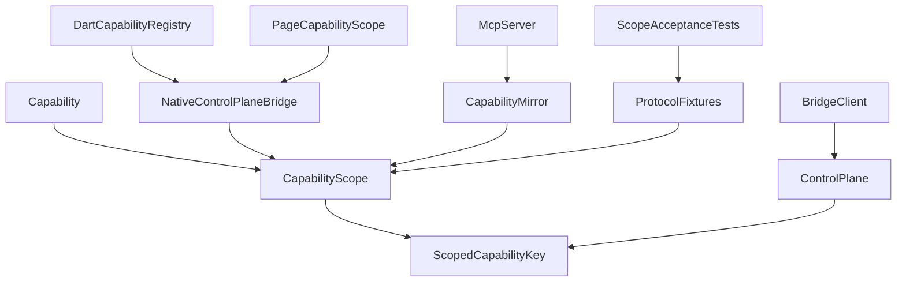
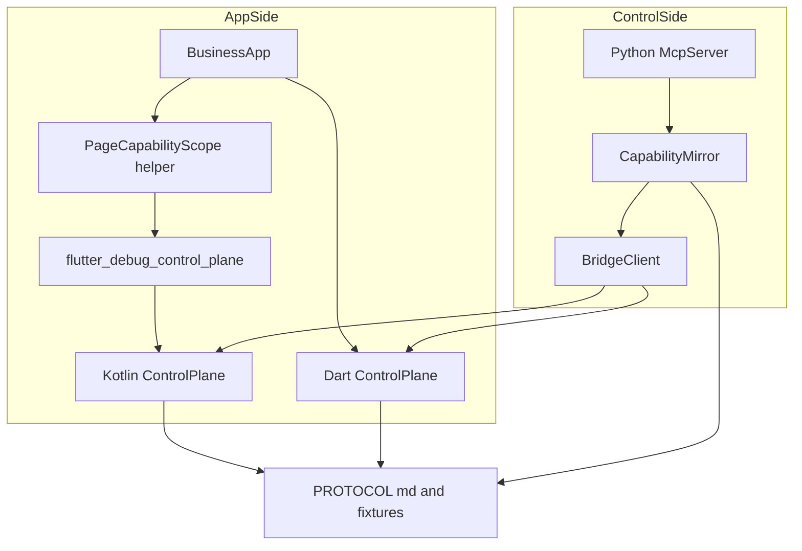
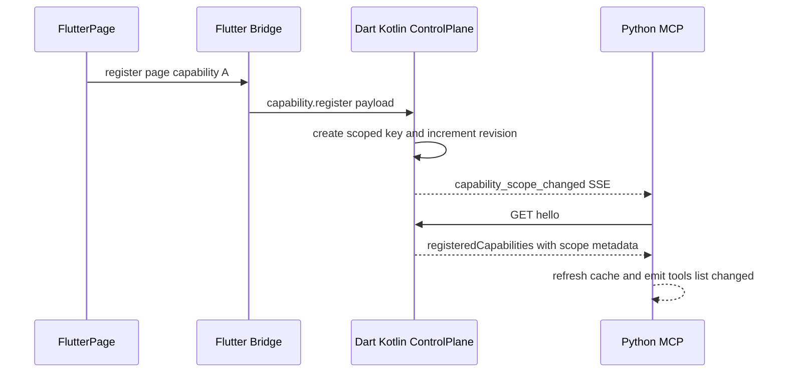
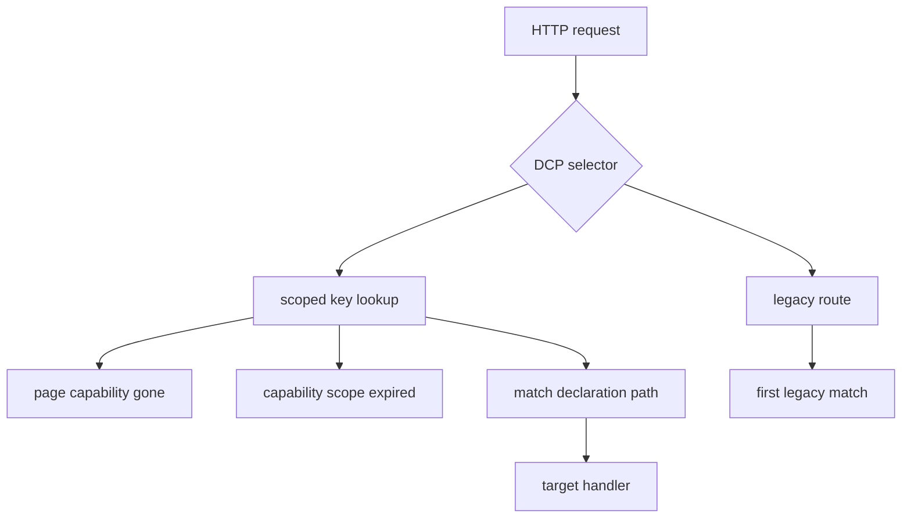
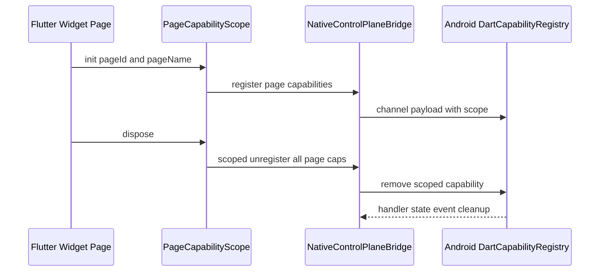
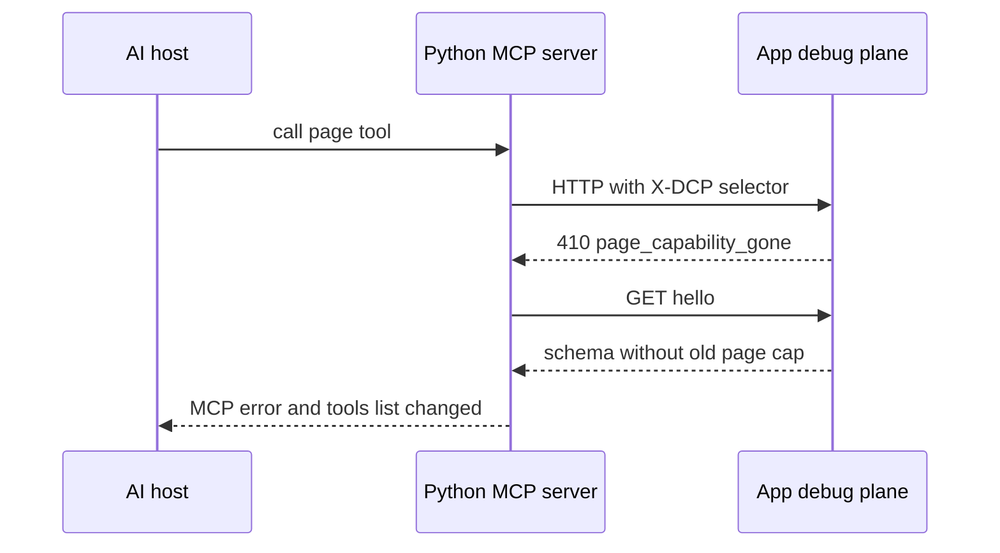

# 调试能力应用级/页面级拆分 — 方案设计

> 关联设计：[测试设计 v1](2026-08-25--capability-scope-split-test.md) / [AcceptanceSpec v1](2026-08-25--capability-scope-split-acceptance-spec.yaml)

## 1. 目标

- BF001：在 `/hello.registeredCapabilities[]` 中新增 `scope/pageId/pageName/scopeRevision`，旧 capability 缺省为 `app`。
- BF002：定义页面能力失效与镜像过期的稳定错误，以及 `capability_scope_changed` 刷新事件。
- BF003：Dart/Kotlin core 增加 `CapabilityScope` 模型，保持旧 `Capability.id` 接口兼容。
- BF004：registry 从裸 `id` 升级为 scope-aware identity，支持多个 active page scope 并存和 scoped unregister。
- FF001：Flutter plugin 的 MethodChannel 注册、事件、state、反向调用都透传 scope identity。
- FB001：Flutter example/helper 提供页面进入注册、页面离开解除注册的接入样例。
- BF005：Python `CapabilitySchema` 解析和输出 app/page metadata。
- BF006：MCP tools/list_changed 能识别页面进入/离开；旧页面工具调用返回 gone/expired 后刷新。
- BF007/BF008：补跨语言 fixture、unit、Python MCP、Flutter Android 集成验收。

## 2. 现状分析

已有能力：

- Dart/Kotlin `ControlPlane` 已有 `register`、`unregister`、`/hello`、`/state`、`/events`、flat route dispatch 和 auth gate。
- `PROTOCOL.md` 已把 `/hello.registeredCapabilities` 定为 MCP runtime schema 真相源，path 是 JSON 数组。
- Flutter plugin 已有 `NativeControlPlaneBridge.register/unregister`、`DartCapabilityRegistry`、reverse invoke、event/state push。
- Python MCP 已有 `CapabilityMirror.refresh`、`ToolSpec`、`list_changed`、`invoke_command/read_resource` fallback。
- R002 已建立 Android example 真机/集成验收路径。

需要改造的卡点：

- registry 当前以裸 `id` 判重，无法表达不同 `pageId` 下同名 page capability 并存。
- route dispatch 当前全局平铺、首匹配胜出；多页面同路径会命中不确定页面。
- `/state` 当前扁平 spread 所有 capability state，page state 同 key 会互相覆盖。
- Flutter bridge 的 channel payload、state/event/reverse invoke 都只携带 `capId`。
- Python MCP schema 和 meta tools 不能传递页面 scope selector，也无法稳定识别 stale page call。

不需要改的方向：

- 不修改 `protocolVersion=1`，本次是向后兼容字段和 header 扩展。
- 不把 `pageId/pageName` 拼进 capability `id` 或 MCP tool name。
- 不实现页面树调试 UI，不自动监听 Flutter Navigator，不引入业务包依赖。
- 不改变 Android plane start/stop 归宿主的架构约束。

## 3. 方案总览

### 项目结构

- 🔵 `PROTOCOL.md` / `fixtures/`：扩展 capability scope schema、selector header、gone/expired 错误和刷新事件 fixture。
- 🔵 `dart/lib/src/capability.dart`：新增 `CapabilityScope` / `CapabilityScopeType`，旧 capability 默认 app。
- 🔵 `dart/lib/src/control_plane.dart`：scope-aware registry、selector dispatch、page state 聚合策略、scope changed event。
- 🔵 `kotlin/src/main/kotlin/com/pantas/debug/controlplane/Capability.kt`：Kotlin mirror scope 模型。
- 🔵 `kotlin/src/main/kotlin/com/pantas/debug/controlplane/ControlPlane.kt`：Kotlin core 同步 Dart 行为。
- 🔵 `flutter_debug_control_plane/lib/src/native_control_plane_bridge.dart`：注册、unregister、event/state push 增加 scope identity。
- 🔵 `flutter_debug_control_plane/android/src/main/kotlin/.../DartCapabilityRegistry.kt`：保存 scope-aware `BridgeCapability`。
- 🟢 `flutter_debug_control_plane/lib/src/page_capability_scope.dart`：Flutter 页面生命周期 helper。
- 🔵 `python/debug_control_plane/mcp_plane/capability_mirror.py`：CapabilitySchema 增加 scope/page 字段。
- 🔵 `python/debug_control_plane/mcp_plane/bridge_client.py` / `server.py`：meta tools 支持 scope selector header、gone/expired 后刷新。
- 🟢 `.dev-flow/R003/analysis/2026-08-25--capability-scope-split-acceptance-spec.yaml`：UI 稳定标识与交互验收。

### 类图

### 模块依赖图

图例：绿色为新增，蓝色为改造，灰色为既有不变调用方；本 RC 无删除节点。调用方向从业务注册侧和 Python 控制侧指向 App debug plane，最终授权和 capability 有效性仍由 App debug plane 判定。

### 职责划分

| 模块 | 职责 | 不负责 |
|---|---|---|
| 协议层 | 字段、header、错误 code、SSE 刷新事件、fixture | 业务页面树、产品 UI |
| Dart/Kotlin core | scope-aware registry、dispatch、hello、state 策略、事件订阅清理 | 自动感知页面生命周期 |
| Flutter plugin | MethodChannel 透传 scope identity，helper 管理页面注册/解除 | 自动启动/停止 plane |
| Python MCP | 镜像 scope schema，生成/刷新 tools，旧 page 调用收敛 | 发明 pageId 或最终授权 |

## 4. 数据模型与接口

### 数据模型

| 模型 | 字段 | 编号追溯 | 说明 |
|---|---|---|---|
| `CapabilityScope` | `type: app|page`、`pageId?`、`pageName?`、`revision?` | BF001/BF003 | `page` 时 `pageId` 必填；旧 capability 归一化为 `app`。 |
| `ScopedCapabilityKey` | `scope`、`pageId?`、`capabilityId` | BF004 | registry 内部唯一键；app 为 `(app,id)`，page 为 `(page,pageId,id)`。 |
| `CapabilitySchema` | `capability_id`、`resources`、`commands`、`description?`、`scope`、`page_id?`、`page_name?`、`scope_revision?` | BF005 | Python mirror 的纯逻辑 schema。 |
| `ToolScopeSelector` | `capability_id`、`scope?`、`page_id?`、`scope_revision?` | BF006 | MCP meta tools 的可选参数，缺省兼容 app/唯一匹配。 |
| `PageCapabilityRegistration` | `pageId`、`pageName?`、`capabilities[]` | FB001 | Flutter helper 管理页面级注册和 dispose 清理。 |

### `/hello.registeredCapabilities[]`

| 字段 | 类型 | 必填 | 编号 | 契约 |
|---|---|---|---|---|
| `id` | string | 是 | BF001 | 原 capability id，不拼接 pageId。 |
| `resources` / `commands` | array | 是 | BF001 | path 仍是 JSON 数组。 |
| `description` | string | 否 | BF001 | 既有字段，非空才输出。 |
| `scope` | `app|page` | 否 | BF001 | 缺省等价 `app`；新实现建议显式输出。 |
| `pageId` | string | `scope=page` 时是 | BF001 | 业务传入，runtime 只校验非空。 |
| `pageName` | string | 否 | BF001 | 展示用，不参与唯一性。 |
| `scopeRevision` | int | 否 | BF001/BF002 | 该 entry 最近一次注册/更新时的 registry revision。 |

### Selector header

| Header | 定义方 | 消费方 | 编号 | 说明 |
|---|---|---|---|---|
| `X-DCP-Capability-Id` | BF002/BF004 | Dart/Kotlin dispatch | BF002/BF004 | 明确指定目标 capability id。 |
| `X-DCP-Capability-Scope` | BF002/BF004 | Dart/Kotlin dispatch | BF002/BF004 | `app` 或 `page`。 |
| `X-DCP-Page-Id` | BF002/BF004 | Dart/Kotlin dispatch | BF002/BF004 | `scope=page` 时用于精确命中页面 capability。 |
| `X-DCP-Scope-Revision` | BF002/BF004 | Dart/Kotlin dispatch | BF002/BF004 | 可选 stale 检测；不一致返回 `capability_scope_expired`。 |

兼容规则：旧 HTTP 客户端不带 header 时继续走现有 flat route matching。Python MCP 在用户指定 `scope/page_id` 或 schema 能唯一确定 page tool 时必须带 selector header，避免多页面同路径 first-match-wins。

### 错误与事件

| 场景 | HTTP status | code | 编号 | 刷新语义 |
|---|---:|---|---|---|
| 指定 page identity 已不在 registry | 410 | `page_capability_gone` | BF002/BF006 | Python 标记 mirror stale 并刷新 `/hello`。 |
| 指定 scope revision 与当前 entry 不一致 | 409 | `capability_scope_expired` | BF002/BF006 | 不重试旧调用，刷新后再决策。 |

事件：`capability_scope_changed` 通过既有 `/events` SSE 发送，payload 扁平展开：`change`、`scope`、`capabilityId`、`pageId?`、`pageName?`、`scopeRevision`。控制端收到事件后重新拉 `/hello`，不做局部 diff 猜测。

### `/state` 聚合策略

`/state` 和 `/hello` 顶层 state spread 只聚合 `scope=app` capability。页面能力 state 不进入顶层聚合，避免不同页面同 key 覆盖；页面调试状态应通过 page capability 自己声明的 resource 读取。该策略保持旧 app 行为兼容，并把 page 状态冲突从框架层移除。

### Flutter MethodChannel payload

| Method | 新字段 | 编号 | 说明 |
|---|---|---|---|
| `capability.register` | `scope`、`pageId?`、`pageName?` | FF001 | 缺省 app；page 缺 pageId 时 Dart/native 双侧拒绝。 |
| `capability.unregister` | `scope?`、`pageId?`、`capId` | FF001/FB001 | 旧调用缺省 app；page helper 必须传 page identity。 |
| `events.emit` | `scope?`、`pageId?`、`capId` | FF001 | native 用 scope-aware key 找到 event flow。 |
| `capability.state.update` | `scope?`、`pageId?`、`capId` | FF001 | app state 可聚合；page state 只缓存给 scoped reverse path，默认不进顶层 `/state`。 |
| `capability.invoke` | native -> Dart 带 `scope/pageId/capId` | FF001 | Dart 端按 scope-aware key 找 handler。 |

## 5. 核心流程

### 注册与发现

### Scoped dispatch

### 页面生命周期

### Stale tool 收敛

## 6. 技术决策

| ID | Type | 决策 | Must Plan | Source | Blast Radius |
|---|---|---|---|---|---|
| DEC-R003-001 | protocol | scope metadata 是 `/hello.registeredCapabilities[]` 顶层可选字段，`protocolVersion` 不变 | 是 | BF001 | PROTOCOL、fixtures、Dart/Kotlin/Python parser |
| DEC-R003-002 | runtime | registry 唯一键为 `(scope,pageId?,capabilityId)`，旧 `register/unregister(id)` 映射 app | 是 | BF003/BF004 | Dart/Kotlin core、Flutter plugin |
| DEC-R003-003 | dispatch | 新增可选 `X-DCP-*` selector header；无 header 走 legacy flat dispatch | 是 | BF002/BF004/BF006 | BridgeClient、ControlPlane dispatch、tests |
| DEC-R003-004 | state | `/state` 和 `/hello` 顶层 state 只聚合 app capability，page state 不顶层 spread | 是 | BF004 | PROTOCOL、Dart/Kotlin tests |
| DEC-R003-005 | refresh | `capability_scope_changed` 只提示刷新；第一版不定义增量 diff 应用 | 是 | BF002/BF006 | SSE、Python refresh |
| DEC-R003-006 | flutter | Flutter helper 不自动追踪 Navigator，只提供显式页面生命周期注册器 | 是 | FB001 | example、业务接入文档 |
| DEC-R003-007 | mcp | tool name 不强制包含 pageName；pageName/pageId 放入 description 和可选 input schema | 是 | BF006 | CapabilityMirror、server tests |

第三方依赖：不新增运行时依赖。测试继续使用现有 Flutter test、Gradle/JVM test、pytest 和 `ci/ci-check-all.sh`。

## 7. 验收标准

| 编号 | 验收条件 | 验证方式 |
|---|---|---|
| BF001 | 旧 `/hello` fixture 仍可解析，新 fixture 包含 app/page/multi-page scope metadata | Dart/Kotlin/Python golden/unit |
| BF002 | 指定已离开 page capability 返回 `page_capability_gone`，revision 不一致返回 `capability_scope_expired` | Dart/Kotlin dispatch tests + Python server tests |
| BF003/BF004 | Dart/Kotlin 支持同 id 不同 pageId 并存，同 pageId+id 重复失败，scoped unregister 不误删 | unit tests |
| FF001 | MethodChannel register/unregister/event/state/reverse invoke 保留 scope identity | Flutter unit + Android JVM tests |
| FB001 | Flutter example 页面进入注册、离开解除，多 page scope 互不影响 | Flutter example tests + Android integration |
| BF005/BF006 | Python mirror diff 识别 schema grow/shrink，MCP 发 list_changed，旧 page tool 调用后刷新 | pytest |
| BF007 | `ci/ci-check-all.sh` 覆盖可自动运行的跨语言回归 | 本地/CI |
| BF008 | Android 真机验收记录 page A gone 后 app/page B 仍可用 | integration evidence |

## 8. 暂不实现

- 不做页面树浏览器、页面层级可视化或复杂调试 UI。
- 不让 Flutter plugin 自动订阅 Navigator/RouteObserver；业务或 example 显式调用 helper。
- 不强制重命名 MCP tool id，也不强制 `pageName` 唯一。
- 不改变旧客户端无 selector header 的 flat route 兼容路径；新页面工具由 Python MCP 带 selector 精确命中。
- 不把 page capability state 扁平聚合到 `/state`；如后续需要页面状态总览，另开 RC 设计 scope-aware state endpoint。
