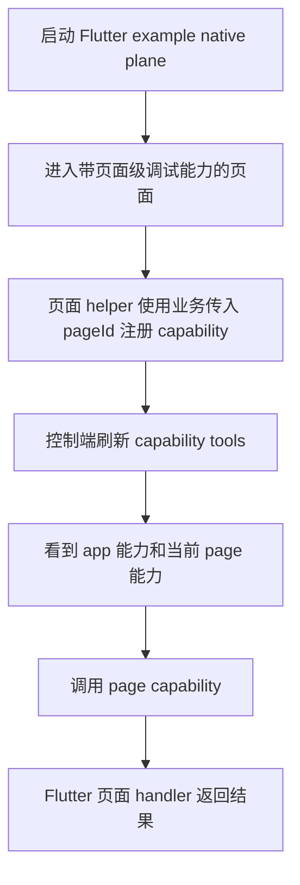
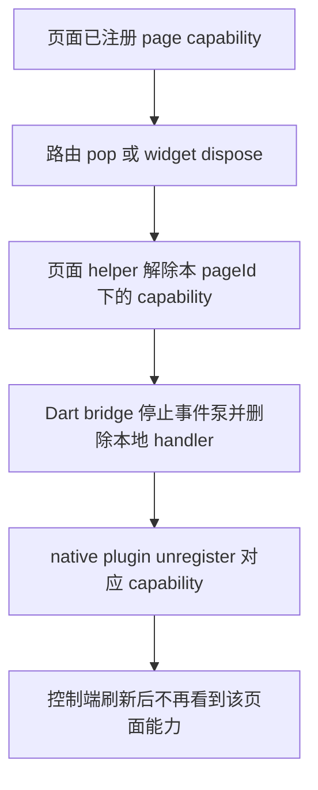

# S03 Flutter Plugin/Page Lifecycle — Capability Scope Split 切片分析

## 概述

本切片负责 Flutter Android plugin 与 Flutter example 层的页面级 capability 生命周期：在保持既有 app 级 capability 默认兼容的前提下，让 Flutter 宿主在页面进入时注册 `scope=page` 的 capability，在页面离开时解除注册，并允许多个 active page scope 同时存在。现有实现中 `NativeControlPlaneBridge.register` 只向 MethodChannel 发送 `capId/resources/commands`，`DartCapabilityRegistry` 也只用 `capId` 索引 `BridgeCapability`；因此 S03 需要把 capability scope 元数据作为注册 payload 的桥接扩展，并提供 Flutter 页面生命周期 helper/example，避免业务页面直接拼装底层 channel 调用。

本切片不改变 Android debug plane 的启动/停止归属：`architecture.md` 规定 Android 生命周期归宿主，debug plane 不自动启动；页面级注册只发生在宿主已启动 plane 后。也不引入业务包依赖；`pageId` 可由业务传入，`pageName` 仅作为展示元数据，MCP tool id 第一版不强制改名。

## 一、交互链

### SCN-FLUTTER-PAGE-LIFECYCLE：页面进入后暴露页面级调试能力

作为 Flutter 业务开发者，我想在页面进入时挂载该页面的调试能力，以便控制端只看到当前活跃页面能响应的页面级工具。

用户可感知验收点：

| 步骤 | 可观察结果 |
|------|------------|
| 启动 native plane | 既有 4 个 app 级 capability 仍按旧流程注册 |
| 进入页面 | 新增 page capability 通过 helper 注册，不要求业务直接操作 MethodChannel |
| 控制端刷新 | 能区分 `scope=app` 与 `scope=page`；page capability 带 `pageId` 与可选 `pageName` |
| 调用页面能力 | native 仍通过 `capId + routeKind + routeIndex` 反向调用 Dart handler |

### SCN-FLUTTER-PAGE-LIFECYCLE：页面离开后解除页面级调试能力

作为 Flutter 业务开发者，我想在页面离开时自动解除该页面注册过的调试能力，以便控制端不再长期暴露已离开页面的能力。

用户可感知验收点：

| 步骤 | 可观察结果 |
|------|------------|
| 页面离开 | helper 只解除该页面持有的 capability，不影响 app 级 capability |
| 多页面活跃 | 允许多个 `pageId` 同时活跃；关闭其中一个页面不解除其它页面能力 |
| 离开后调用 | 若控制端使用旧工具缓存继续调用，底层应返回稳定 gone/expired 类错误，触发控制端刷新 |

## 二、逻辑树

### 事件流：页面级 capability 注册

| 时刻 | 事件 | 处理 | 产生的新事件 |
|------|------|------|--------------|
| T1 | Flutter 页面进入 | 页面 helper 接收 `pageId`、可选 `pageName` 与 capability builder | 生成页面级 `BridgeCapability` 注册请求 |
| T2 | Dart 调用 `NativeControlPlaneBridge.register` | 在现有 `capId/resources/commands` payload 上补充 scope metadata；未传 scope 的旧能力默认 `app` | MethodChannel `capability.register` |
| T3 | Android plugin 收到 `CAPABILITY_REGISTER` | `parseDecl` 继续解析 resources/commands，同时读取 scope metadata；缺省 `scope=app` | `DartCapabilityRegistry.register` |
| T4 | Registry 创建 `BridgeCapability` | native 保存 `capId -> BridgeCapability`，并保留 `scope/pageId/pageName` 供 manifest/tool 展示链路消费 | `ControlPlane.register(cap)` |
| T5 | 控制端刷新 | 后续切片消费 native manifest/scope 字段；MCP 可展示 `pageName` | page capability 出现在活跃能力集合 |

异常流：

| 异常 | 处理 |
|------|------|
| page scope 缺少 `pageId` | Dart helper 应阻止注册并返回参数错误；native 侧也应拒绝无 `pageId` 的 page payload |
| duplicate identity | 现有实现只按裸 `capId` 判重；R003 需要随核心 registry 升级为 scope-aware key，允许不同 `pageId` 下同名 page capability 共存，同一 `pageId + capId` 仍重复失败 |
| plane 未启动 | 沿用现有 `not_started`；页面 helper 不负责启动 plane |

### 事件流：页面级 capability 解除

| 时刻 | 事件 | 处理 | 产生的新事件 |
|------|------|------|--------------|
| T1 | 页面 dispose / route leave | helper 找到本页面已注册 capability id 列表 | 调用 `NativeControlPlaneBridge.unregister(capId)` |
| T2 | Dart bridge unregister | 发送 MethodChannel `capability.unregister`，删除 `_caps/_registeredIds`，取消事件泵 | native unregister |
| T3 | Android plugin unregister | `DartCapabilityRegistry.remove(capId)`，`PlaneCarrier.plane?.unregister(cap.id)`，`pluginBridge.teardownCapability(capId)` | active page scope 能力集合收缩 |
| T4 | 控制端旧缓存调用已离开 capability | native/core 找不到路由或 capability | 返回稳定 gone/expired 语义，控制端刷新 |

### 状态流转

| 实体 | 触发事件 | 前状态 | 后状态 |
|------|----------|--------|--------|
| app capability | 旧 `register(cap)` | 未注册 | `scope=app` 已注册 |
| page capability | 页面 helper 注册 | 未注册 | `scope=page,pageId,pageName?` 已注册 |
| page scope | 第一个页面 capability 注册 | absent | active |
| page scope | 同 pageId 下最后一个 capability unregister | active | inactive |
| Dart bridge `_caps` | unregister/dispose | 含页面 capability handler | 已删除 handler |
| Dart bridge `_eventPumps` | unregister/dispose | 页面 capability event pump active | event pump cancelled |
| native registry | unregister | `capId -> BridgeCapability` 存在 | 映射删除 |

## 三、功能编号与网络定位

### 本切片 owner

| Owner ID | 类型 | 说明 |
|----------|------|------|
| SCN-FLUTTER-PAGE-LIFECYCLE | 场景 | Flutter 页面进入注册、页面离开解除注册的完整用户链路 |
| FF001 | 前端基础 | Flutter plugin capability scope bridge |
| FB001 | 前端业务 | Flutter 页面级能力生命周期 helper/example |

### 本次新增节点

| 编号 | 功能节点 | 前缀含义 | 简介 | 五项原子检查 |
|------|----------|----------|------|--------------|
| FF001 | Flutter plugin capability scope bridge | 前端基础 | 扩展 Dart `NativeControlPlaneBridge` 与 Android plugin registry，使 capability 注册 payload 携带 `scope/pageId/pageName`，旧 payload 缺省为 app | trigger=register 调用；responsibility=桥接 scope metadata；result=native registry 可识别 scope；acceptance=旧 app 能力兼容且 page 能力带 metadata；independently_absent=缺席时 helper/example 可存在但无法透传 page scope |
| FB001 | Flutter 页面级能力生命周期 helper/example | 前端业务 | 提供 Flutter 页面进入/离开注册 page capability 的 helper 与 example，屏蔽直接 MethodChannel 操作 | trigger=页面生命周期；responsibility=页面能力注册与解除；result=页面 active 时能力可见、离开后不可见；acceptance=多 active page scope 互不影响；independently_absent=缺席时底层 bridge 仍可被手写调用 |

### 网络定位

| 功能编号 | 上游依赖 | 下游消费者 | 网络位置 |
|----------|----------|------------|----------|
| FF001 | 现有 `BridgeCapability`、`NativeControlPlaneBridge.register/unregister`、Android `DartCapabilityRegistry`、plugin `CAPABILITY_REGISTER/UNREGISTER` | Flutter helper/example；后续 core/manifest/MCP scope 消费链路 | Flutter plugin scope metadata 桥接层，位于 Dart capability 与 Kotlin core 之间 |
| FB001 | FF001；Flutter widget/route lifecycle；example `AndroidNativePlane` start/stop 语义 | Flutter example、业务宿主接入文档/样例 | 用户可见的页面级生命周期接入层 |

### 前置依赖

| 依赖节点 | 依赖方式 | 是否已有 |
|----------|----------|----------|
| 既有 native bridge register/unregister | 复用 MethodChannel 生命周期与 reverse invoke | 已有 |
| 既有 app capability 默认行为 | 未声明 scope 视为 `app`，保持旧 API 和测试兼容 | 已有 |
| 多 active page scope 决策 | helper 与 registry 不能使用单一 current page 全局状态 | 已确认 |
| pageId 由业务传入 | helper 参数与 native 校验需要接受业务稳定 id | 已确认 |
| pageName 展示元数据 | 作为可选 metadata 透传，MCP 可展示但 tool id 不强制改 | 已确认 |

## 四、稳定标识预清单

S03 主要是 Flutter plugin/helper 能力，不强制新增生产 UI 控件稳定 ID。若 example 增加页面级 capability 演示入口，建议预留以下中立逻辑标识，供 design 阶段按实际界面裁剪：

| 功能编号 | 稳定标识预清单 | 说明 |
|----------|----------------|------|
| FB001 | `acceptance.page_scope.open_button` | 进入或展示页面级 capability demo 的入口 |
| FB001 | `acceptance.page_scope.page_id_text` | 展示当前业务传入 pageId |
| FB001 | `acceptance.page_scope.registered_count_text` | 展示当前页面级 capability 注册数量 |
| FB001 | `acceptance.page_scope.close_button` | 离开页面并触发 unregister 的入口 |

## 五、边界接口

| 接口/协议 | 定义方 | 消费方 | 敏感度 |
|-----------|--------|--------|--------|
| Dart `NativeControlPlaneBridge.register` 参数扩展 | FF001 | FB001、Flutter 宿主 | 中：影响 Flutter plugin 公共 API，必须默认兼容旧 app capability |
| MethodChannel `capability.register` payload | FF001 | Android `DebugControlPlaneFlutterPlugin.parseDecl`、`DartCapabilityRegistry` | 中：跨 Dart/Kotlin 字段需一致；旧 payload 缺省 app |
| Scope metadata：`scope`、`pageId`、`pageName?` | FF001 | core manifest / Python MCP scope 展示链路（其它 slice） | 中：`pageId` 是业务稳定标识，不应包含敏感用户数据 |
| `capability.unregister` by `capId` | 既有 bridge，S03 复用 | Flutter helper、Android plugin | 低：语义已有；S03 要求 helper 按页面维度批量解除 |
| Flutter page lifecycle helper API | FB001 | Flutter example、业务接入方 | 低：只管理注册/解除，不持有 plane start/stop 生命周期 |
| 离开后调用错误语义 | 跨切片共享契约 | Python MCP adapter / 控制端 | 中：S03 负责产生 unregister 事实；稳定 gone/expired 错误由 core/adapter 切片最终统一 |

边界约束：

- 现有 `capId` 是 native registry 的唯一 key；R003 目标是把 bridge 与 native registry 对齐为 scope-aware key，不要求业务把 `pageId` 硬拼进 `capId`。
- 若同一业务页面能力需要在多个页面实例同时存在，业务传入的 `pageId` 与 capability id 共同构成页面能力身份；同一 `pageId + capId` 重复注册仍应失败。
- `pageName` 是展示字段，不能作为生命周期 key。
- 页面 helper 不启动、不停止 native plane；plane 生命周期仍由 `AndroidNativePlane.start/stop` 或宿主应用负责。

## 六、结论

- 开发顺序建议：先实现 FF001，在 Dart bridge 与 Android plugin registry 中透传并保存 scope metadata，同时保持旧 register payload 默认 `app`；再实现 FB001，用 helper/example 验证页面进入注册、页面离开 unregister、多 page scope 共存。
- 复杂度集中点：现有裸 `capId` 唯一性需要升级为 scope-aware key，以及 page capability 离开后控制端旧缓存调用的稳定错误语义。S03 只负责 Flutter 侧 unregister 与 metadata 透传，错误码最终需与 core/adapter 切片对齐。
- 暂不实现：不强制修改 MCP tool id，不实现页面树 UI，不让 plugin 自动追踪 Flutter Navigator；这些都会扩大业务耦合或跨越本切片边界。
- 本切片功能节点数为 2，无需继续拆分 RC。
