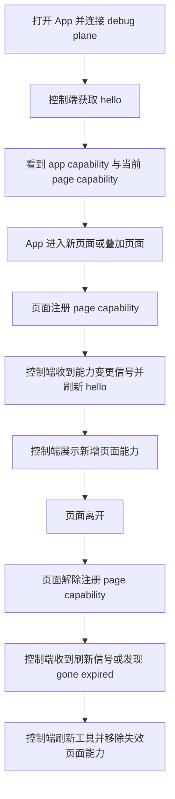
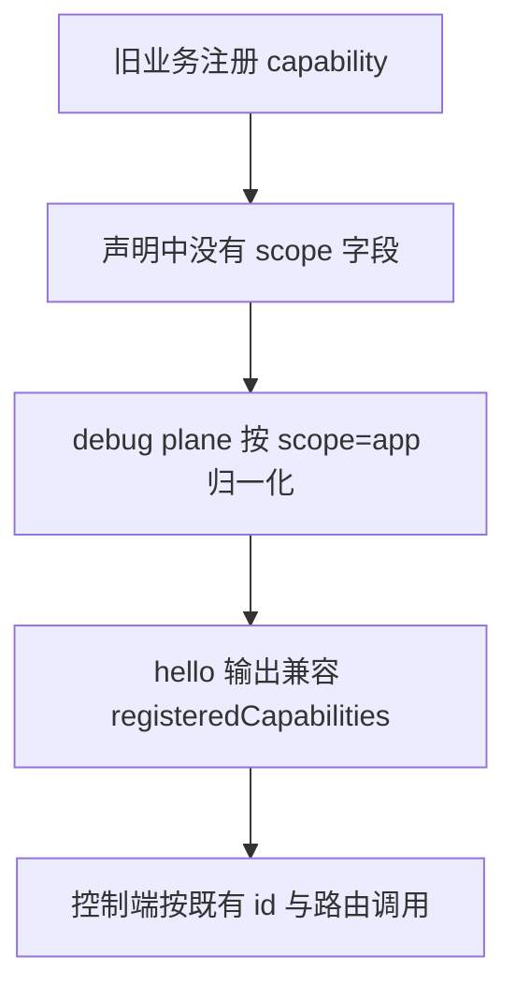
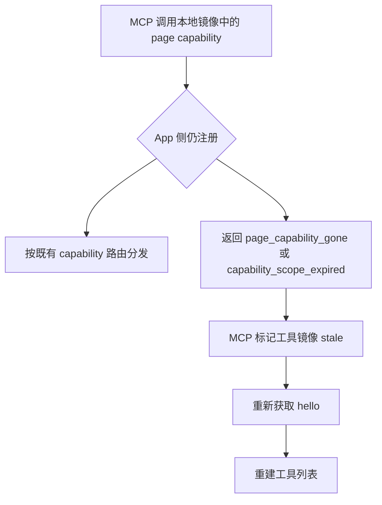

# Capability Scope Split / S01 协议契约切片

## 概述

本切片定义页面级 capability 的协议契约边界，owner IDs 为 `SCN-SCOPE-CONTRACT`、`BF001`、`BF002`。目标是在不破坏现有 `/hello.registeredCapabilities`、扁平 capability 路由、错误体 schema、SSE 事件帧和 `protocolVersion = 1` 的前提下，把 capability 从单一全局注册扩展为 `app` 与 `page` 两类 scope：旧 capability 未声明 scope 时默认 `app`；页面进入时注册 `page` capability；页面离开时解除注册；控制端能区分页面能力已离开、镜像已过期，并据此刷新工具。

本切片采用向后兼容字段新增，不改变既有 `id`、`resources`、`commands` 三键的含义，不要求 MCP tool id 强制改成 `pageName`。`pageId` 可以由业务传入；同一时刻允许多个 active page scope，以覆盖嵌套路由、弹窗、tab、多 Navigator 等宿主形态。`pageName` 只作为展示元数据，Python MCP 可用于 tool title/description 或辅助上下文，不作为强制唯一键。

## 一、交互链

### SCN-SCOPE-CONTRACT：页面能力随页面生命周期进入和离开

作为调试控制端使用者，我想只看到当前仍有效的应用级能力和页面级能力，以便调用工具时不会误操作已经离开的页面。



### BF001：旧 capability 继续按 app scope 工作

作为现有业务接入方，我想不改旧 capability 声明也能继续被发现和调用，以便 scope split 不造成已接入应用的协议破坏。



### BF002：失效页面能力可被识别并触发刷新

作为 MCP adapter，我想在页面能力消失或本地工具镜像过期时得到稳定错误与刷新信号，以便移除失效 tool 后重新发现最新能力。



## 二、逻辑树

### 事件流：页面级 capability 注册与镜像刷新

| 时刻 | 事件 | 处理 | 产生的新事件 |
|---|---|---|---|
| T1 | App 启动并注册旧 capability | 未声明 `scope` 时归一化为 `app`；保留原 `id/resources/commands` 输出 | `/hello.registeredCapabilities` 包含 app capability |
| T2 | 页面进入 | 业务或宿主传入 `pageId`，可选传入 `pageName`，注册 `scope=page` capability | 注册表新增页面能力；能力版本/修订号递增 |
| T3 | 控制端监听到能力变更 | 通过 SSE 刷新信号或调用错误中的刷新提示判断镜像已 stale | 控制端重新请求 `/hello` |
| T4 | `/hello` 重新聚合 capability | 输出 app capability 与所有 active page scope capability；多个 page scope 可并存 | MCP adapter 重建工具展示 |
| T5 | 页面离开 | App 解除该 `pageId` 下页面能力注册；app capability 不受影响 | 注册表移除对应 page capability；能力版本/修订号递增 |

### 事件流：已离开页面能力调用

| 时刻 | 事件 | 处理 | 产生的新事件 |
|---|---|---|---|
| T1 | MCP adapter 使用旧工具镜像发起 capability 调用 | Python bridge 仍按既有 HTTP route 调用 App debug plane，不自行最终判定有效性 | App debug plane 收到敏感 capability 请求 |
| T2 | App debug plane 匹配不到已解除注册的页面能力 | 若可识别为曾存在但当前 gone 的页面能力，返回 `page_capability_gone`；无法识别时仍可走既有 `404 not_found` | 响应体保持 `{ok:false, code, message}` |
| T3 | App debug plane 识别请求携带的 scope revision 已落后 | 返回 `capability_scope_expired`，提示客户端刷新 scope 镜像 | MCP adapter 标记能力缓存 stale |
| T4 | MCP adapter 收到 gone/expired | 不重试原调用；触发 `/hello` 刷新并重建工具 | 失效工具从 MCP 暴露面移除 |

### 状态流转

| 实体 | 触发事件 | 前状态 | 后状态 |
|---|---|---|---|
| Capability 声明 | 旧能力注册且缺省 scope | `scope` 未声明 | 逻辑等价 `scope=app` |
| Page scope | 页面进入并注册页面能力 | 不存在 / inactive | active，绑定业务传入 `pageId`，可带 `pageName` |
| Page scope | 页面离开并 unregister | active | gone，不再出现在 `/hello.registeredCapabilities` |
| Capability mirror | `/hello` 成功返回 | stale / unknown | fresh，记录当前能力集合与 scope 元数据 |
| Capability mirror | 收到能力变更 SSE 或 gone/expired 错误 | fresh | stale，等待重新 `/hello` |
| MCP tool 暴露 | mirror fresh | 待重建 | 暴露 app tools 与 active page tools；可展示 `pageName` |

异常流约束：

- 页面能力解除注册后，不得继续长期暴露为可调用 MCP tool；刷新信号丢失时，下一次调用必须通过 gone/expired 错误触发二次刷新。
- `pageName` 重名不构成协议冲突；唯一定位不能依赖 `pageName`。
- 多个 active page scope 同时存在时，协议层不得把所有页面能力压成单一 current page；聚合输出必须能保留每个页面能力的 scope 元数据。

## 三、功能编号与网络定位

### 本次新增节点

| 编号 | 功能节点 | 前缀含义 | 简介 |
|---|---|---|---|
| BF001 | CapabilityScope 协议字段与向后兼容 | 后端基础 | 在 capability 声明和 `/hello.registeredCapabilities` 镜像中新增 scope 元数据；缺省按 `app` 解释；保持 `protocolVersion=1` 与既有三键兼容。 |
| BF002 | 页面能力 gone/expired 错误与刷新信号契约 | 后端基础 | 定义页面能力失效、镜像过期时的稳定错误 code 与客户端刷新语义；复用现有错误体 schema 和 SSE 事件编码。 |

### 原子性检查

| 编号 | trigger | responsibility | result | acceptance | independently_absent |
|---|---|---|---|---|---|
| BF001 | capability 注册或 `/hello` 聚合 | 定义 scope 字段、默认值和跨语言序列化 | `/hello` 可表达 app/page 能力和页面元数据 | 旧 fixture 仍可解析；新 page 能力可被控制端区分 | 移除后页面能力无法被协议区分，但错误刷新契约仍可独立定义 |
| BF002 | 页面离开、scope revision 落后或调用已失效 page capability | 定义 gone/expired 错误与刷新触发 | 控制端能稳定识别 stale mirror 并重新 `/hello` | 错误体符合 `{ok:false, code, message}`；刷新后失效 tool 消失 | 移除后 scope 字段仍可存在，但控制端无法可靠收敛失效工具 |

### 网络定位

| 节点 | 上游依赖 | 下游消费者 | 网络位置 |
|---|---|---|---|
| BF001 | `PROTOCOL.md §3.2` registeredCapabilities schema、`fixtures/hello.json`、`fixtures/route-decl.json` | Kotlin core、Dart core、Flutter plugin、Python bridge/MCP adapter | 协议模型层；影响 capability 注册表镜像和跨语言解析 |
| BF002 | `PROTOCOL.md §4` SSE 编码、`PROTOCOL.md §5` 错误体 schema、`fixtures/error-*.json` | Python MCP adapter、控制端工具刷新逻辑、App debug plane 路由分发 | 协议状态同步层；影响页面生命周期与工具暴露收敛 |

### 前置依赖

| 依赖节点 | 依赖方式 | 是否已有 |
|---|---|---|
| `/hello.registeredCapabilities` | 作为 capability 动态镜像的承载面 | 已有 |
| `Resource/Command path` JSON 数组 | 保持 route 声明结构，不通过字符串拼 scope | 已有 |
| 错误响应体 `{ok,false,code,message}` | gone/expired 错误沿用同一 schema | 已有 |
| SSE 事件帧 `event:` + `data:` | 能力变更刷新信号沿用现有事件通道 | 已有 |
| 多 active page scope | 协议必须允许多个页面 scope 同时 active | 本次需求确认 |

## 四、边界接口

### CapabilityScope 字段契约（BF001）

建议在 `/hello.registeredCapabilities[]` 元素上新增顶层可选 metadata 字段，避免破坏旧客户端对 `id/resources/commands` 的读取：

```jsonc
{
  "id": "cap-alpha",
  "resources": [{ "method": "GET", "path": ["items"] }],
  "commands": [{ "method": "POST", "path": ["invoke"] }],
  "scope": "page",
  "pageId": "business-provided-page-id",
  "pageName": "Profile",
  "scopeRevision": 7
}
```

字段约束：

| 字段 | 类型 | 必含 | 说明 |
|---|---|---|---|
| `scope` | string enum: `app` / `page` | 否 | 缺省等价 `app`；旧 capability 可完全不输出该字段。 |
| `pageId` | string | `scope=page` 时是 | 页面 scope 的稳定定位键，可由业务传入；同一 active 集合内用于区分页面实例。 |
| `pageName` | string | 否 | 人类可读展示名；MCP 可展示，但 tool id 不强制改为 pageName。 |
| `scopeRevision` | int | 建议 | scope/capability 镜像修订号，用于发现客户端镜像过期。 |

兼容规则：

- 不改变 `registeredCapabilities[].id` 的既有语义：仍是 capability 注册表 key；未明确设计前，不把 `pageId` 或 `pageName` 硬拼入 `id` 作为协议要求。
- 不改变 `resources[].path` / `commands[].path` 的 JSON 数组形态；scope 是元数据，不是路由 path 前缀。
- `protocolVersion` 保持 `1`：新增字段是向后兼容扩展，旧客户端忽略未知字段仍可工作。
- `/state` 聚合状态若纳入页面能力状态，必须避免不同 page capability 扁平 state 键互相覆盖；具体 state 命名或嵌套策略需在后续实现设计中明确，不能由本切片擅自改变 `/state` 无 `ok`、扁平 object 的硬契约。

### gone/expired 错误与刷新信号契约（BF002）

新增错误 code 沿用现有错误体：

| 场景 | HTTP status | code | message guidance | 刷新语义 |
|---|---:|---|---|---|
| 页面已离开，目标 page capability 不再 active | `410` | `page_capability_gone` | Page capability is no longer available. | 客户端必须标记工具镜像 stale 并重新 `/hello`。 |
| 客户端携带或引用的 capability scope revision 落后 | `409` | `capability_scope_expired` | Capability scope mirror expired. | 客户端不得重试旧工具，必须刷新 `/hello` 后再决策。 |

刷新信号建议：

| 信号 | 承载接口 | 定义方 | 消费方 | 敏感度 |
|---|---|---|---|---|
| capability scope changed event | `GET /events` SSE，事件 type 建议 `capability_scope_changed` | App debug plane | Python bridge / MCP adapter | 敏感；沿用 `/events` auth gate |
| scope metadata mirror | `GET /hello.registeredCapabilities[]` 的 `scope/pageId/pageName/scopeRevision` | App debug plane | Python discovery / MCP adapter | 敏感；授权后完整 hello 才返回 |
| gone/expired error | capability GET/POST 响应错误体 | App debug plane | Python bridge / MCP adapter | 敏感；沿用 capability route auth gate |

SSE 事件 payload 建议保持扁平 JSON object，不改变 §4.2：

```jsonc
{
  "type": "capability_scope_changed",
  "sequence": 12,
  "scopeType": "page",
  "pageId": "business-provided-page-id",
  "change": "registered",
  "revision": 7
}
```

`change` 建议取值 `registered` / `unregistered` / `updated`。控制端接到该事件后不应只做本地增量猜测，第一版以重新拉取 `/hello` 为准，避免跨语言实现对局部 diff 的解释不一致。

### 边界接口字段总表

| 接口/协议 | 定义方 | 消费方 | 敏感度 |
|---|---|---|---|
| `/hello.registeredCapabilities[].scope/pageId/pageName/scopeRevision` | App debug plane protocol | Python MCP adapter、Kotlin/Dart/Flutter 实现 | 授权后敏感 |
| `scope/pageId/pageName/scopeRevision` | Capability scope contract | 跨语言 capability registry 与 MCP 展示层 | 授权后敏感 |
| `page_capability_gone` | App debug plane route dispatch | Python bridge/MCP adapter | 敏感能力调用错误 |
| `capability_scope_expired` | App debug plane route dispatch | Python bridge/MCP adapter | 敏感能力调用错误 |
| `capability_scope_changed` SSE | App debug plane event bus | Python bridge/MCP adapter | 敏感 SSE 事件 |

## 五、结论

- S01 建议把 scope 作为 `/hello.registeredCapabilities[]` 的新增可选元数据，而不是改变 capability id、route path 或 MCP tool id；旧 capability 缺省 `app`，旧 fixture 仍应成立。
- 页面级 capability 的核心契约是生命周期绑定：页面进入注册，页面离开解除注册；多个 active page scope 同时存在是协议允许态，不应收敛成单一 current page。
- BF001 的复杂点在跨语言序列化与兼容：`id/resources/commands`、path JSON 数组、`protocolVersion=1`、auth 后完整 hello 的既有规则都不能被 scope split 改坏。
- BF002 的复杂点在失效收敛：SSE 刷新信号负责主动刷新，`page_capability_gone` / `capability_scope_expired` 负责兜底刷新；MCP adapter 不应长期暴露已离开页面的能力。
- 本切片不决定具体语言 API 命名、不改 manifest、不定义业务页面 SDK；后续 design 需明确各语言 CapabilityScope 类型、注册表 key 冲突策略、`/state` 页面状态聚合避免覆盖的策略，以及新增 fixture 的精确 golden 内容。
