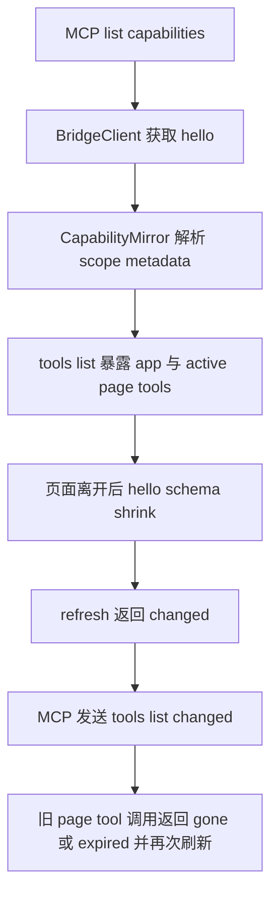

# S04 Python MCP Mirror 切片分析

## 概述

本切片 owner 为 `SCN-MCP-SCOPE-MIRROR`，覆盖 Python `mcp_plane` 对应用级 `app` 与页面级 `page` capability 的镜像、MCP tool manifest 刷新，以及调用已离开页面 capability 时的稳定退化语义。

当前 Python 侧已有 `CapabilityMirror` 作为 `/hello.registeredCapabilities` 到 MCP `ToolSpec` 的纯逻辑镜像层，`BridgeClient` 负责按 `device_id` 转发 `/hello`、`invoke`、`read`、`events`。现状 `CapabilitySchema` 仅包含 `capability_id`、`resources`、`commands`、`description`，未承载 scope/page 元数据；`refresh(device_id)` 通过比较 schema snapshot 触发 `tools/list_changed`；`list_capabilities` 会刷新并返回 schema JSON；`invoke_command`/`read_resource` 目前只按 path 转发，不使用 `capability_id` 做本地 scope 校验。

需求确认已落地到本切片约束：

- 允许多个 active page scope 同时存在。
- `pageId` 可由业务传入，Python 不生成业务 page identity。
- MCP 可展示 `pageName`，但 tool id 不强制改。
- 页面级 capability 在页面进入时注册、页面离开时解除注册；Python 只镜像 App debug plane 的 `/hello` 事实。
- 未声明 scope 的旧 capability 默认视为 `app`。

## 交互链

`SCN-MCP-SCOPE-MIRROR`

作为 MCP adapter 维护者，我想把 `/hello` 中的 app/page capability 准确镜像到 MCP tools，并在页面离开后刷新工具列表，以便 AI host 不会长期调用失效页面工具。

1. App 启动后，宿主 debug plane 暴露 app capability；AI host 通过 MCP `list_capabilities` 或 `tools/list` 获取全局 capability。
2. 用户进入页面后，业务侧把该页面的 page capability 注册进 App debug plane，并带上 `scope=page`、`pageId`、可选 `pageName`。
3. Python MCP adapter 执行 `CapabilityMirror.refresh(device_id)` 拉取 `/hello`，把 app/page capability 一并解析为 schema snapshot；如果 snapshot 变化，MCP server 发出 `notifications/tools/list_changed`。
4. AI host 再次 `tools/list` 时看到更新后的 tool manifest；若某个 provider 生成语义化 tool，tool 描述可展示 `pageName`/`pageId` 帮助用户区分页面上下文，但 tool name 不强制拼接 page id。
5. 用户离开页面后，业务侧 unregister 对应 page capability；下一次 `refresh` 或 `list_capabilities` 使 Python mirror 删除该 page schema，并触发 `list_changed`。
6. 若 AI host 使用旧 tool 列表调用已离开页面的 page capability，Python 需要给出稳定 stale/gone 语义：优先在本地 snapshot 未命中时拒绝并提示刷新；若 snapshot 尚未刷新但 App 已解除注册，则透传 App debug plane 的 404/410/409 等结构化错误，同时触发二次 refresh/list_changed。

## 逻辑树

`SCN-MCP-SCOPE-MIRROR`

### 事件流：MCP scope mirror refresh

| 时刻 | 事件 | 处理 | 产生的新事件 |
|---|---|---|---|
| T1 | `list_capabilities(device_id)` | `BridgeClient.hello` 拉取 `/hello`，`CapabilityMirror` 解析 `registeredCapabilities` | cache 写入 `CapabilitySchema(scope,page_id,page_name)` |
| T2 | 页面进入导致 schema grow | `refresh(device_id)` 比较新旧 dataclass tuple | 返回 `changed=true`，server best-effort 发送 `tools/list_changed` |
| T3 | 页面离开导致 schema shrink | `refresh(device_id)` 发现目标 `(capability_id,scope,page_id)` 消失 | cache 删除 page schema，触发 tools/list_changed |
| T4 | 旧 tool 指定 page 调用 | handler 先查本地 snapshot 是否存在目标 page schema | 不存在则返回 page stale/gone MCP error，不静默转发 |
| T5 | App 端返回 gone/expired | Python 保留结构化错误并触发一次 refresh | 若 manifest 变化则发送 `tools/list_changed` |
| T6 | device offline/auth error | 沿用 DeviceUnreachable/DeviceAuthError 语义 | 不误报为页面 gone |

### 状态流转

| 实体 | 触发事件 | 前状态 | 后状态 |
|---|---|---|---|
| CapabilitySchema | 旧 app capability 解析 | `scope` 缺省 | `scope=app,page_id=None,page_name=None` |
| CapabilitySchema | page capability 解析 | raw hello entry | `scope=page,page_id=<business>,page_name?` |
| Mirror cache | schema grow | old tuple | new tuple，changed=true |
| Mirror cache | schema shrink | 含离开页面 schema | 不含该 page schema，changed=true |
| MCP tool manifest | cache changed | stale | rebuilt |
| Stale page call | snapshot 未命中 | callable assumed | gone/expired error + refresh requested |

- Python MCP scope mirror
  - `BF005` CapabilitySchema scope/page metadata
    - 在 `CapabilitySchema` 增加 `scope`、`page_id`、`page_name` 三类元数据。
    - 解析 `/hello.registeredCapabilities[]` 时读取 `scope`；缺失或非法值默认 `app`。
    - 当 `scope=page` 时保留业务传入的 `pageId`，可选保留 `pageName`；Python 不分配、不推断、不规范化业务 page id。
    - 支持同一 `device_id` 下多个 page capability 同时存在；cache key 仍为 `device_id`，schema 列表内通过 `(capability_id, scope, page_id)` 表达并存关系。
    - `_schemas_to_jsonable` 和 MCP `list_capabilities` 返回值必须包含 scope/page 字段，旧 app capability 也应显式或等价呈现为 `scope=app`。
    - `SemanticProvider.matches/build_tools` 继续接收完整 `CapabilitySchema`，让业务 provider 能按 page metadata 生成描述、输入 schema 或 handler 映射。
  - `BF006` MCP tool refresh 与 stale page capability 调用处理
    - `CapabilityMirror.refresh(device_id)` 的 diff 必须比较 scope/page metadata；页面进入/离开会被识别为 manifest change。
    - `build_tools(device_id)` 聚合 dynamic tools 时不能因同名 page capability 覆盖 app capability；若 provider 仍生成相同 tool name，server 侧 union/去重策略必须有确定结果，并在设计阶段决定是否把 page metadata 放入 tool 描述或输入参数。
    - meta `invoke_command`/`read_resource` 可增加可选 `scope`、`page_id` 参数用于本地校验与错误提示；兼容旧调用时缺省视为 `app` 或按 capability_id 唯一匹配。
    - 调用前若用户指定 `scope=page/page_id` 且 mirror 当前 snapshot 不存在该 capability，应返回稳定 stale/gone MCP 错误，提示重新获取 tools/list_capabilities，不应静默转发到错误页面。
    - 调用后若 App debug plane 返回 page capability gone/expired 类结构化错误，Python 保留原始错误码并触发一次 refresh；若 manifest 变化，发出 `list_changed`。
    - 离线、stale device、auth error 的既有语义保持：设备级 stale 仍走 `DeviceStale`/discover 提示；auth error 不清空 schema；页面级 stale 不能混淆为设备离线。

## 功能编号与网络定位

### `BF005` Python CapabilitySchema scope/page metadata

- 类型：后端基础。
- 代码网络定位：
  - `python/debug_control_plane/mcp_plane/capability_mirror.py`
    - `CapabilitySchema` dataclass：增加 `scope: str = "app"`、`page_id: str | None = None`、`page_name: str | None = None`。
    - `_parse_one(cap)`：解析 `scope`、`pageId`、`pageName`；非法 scope 降级为 `app`；非字符串 page 字段降级为 `None`。
    - legacy sentinel 路径：旧 `target.capabilities` 生成 `scope=app`。
    - `_diff_changed` 依赖 dataclass equality，新增字段天然进入 diff；需保留 frozen/tuple 语义。
  - `python/debug_control_plane/mcp_plane/server.py`
    - `_schemas_to_jsonable`：返回 JSON 时包含 `scope`、`pageId`、`pageName`。
- 测试定位：
  - `python/tests/test_capability_mirror.py` 增加解析 app/page/default/非法值/多 active page schema 的单元测试。
  - `python/tests/test_server.py` 增加 `list_capabilities` 返回 scope/page 字段的 handler 测试。
- 验收要点：
  - 未声明 scope 的旧 capability 默认 `app`。
  - 多个 page capability 可同时出现在同一设备 schema snapshot 中。
  - `pageName` 只作为展示元数据，不参与强制 tool id 生成。

### `BF006` MCP tool refresh 与 stale page capability 调用处理

- 类型：后端基础。
- 代码网络定位：
  - `python/debug_control_plane/mcp_plane/capability_mirror.py`
    - `refresh(device_id)`：确认页面进入/离开、`pageName` 变化、`pageId` 变化均进入 changed 判断。
    - `build_tools(device_id)` / `_build_sugar(schema)`：把带 page metadata 的 schema 传给 provider；不在 mirror 层硬编码业务 capability。
    - 可新增纯函数用于按 `capability_id/scope/page_id` 判断 snapshot 中 capability 是否仍存在，供 server 调用前校验。
  - `python/debug_control_plane/mcp_plane/bridge_client.py`
    - 保持 HTTP 透传职责，不生成 page metadata；需要时只新增调用后错误分类辅助，不改变 App debug plane 协议真相。
  - `python/debug_control_plane/mcp_plane/server.py`
    - `h_invoke_command` / `h_read_resource`：支持可选 `scope`、`page_id` 参数；当指定 page capability 已不在 snapshot 中时返回稳定 MCP error。
    - handler 捕获 App 返回的 page gone/expired 错误后触发 `mirror.refresh(device_id)` 并 best-effort `list_changed`。
- 测试定位：
  - `python/tests/test_capability_mirror.py`：页面 unregister 后 `refresh` 返回 changed，`schemas` 删除对应 page capability。
  - `python/tests/test_server.py`：旧 page capability 调用本地命中 stale/gone、App 返回 gone 后触发 refresh/list_changed、auth/device stale 语义不被误报为 page stale。
  - `python/tests/test_e2e_mock.py` 可覆盖 `/hello` 从含 page schema 到不含 page schema 的 mock 端到端刷新。
- 验收要点：
  - 页面离开后 MCP 不长期暴露已失效 page tools。
  - 已缓存旧 tool 的客户端调用时得到稳定、可解释的 gone/expired 结果。
  - 旧 meta tool 调用仍兼容，不强制业务方把 page id 拼入 capability id 或 tool id。

## 边界接口

- App debug plane → Python `/hello`：`registeredCapabilities[]` 每项继续保留 `id/resources/commands/description`，新增可选 `scope`、`pageId`、`pageName`。Python 对缺省 scope 解释为 `app`。
- Python `CapabilitySchema`：作为 Python mirror 内部 SSOT，必须携带 scope/page metadata；provider 和 server JSON 输出从这里取值。
- MCP `list_capabilities`：返回 schema JSON 包含 `capability_id/resources/commands/description/scope/pageId/pageName`。
- MCP `tools/list`：tool name 保持 provider 决定；Python 平面不强制改 tool id。展示 pageName/pageId 的推荐位置是 `ToolSpec.description` 或 input schema description。
- MCP `invoke_command`：保持 `device_id/capability_id/command_path/args`，可扩展 `scope/page_id` 为可选字段；未传时兼容旧 app capability。
- MCP `read_resource`：保持 `device_id/capability_id/resource_path/params`，可扩展 `scope/page_id` 为可选字段；未传时兼容旧 app capability。
- 错误边界：设备级不可达/TTL/auth 仍由 `BridgeClient` 现有错误体系表达；页面级 capability gone/expired 应是独立 MCP 错误语义，不改写成设备不可达。

## 结论

S04 需要落两类后端基础能力：`BF005` 让 Python mirror 完整承载 scope/page metadata，`BF006` 让 MCP tool 列表在页面进入/离开后可靠刷新，并让旧 page capability 调用返回稳定 gone/expired 语义。

本切片不要求 Python 发明页面生命周期，也不要求强制修改 tool id。Python 的职责是镜像 App debug plane 暴露的事实、把 page metadata 传递给 MCP 展示/handler、在调用路径上避免把已离开页面的能力误判成仍可用。
