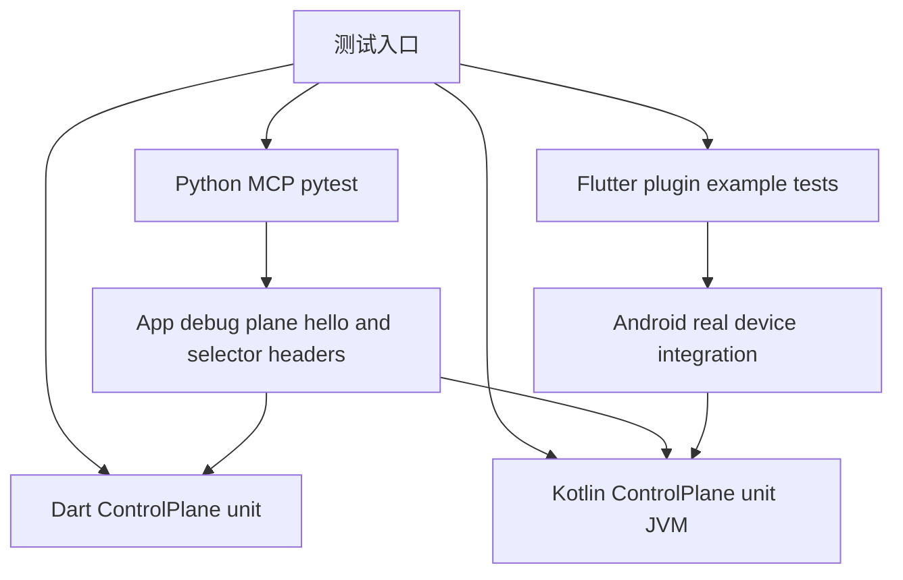

# 调试能力应用级/页面级拆分 — 测试设计

> 关联设计：[主设计 v1](2026-08-25--capability-scope-split-design.md) / [AcceptanceSpec v1](2026-08-25--capability-scope-split-acceptance-spec.yaml)

## 1. 测试策略

- unit.backend/dart：覆盖 `CapabilityScope` 默认 app、pageId 校验、scope-aware registry、selector dispatch、`/state` 只聚合 app。
- unit.android/kotlin：覆盖 Kotlin core 与 Dart 同形行为，包括 `/hello` scope metadata、gone/expired 错误、SSE event。
- unit.flutter：覆盖 MethodChannel payload、BridgeCapability scope identity、PageCapabilityScope helper dispose 清理。
- unit.backend/python：覆盖 `CapabilitySchema` scope 解析、mirror diff、MCP meta tool selector 参数、stale page error 后 refresh。
- integration.cross_stack：`ci/ci-check-all.sh` 继续作为自动回归总入口。
- integration.android/manual：R002 Android 真机验收路径扩展页面 A/B 生命周期证据。

覆盖目标：新增/改造逻辑 unit 覆盖 ≥80%；协议 fixture/golden、selector dispatch、MCP stale 收敛和 Flutter page lifecycle 关键链路 100% 覆盖正常/异常/边界。

## 2. 测试场景矩阵

| 层 | 场景 | 正常 | 异常/边界 | 安全/兼容断言 |
|---|---|---|---|---|
| Protocol fixture | `/hello.registeredCapabilities` | app/page/multi-page 输出 scope metadata | 缺 scope 默认 app，page 缺 pageId fixture 不允许 | `protocolVersion=1` 不变，path 仍 JSON array |
| Dart core | registry | app 与 page 注册、不同 pageId 同 id 并存 | 同 `(pageId,id)` 重复失败，scoped unregister 不误删 | auth gate 仍在 handler 前执行 |
| Dart core | dispatch | 带 selector header 命中目标 page | page gone=410，revision mismatch=409，无 header legacy flat | 旧无 header route 兼容 |
| Kotlin core | hello/state/events | scope metadata 与 Dart 一致，page state 不顶层 spread | unregister 后 event subscription 取消 | 未授权 hello 仍不暴露 registeredCapabilities |
| Flutter bridge | channel payload | register/unregister/event/state 带 scope identity | page 缺 pageId 参数错误，dispose 重复调用 no-op | 不启动/停止 plane |
| Flutter helper/example | 页面生命周期 | page A/page B 并存，离开 A 后 B/app 保留 | route pop/dispose 清理，重复进入生成稳定 pageId | stable identifiers 存在 |
| Python mirror | schema parse/diff | app/page/pageName/scopeRevision 保真，grow/shrink changed | malformed scope 降级 app，auth error 不清空为 no caps | device stale/offline 语义不误报 page gone |
| Python MCP server | meta tools | `invoke_command/read_resource` 可选 scope/page_id 发 selector header | snapshot 未命中 page 返回 stale/gone，App gone 后 refresh | token 仍走 Bearer header |
| Android integration | 真机链路 | example 页面 A/B 注册/解除，HTTP/MCP 刷新可见 | 页面 A gone 后旧工具失败并刷新 | 不引入业务依赖 |

## 3. 验收标准

| 编号 | 标准 | 命令/操作 |
|---|---|---|
| BF001/BF002/BF003/BF004 | Dart core scope registry、selector dispatch、state/event 测试通过 | `cd dart && fvm flutter test` |
| BF001/BF002/BF003/BF004 | Kotlin core scope registry、hello fixture、dispatch 错误测试通过 | `./gradlew build` |
| FF001/FB001 | Flutter plugin/helper channel 与 example unit 测试通过 | `cd flutter_debug_control_plane && fvm flutter test` |
| BF005/BF006 | Python mirror/server scope/stale 测试通过 | `cd python && ${PYTHON_BIN:-python3} -m pytest tests -q --no-header` |
| BF007 | 自动化跨语言回归通过 | `bash ci/ci-check-all.sh` |
| BF008 | Android 真机页面能力验收有 evidence | R003 test override 或手动 integration 脚本 |

## 4. 集成测试方案

环境拓扑：

- 自动化 unit 在本机跑，不依赖真机。
- Android 真机验收复用 R002 example app 和授权验收路径，增加页面 A/B demo。
- Python MCP integration 可用 mock `NetworkTarget` 覆盖 schema grow/shrink，也可连接真实 Android endpoint 做 evidence。
- 每个集成用例结束必须 stop plane 或 scoped unregister，避免后续用例继承 stale registry。

真实 vs Mock 边界：

- 协议字段、Python diff、MCP handler 可用 mock/fixture 覆盖。
- MethodChannel payload 用 Flutter unit 和 Android JVM test 覆盖。
- 页面生命周期最终必须有 Android 真机或 integration evidence，证明 Dart helper、plugin、Kotlin core、HTTP/MCP 链路连通。

故障注入：

- 注册 `scope=page` 但缺 `pageId`。
- 同 pageId + id 重复注册。
- 带旧 `X-DCP-Scope-Revision` 调用。
- 页面 unregister 后旧 tool 调用。
- auth denied/expired 与 page gone 同时存在时，优先保持 auth 事实边界，不把授权错误改写成 page gone。

## 5. 测试数据与 Mock 实现策略

- 新增中性 fixture capability：`sample.app`, `sample.page.panel`, `sample.page.form`，不含业务包名。
- pageId 使用稳定字符串：`page-a`, `page-b`；pageName 使用 `Page A`, `Page B`。
- fixture 路径保持 JSON array，例如 `["debug","read"]`，用于覆盖多页面同路径 selector。
- Python tests 使用 frozen `CapabilitySchema` tuple 比较 diff，断言 pageName 变化、page unregister 都返回 changed。
- Flutter helper tests 使用 fake bridge 记录 register/unregister payload，不启动 native plane。
- Android integration evidence 记录 `/hello` 中 app/page A/page B 三个阶段：进入 A、进入 B、离开 A。

## 6. 暂不测试

- 不做页面树 UI 的视觉像素验收。
- 不做 iOS native plugin 验收。
- 不做设备农场或自动安装 APK 的完整流水线。
- 不重复测试 R001 token hash 和授权内部算法，只验证 R003 不破坏 auth gate。
- 不测试业务 provider 自定义 semantic tool 的所有命名策略；只验证 page metadata 传入 provider。
