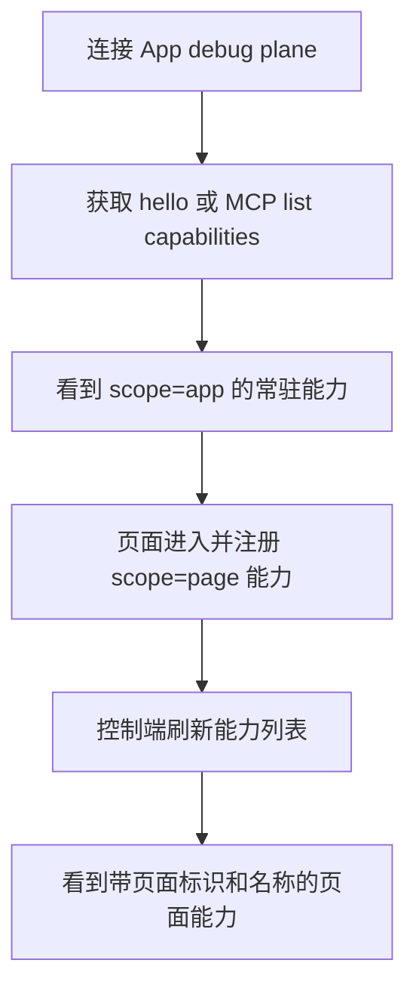
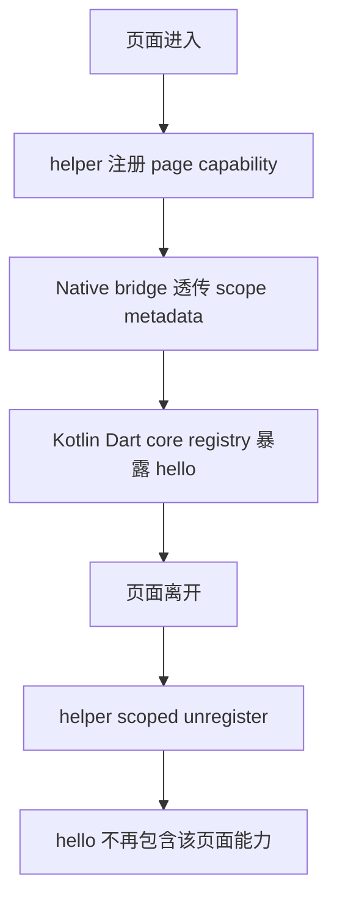
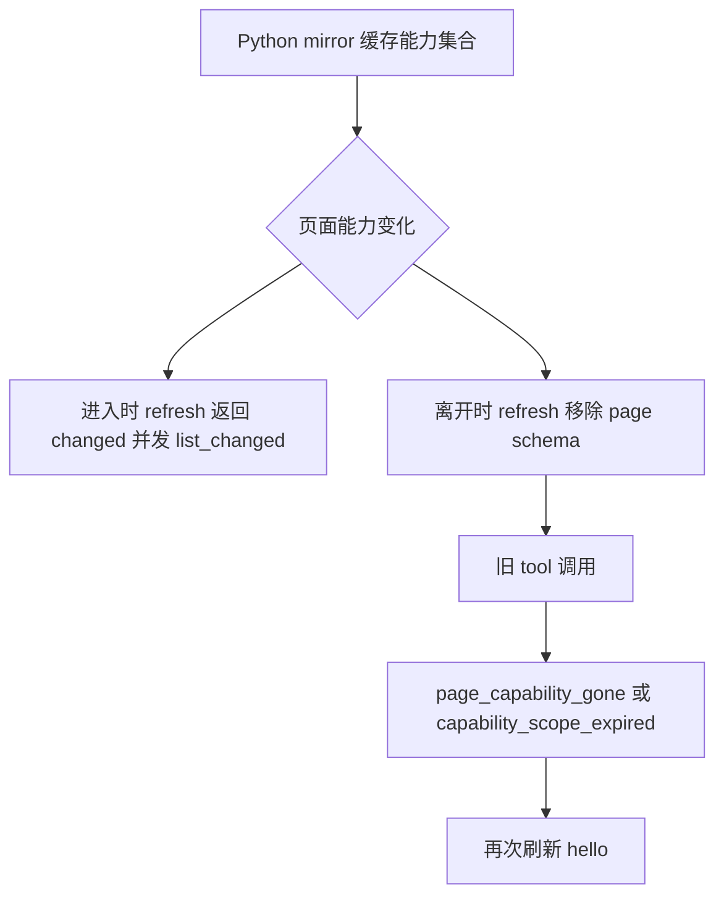

# 调试能力应用级/页面级拆分 — 总分析

## 概述

R003 要把现有全局 capability 模型拆成应用级 `app` 与页面级 `page` 两类 scope。旧 capability 未声明 scope 时默认 `app`；页面级 capability 在页面进入时注册、页面离开时解除注册；允许多个 active page scope 同时存在；`pageId` 可由业务传入；`pageName` 可供 MCP 展示，但 tool id 不强制改为页面名称。

当前代码事实是：Dart/Kotlin core registry 以裸 `capability.id` 为唯一键，`/hello.registeredCapabilities` 只输出 `id/resources/commands/description`；Flutter plugin MethodChannel 只桥接 `capId/resources/commands`；Python MCP mirror 的 `CapabilitySchema` 也没有 scope/page metadata。因此本需求不是单端字段补充，而是跨协议、core registry、Flutter bridge、Python MCP mirror 和验收网络的共享契约演进。

## ScopeInventory

| 维度 | 结论 |
|---|---|
| goals | 控制端能区分全局能力与页面能力；页面离开后不长期暴露失效工具；旧接入保持兼容。 |
| scenarios | app 能力常驻；页面进入注册；多个页面并发；页面离开解除注册；MCP 刷新；旧工具调用 gone/expired。 |
| entities | CapabilityScope、PageScope、CapabilitySchema、scope-aware registry key、MCP ToolSpec/cache。 |
| boundaries | `/hello.registeredCapabilities`、capability route error、SSE refresh event、Dart/Kotlin API、Flutter MethodChannel、Python MCP schema。 |
| unknowns | 具体 API 命名、`/state` 是否 scope-aware、route path 冲突处理细节交给 design 决策。 |
| acceptance | 跨语言 fixture/单测一致；Flutter Android 集成验收页面注册/解除；Python tools/list_changed 收敛。 |

分类结论：`sliced`。原因是需求跨 4 个实现模块与 3 类共享契约，并有页面生命周期、缓存刷新、错误语义等独立 owner；单文档会把协议、运行时、桥接、MCP 和验收混在一起。

## 一、交互链

### SCN-SCOPE-CONTRACT：控制端发现 scope 能力

作为调试控制端使用者，我想看到应用级能力和当前活跃页面能力，以便只调用仍有效的调试工具。

### SCN-FLUTTER-PAGE-LIFECYCLE：页面能力跟随页面生命周期

作为 Flutter 业务开发者，我想在页面进入时注册页面能力、离开时解除注册，以便调试面板不操作已经销毁的页面。

### SCN-MCP-SCOPE-MIRROR：MCP 列表刷新与旧工具收敛

作为 MCP adapter，我想在页面能力变化后刷新 tools，并在旧工具调用时得到稳定错误，以便工具列表最终收敛到真实状态。

## 二、逻辑树

### 事件流

| 时刻 | 事件 | 处理 | 产生的新事件 |
|---|---|---|---|
| T1 | 旧 capability 注册 | 缺省 `scope=app`，保持现有 id/route/state 行为 | `/hello` 暴露 app capability |
| T2 | 页面进入 | 业务传入 `pageId`，可选 `pageName`，注册 `scope=page` capability | scope-aware registry 增加 page entry |
| T3 | 控制端刷新 | Python/Dart/Kotlin 解析 `scope/pageId/pageName` | MCP tools/list_changed |
| T4 | 多页面并发 | registry 以 `(scope,pageId,id)` 区分页面能力 | 同名 page capability 可跨 pageId 并存 |
| T5 | 页面离开 | scoped unregister 精确移除目标 page capability 并取消事件订阅 | `/hello` schema shrink |
| T6 | 旧工具调用 | App 或 Python mirror 返回稳定 gone/expired 语义 | MCP 标记 stale 并刷新 |

### 状态流转

| 实体 | 触发事件 | 前状态 | 后状态 |
|---|---|---|---|
| Capability | 旧注册 | 无 scope | `scope=app` |
| PageScope | 页面进入 | absent | active(`pageId`,`pageName?`) |
| PageScope | 页面离开 | active | gone |
| RegistryKey | R003 注册 | `id` | `(scope,pageId?,id)` |
| MCP mirror | `/hello` 变化 | fresh | stale -> refreshed |
| Flutter helper | widget dispose | page capability registered | unregistered |

### 关键约束

- `pageName` 只能用于展示，不参与唯一性。
- 设计阶段必须统一唯一键：旧 `id` 兼容 app；page 用 `(scope=page,pageId,id)`，避免业务强制拼接 id。
- 设计阶段必须明确 route/path 冲突策略。当前协议是全局平铺 first-match-wins，多页面同路径会歧义。
- 设计阶段必须明确 `/state` 页面状态聚合策略。当前 `/state` 是扁平 spread，同 key 会覆盖。

## 三、功能编号与网络定位

| 编号 | 功能节点 | 所属 slice | 简介 |
|---|---|---|---|
| BF001 | CapabilityScope 协议字段与向后兼容 | S01 | `/hello.registeredCapabilities[]` 新增 `scope/pageId/pageName/scopeRevision`，缺省 app。 |
| BF002 | 页面能力 gone/expired 错误与刷新信号契约 | S01 | 定义 `page_capability_gone`、`capability_scope_expired` 与刷新语义。 |
| BF003 | Dart/Kotlin Capability metadata/API | S02 | core API 表达 scope/page metadata，旧 capability 默认 app。 |
| BF004 | Scoped registry unregister 与 hello 聚合 | S02 | registry、unregister、event subscription、`/hello` 聚合升级为 scope-aware。 |
| FF001 | Flutter plugin capability scope bridge | S03 | MethodChannel 注册 payload 透传 scope/page metadata。 |
| FB001 | Flutter 页面级能力生命周期 helper/example | S03 | 页面进入注册、离开解除、多 active page 示例。 |
| BF005 | Python CapabilitySchema scope/page metadata | S04 | Python mirror 解析、缓存、JSON 输出 scope/page metadata。 |
| BF006 | MCP tool refresh 与 stale page capability 调用处理 | S04 | tools/list_changed、旧 page tool gone/expired 收敛。 |
| BF007 | 跨语言协议 fixture/单测回归 | S05 | fixtures、Dart/Kotlin/Flutter/Python 单测保持字段和错误一致。 |
| BF008 | Flutter Android 真机/集成验收场景 | S05 | 验证真实 Android 页面生命周期注册/解除与 MCP/HTTP 收敛。 |

### 边界接口

| 接口/协议 | 定义方 | 消费方 | 敏感度 |
|---|---|---|---|
| `/hello.registeredCapabilities[].scope/pageId/pageName/scopeRevision` | App debug plane | Python MCP、控制端、fixtures | 授权后敏感 |
| `CapabilityScope` API | Dart/Kotlin core | Flutter bridge、业务宿主 | 中 |
| `capability.register` MethodChannel payload | Flutter plugin | Android plugin registry | 中 |
| `page_capability_gone` / `capability_scope_expired` | App debug plane | Python MCP adapter | 敏感 route 错误 |
| `capability_scope_changed` SSE | App debug plane | Python MCP adapter | 敏感事件 |
| MCP `list_capabilities` / `invoke_command` / `read_resource` | Python MCP | AI host | 中 |

## 四、结论

R003 可在单个 RC 内推进，共 10 个功能节点，低于复杂度阀门。开发顺序建议：

1. 先落 BF001/BF002，确定协议字段、错误码、fixture。
2. 再落 BF003/BF004，使 Dart/Kotlin core 的 registry 与 `/hello` 成为 scope-aware 真相源。
3. 然后落 FF001/FB001，把 Flutter plugin 和 example 接入页面生命周期。
4. 再落 BF005/BF006，使 Python MCP mirror/tools 能刷新和处理 stale page 调用。
5. 最后落 BF007/BF008，补齐跨语言回归和 Android 集成验收。

暂不实现：业务页面 SDK、页面树调试 UI、强制修改 MCP tool id、debug plane 自动追踪 Flutter Navigator。上述内容会扩大业务耦合或破坏现有架构边界。
