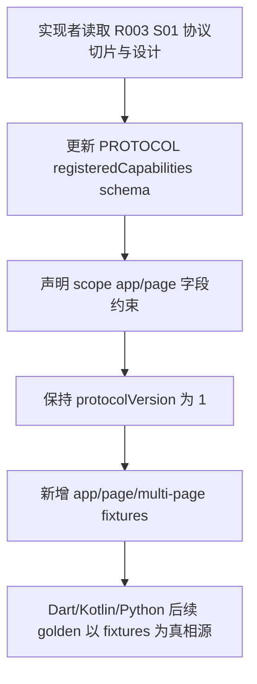
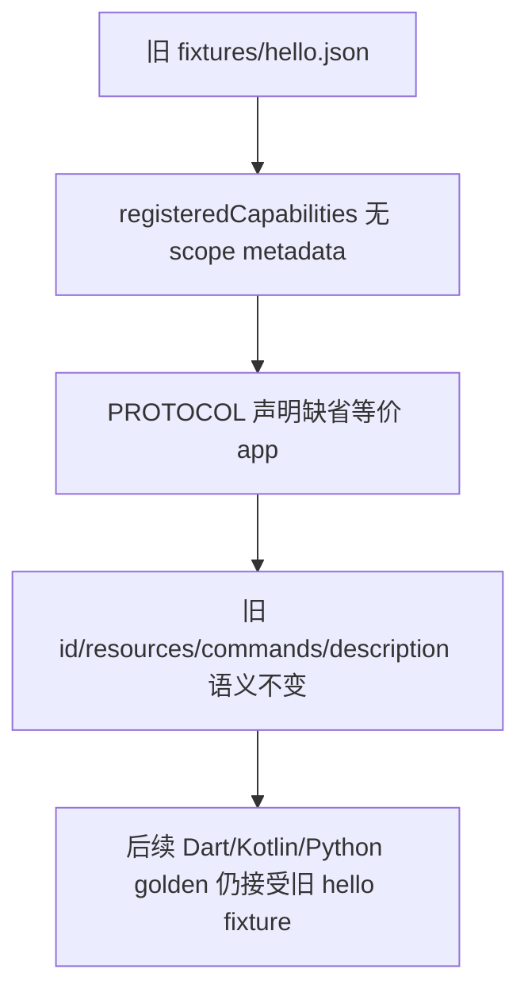
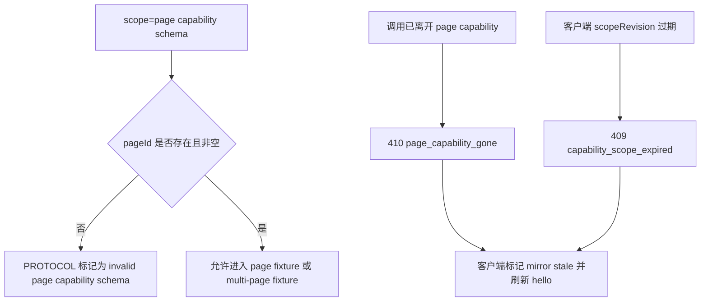
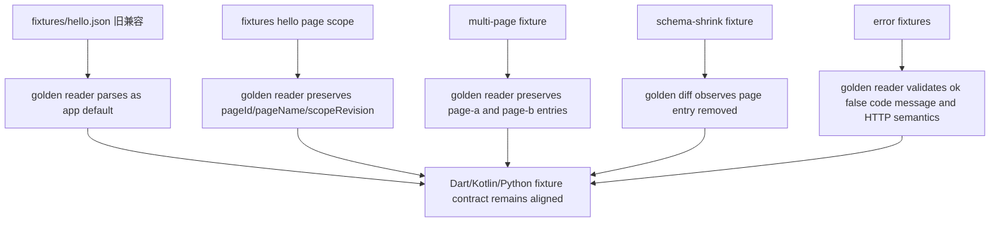

# Sprint Contract: R003-BF001

status: agreed

## Task Reference

- task_id: R003-BF001
- domain: backend
- assignee: xlfoundry-implementer
- evaluator: xlfoundry-evaluate
- created_at: 2026-08-26T07:20:26Z
- negotiation_rounds: 4
- xlfoundry_version: 5.15.0

## Implementation Scope

### 目标

在协议真相源 `PROTOCOL.md` 与 `fixtures/` 中固化 capability scope schema、页面能力失效错误契约和向后兼容 golden，作为 Dart/Kotlin/Python 后续实现的共同依据。

### 范围内

- 更新 `PROTOCOL.md`，在 `/hello.registeredCapabilities[]` 契约中记录 `scope`、`pageId`、`pageName`、`scopeRevision` 字段。
- 明确 `scope` 取值为 `app` / `page`，旧 capability 缺省等价 `app`；`scope=page` 时 `pageId` 必填，`pageName` 仅用于展示且不参与唯一性。
- 明确 `scopeRevision` 的协议含义：代表 capability scope 镜像修订号，可用于客户端判断本地镜像是否过期；具体 runtime 递增实现不在本任务内。
- 保持 `protocolVersion` 为 `1`，并说明新增字段属于向后兼容扩展，旧客户端忽略未知字段仍可解析既有 `id/resources/commands/description`。
- 在 `PROTOCOL.md` 错误契约中定义 `page_capability_gone` 和 `capability_scope_expired`，错误体沿用 `{ok:false, code, message}`。
- 固化错误语义：已离开 page capability 返回 `410 page_capability_gone`；scope revision 过期返回 `409 capability_scope_expired`；两者均要求客户端标记 mirror stale 并重新拉取 `/hello`，不得重试旧工具。
- 新增或更新 protocol fixtures，覆盖 app 默认、page、multi-page、schema-shrink、gone error、expired error；固定文件名为 `fixtures/hello.json`、`fixtures/hello-page-scope.json`、`fixtures/hello-multi-page-scope.json`、`fixtures/hello-schema-shrink.json`、`fixtures/error-page-capability-gone.json`、`fixtures/error-capability-scope-expired.json`。
- 保留旧 `fixtures/hello.json` 兼容性：不强制旧 hello fixture 输出 scope 字段，且旧 fixture 仍应被 Dart、Kotlin、Python golden 测试接受。
- fixture capability 使用中性样例，如 `sample.app`、`sample.page.panel`、`sample.page.form`；pageId 使用 `page-a` / `page-b`，pageName 使用 `Page A` / `Page B`。

### 范围外

- 不实现 Dart runtime 的 `CapabilityScope` 类型、registry、dispatch 或 golden 测试逻辑。
- 不实现 Kotlin runtime 的 `CapabilityScope` 类型、registry、dispatch 或 golden 测试逻辑。
- 不实现 Python runtime 的 `CapabilitySchema`、MCP mirror、selector header 或 refresh 逻辑。
- 不实现 Flutter helper、Flutter plugin MethodChannel scope bridge、example 页面生命周期 helper。
- 不执行或要求 Android 真机验收，本任务只提供协议与 fixture 基础。
- 不实现 MCP selector header 传递或服务端 selector dispatch；`X-DCP-*` header 如需记录，只能作为后续 BF002/BF004/BF006 的协议背景，不作为本任务可执行实现范围。
- 不改变 `/state` 聚合行为、route dispatch 策略、MCP tool id 命名策略或业务页面 SDK。
- 不新增或修改 Dart/Kotlin/Python 测试源文件；跨语言场景证据由本任务的 `unit/backend` evidence log 或 test override 对 fixtures 做协议级校验，并可调用既有 golden 测试验证旧 fixture 兼容。

### 已知约束

- `PROTOCOL.md` 与 `fixtures/` 是 HTTP/SSE 字节级协议真相源；跨语言字段、错误码和协议版本必须以这些文件为准。
- `protocolVersion=1` 是硬约束；本任务不得通过升级版本规避兼容性。
- Scope metadata 是 capability 元数据，不是 route path 前缀；`resources[].path` 与 `commands[].path` 必须继续保持 JSON array 形态。
- `pageName` 不参与唯一性，不能被写成必须唯一或必须拼入 capability id / MCP tool id。
- 多个 active page scope 必须是协议允许态，fixture 需要证明同一 capability id 可在不同 `pageId` 下表达。
- 页面缺 `pageId` 是无效 page schema，协议必须写清；是否在 runtime 注册时抛错属于后续任务。
- 本 contract 为 draft；evaluate 的协商模式最终只接受 `status: agreed` 的 contract。

### 任务流程图

正常路径：

旧 schema 兼容路径：

page 缺 pageId / 失效错误路径：

fixture golden 验证路径：

### 评估者挑战记录

- Round 1 Q: `unit_test_pass`、`test_coverage` 和 `integration_test_pass` 的证据口径过宽，不能用“后续任务承接”替代 evaluate 可验证日志。
  A: 收紧为 `.dev-flow/R003/evidence/R003-BF001-unit-backend-test.log` 或 evaluate 白名单认可的 skip/deferred；`integration_test_pass` 因本任务无 integration test_tasks 按 N/A。
  Conclusion: addressed
- Round 2 Q: Scored Criteria “测试覆盖”仍残留“后续任务承接”，multi-page/schema-shrink fixture 文件名不固定。
  A: 删除后续任务承接口径，固定 `fixtures/hello-multi-page-scope.json` 与 `fixtures/hello-schema-shrink.json`，并在 checklist 中使用同一名称。
  Conclusion: addressed
- Round 3 Q: 范围外排除 Dart/Kotlin/Python 测试源修改，但验收仍要求跨语言 golden 证据，来源不清；Acceptance #8 暗示后续测试日志。
  A: 明确本任务不新增或修改 Dart/Kotlin/Python 测试源；跨语言场景证据由本任务 `unit/backend` evidence log 或 test override 进行协议级 fixture 校验、旧 fixture 兼容校验、或 evaluate 白名单 skip/deferred 记录支撑。Acceptance #8 改为当前 evidence 中的测试/skip/deferred 记录。
  Conclusion: addressed
- Round 4 Q: 协商轮次与挑战记录未反映实际第四轮；需保留已确认风险。
  A: 将 `negotiation_rounds` 更新为 4，并补齐四轮挑战记录。确认剩余风险：BF001 只固化协议和 fixture，不证明 runtime stale 检测闭环；跨语言兼容必须在 evaluate 时按当前日志事实判定。
  Conclusion: addressed

## Hard Gates

- [ ] unit_test_pass: `.dev-flow/R003/evidence/R003-BF001-unit-backend-test.log` 证明本任务的协议级 fixture/golden 校验通过，0 failure，0 error；日志来源是 `.dev-flow/R003/test-overrides/R003-BF001/unit-backend.sh` 或等价命令，不能要求修改 Dart/Kotlin/Python 测试源文件。若不可执行，只能使用 evaluate 白名单认可的 `skipped_explicit_null` 或 `deferred` 证据，不允许用“后续任务承接”作为 PASS。
- [ ] integration_test_pass: 本任务 `test_tasks` 仅声明 `unit/backend`，未声明 integration layer；evaluate 可将 integration gate 记为 N/A。若 implementer 额外运行 `bash ci/ci-check-all.sh`，可作为补充证据，但不是本任务必需 gate。
- [ ] api_contract_consistency: `PROTOCOL.md` 与所有新增/更新 fixtures 在字段名、类型、错误 code、HTTP status、刷新语义和 `protocolVersion=1` 上一致。
- [ ] simplify_pass: implementer 完成本任务后已运行 simplify 或等价收敛检查，确认没有无关文件修改、重复 fixture 语义或漂移的协议描述。
- [ ] architecture_md_consistency: 变更符合 architecture.md 的协议真相源、跨语言一致、零业务依赖和 Android 生命周期归宿主约束。
- [ ] test_coverage: `.dev-flow/R003/evidence/R003-BF001-unit-backend-test.log` 必须逐项记录 `Protocol fixture`、`Dart core`、`Kotlin core`、`Python mirror` 四个 scenarios 的当前证据：协议级 JSON/schema 校验、旧 hello 兼容校验、或 evaluate 白名单认可的显式 skip/deferred；不允许用“后续任务承接”作为 PASS。覆盖不得遗漏旧 hello 兼容、page schema、multi-page、schema-shrink、gone、expired。
- [ ] acceptance_criteria_met: 下方 Acceptance Criteria Checklist 全部 PASS；任一 FAIL 则本 gate FAIL。

## Acceptance Criteria Checklist

| # | acceptance_criteria | 验证方式 |
|---|---|---|
| 1 | `PROTOCOL.md` 记录 `scope/pageId/pageName/scopeRevision`，并说明 `scope` 缺省等价 `app` | 检查 `PROTOCOL.md` 的 `/hello.registeredCapabilities[]` schema 与字段表 |
| 2 | `protocolVersion` 保持 `1` | 检查 `PROTOCOL.md` 与所有 hello fixtures 的 `protocolVersion` 字段 |
| 3 | `scope=page` 时 `pageId` 必填；page 缺 `pageId` 被定义为无效 schema | 检查 `PROTOCOL.md` 字段约束与负路径说明 |
| 4 | `pageName` 只作为展示 metadata，不参与唯一性，不强制拼入 capability id 或 MCP tool id | 检查 `PROTOCOL.md` 兼容规则 |
| 5 | 定义 `page_capability_gone`，HTTP status 为 `410`，错误体为 `{ok:false, code, message}`，刷新语义为 mirror stale 后拉取 `/hello` | 检查 `PROTOCOL.md` 错误表与 `fixtures/error-page-capability-gone.json` |
| 6 | 定义 `capability_scope_expired`，HTTP status 为 `409`，错误体为 `{ok:false, code, message}`，刷新语义为不得重试旧工具、先刷新 `/hello` | 检查 `PROTOCOL.md` 错误表与 `fixtures/error-capability-scope-expired.json` |
| 7 | fixture 覆盖 app 默认、page、multi-page、schema-shrink、gone、expired | 检查 `fixtures/hello.json`、`fixtures/hello-page-scope.json`、`fixtures/hello-multi-page-scope.json`、`fixtures/hello-schema-shrink.json`、`fixtures/error-page-capability-gone.json`、`fixtures/error-capability-scope-expired.json` |
| 8 | 旧 `fixtures/hello.json` 仍保持旧 schema 兼容，不强制补 scope 字段 | 检查 fixture diff 与当前 `.dev-flow/R003/evidence/R003-BF001-unit-backend-test.log` 中的测试/skip/deferred 记录 |
| 9 | fixture 中 route path 仍是 JSON array，scope 不被写成 path 前缀 | 检查所有新增/更新 fixtures 的 `resources[].path` 与 `commands[].path` |
| 10 | 多页面 fixture 证明多个 active page scope 可并存，并保留每个页面的 `pageId/pageName/scopeRevision` | 检查 multi-page fixture 至少包含 `page-a` 与 `page-b` 两个 page entries |

## Scored Criteria

### 维度评分

| 维度 | 权重(满分) | 阈值(最低通过分) | 确认 |
|------|----------|----------------|------|
| API 正确性 | 4/5 | 3/5 | YES |
| 错误处理 | 3/5 | 2/5 | YES |
| 代码质量 | 3/5 | 2/5 | YES |
| 安全性 | 3/5 | 2/5 | YES |
| 并发安全 | 3/5 | 2/5 | YES |
| 测试覆盖 | 3/5 | 2/5 | YES |

### 评分细则

- API 正确性：`PROTOCOL.md` 与 fixtures 字段完全一致；`scope/pageId/pageName/scopeRevision` 类型、必填性、默认值和 `protocolVersion=1` 兼容规则无歧义。
- 错误处理：gone/expired 两类错误的 `code`、HTTP status、message guidance、刷新语义和不重试旧工具要求明确，且不泄漏业务页面细节。
- 代码质量：协议文字、fixture 命名、样例 id、pageId、pageName 保持中性、去重且与现有 fixture 风格一致；无无关业务代码修改。
- 安全性：协议说明不削弱现有 auth gate；敏感 hello、SSE 和 capability route 仍按既有授权边界执行，token 不进入 query string。
- 并发安全：multi-page fixture 和协议说明能表达多个 active page scope 并存，不依赖单一 current page 或 `pageName` 唯一。
- 测试覆盖：新旧 fixture、schema-shrink、page 缺 `pageId` 负路径、gone/expired 错误和 Dart/Kotlin/Python golden 接受路径均由 `.dev-flow/R003/evidence/R003-BF001-unit-backend-test.log` 给出当前测试证据，或给出 evaluate 白名单认可的显式 skip/deferred 证据。

### 总分

pending/19 | 等级: pending
