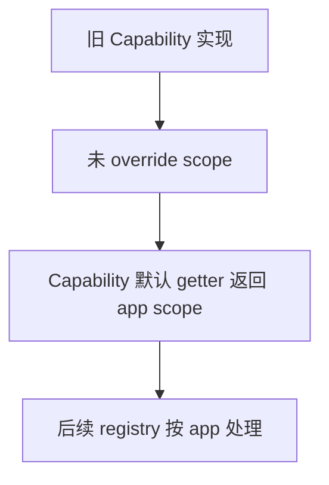
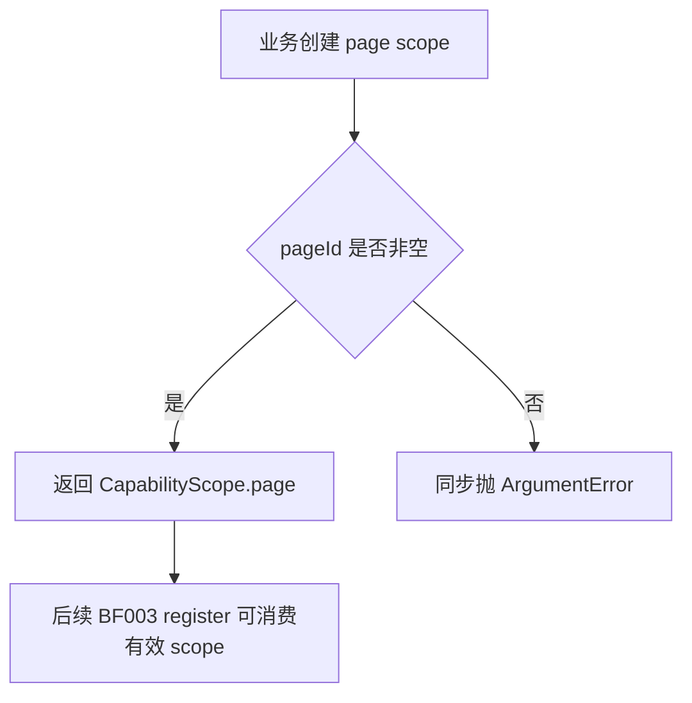
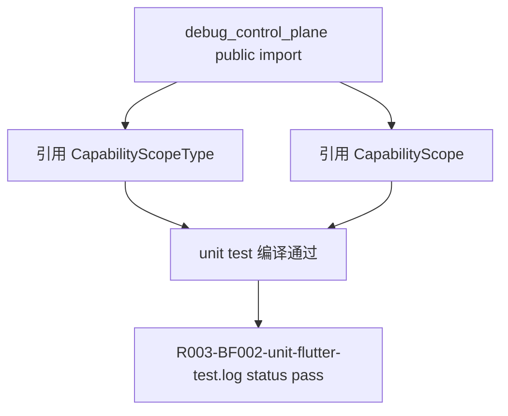

# Sprint Contract: R003-BF002

status: agreed

## Task Reference

- task_id: R003-BF002
- domain: backend
- assignee: xlfoundry-implementer
- evaluator: xlfoundry-evaluate
- created_at: 2026-08-26T08:14:00Z
- negotiation_rounds: 2
- xlfoundry_version: 5.15.0

## Implementation Scope

### 目标

在 Dart capability model 中新增 `CapabilityScopeType` / `CapabilityScope`，让旧 `Capability` 默认等价应用级 `app`，并为后续 BF003 scoped registry/dispatch 提供稳定、可测试的 scope identity 类型。

### 范围内

- 修改 `dart/lib/src/capability.dart`，新增 `CapabilityScopeType`，稳定表达 `app` 与 `page`。
- 修改 `dart/lib/src/capability.dart`，新增不可变 `CapabilityScope` 值对象，字段至少包含 `type`、`pageId`、`pageName`、`revision`。
- 为 `CapabilityScope` 提供 `const CapabilityScope.app()` 与 `CapabilityScope.page(...)` 构造入口。
- `CapabilityScope.page(...)` 必须同步拒绝缺失或空白 `pageId`，以 model/API 层证明 page scope 在进入 registry 前不能成为半有效对象。
- 通过 public `Capability.scope` 访问路径提供默认 app scope；为保持 Dart `implements Capability` 旧实现兼容，不在 `Capability` interface 上新增必须由实现类覆盖的抽象成员。
- 新增 `ScopedCapability` 或等价 opt-in 协议，让声明 page scope 的实现可以显式提供 `CapabilityScope`，同时旧 capability 未声明 scope 时仍解析为 `const CapabilityScope.app()`。
- 修改 `dart/lib/debug_control_plane.dart` 公开导出上述类型。
- 新增或更新 Dart unit test，覆盖默认 app、有效 page、缺失/空白 `pageId` 拒绝、public entrypoint 导出。
- 产出测试日志 `.dev-flow/R003/evidence/R003-BF002-unit-flutter-test.log`，frontmatter `status: pass` 且 passed 数大于 0。

### 范围外

- 不修改 `dart/lib/src/control_plane.dart`。
- 不实现 `ScopedCapabilityKey`。
- 不实现 scoped registry、scoped unregister、同 id 不同 pageId 并存。
- 不实现 `X-DCP-*` selector header dispatch。
- 不实现 `page_capability_gone` / `capability_scope_expired` HTTP 返回。
- 不改变 `/hello`、`/state`、`/events` 聚合或分发行为。
- 不修改 Kotlin、Python、Flutter plugin、fixtures 或 `PROTOCOL.md`。

### 已知约束

- 本任务只建立 Dart model/API 基础；真正 registry key、selector dispatch、gone/expired 路由行为属于 R003-BF003。
- `pageName` 仅用于展示 metadata，不参与唯一性。
- `revision` 对应协议层 `scopeRevision` 语义，但本任务不负责 registry 递增策略。
- 旧 capability 默认 app 是兼容性硬约束，不得要求已有实现类新增 `scope` override。

### 任务流程图

正常路径：

page scope 构造路径：

导出与测试路径：

### 评估者挑战记录

- Round 1 Q: BF002 不能单独证明 dispatch/gone 行为；“page scope 缺 pageId 注册前拒绝”必须限定为 model/API 层校验。
  A: Contract 将拒绝点收窄为 `CapabilityScope.page(...)` 同步拒绝缺失或空白 `pageId`，并把 registry、selector、410/409 全部列为范围外。
  Conclusion: addressed
- Round 2 Q: 不能只改类型和导出，必须有 Dart unit test，并固定 evidence 日志路径。
  A: Contract 要求新增/更新 Dart unit test，覆盖默认 app、有效 page、无效 pageId、public export；日志固定为 `.dev-flow/R003/evidence/R003-BF002-unit-flutter-test.log`。
  Conclusion: addressed

### SubagentExecutionEvidence

- implementer_perspective:
  - isolation: direct_subagent
  - provider: direct_subagent
  - subagent_role: xlfoundry-contract-negotiate/implementer-perspective
  - execution_id: xlf-subagent:R003-BF002:contract-implementer:01
- evaluator_perspective:
  - isolation: direct_subagent
  - provider: direct_subagent
  - subagent_role: xlfoundry-contract-negotiate/evaluator-perspective
  - execution_id: xlf-subagent:R003-BF002:contract-evaluator:01

## Hard Gates

- [ ] unit_test_pass: `.dev-flow/R003/evidence/R003-BF002-unit-flutter-test.log` 为 `status: pass`，0 failure，0 error，passed > 0。
- [ ] integration_test_pass: 本任务只声明 `unit/flutter`，未声明 integration layer；evaluate 可记为 N/A。
- [ ] api_contract_consistency: `CapabilityScope` 与 `PROTOCOL.md` 的 `scope=app/page`、`pageId` 必填、`pageName` 展示语义、`scopeRevision` 概念一致。
- [ ] simplify_pass: 独立 simplify 完成，确认无 registry/dispatch 偷跑、无无关文件修改、无过度抽象。
- [ ] architecture_md_consistency: 实现符合 Dart core model 边界，不改变 ControlPlane registry、transport、auth 或聚合行为。
- [ ] test_coverage: 测试覆盖旧 capability 默认 app、有效 page scope、缺失/空白 `pageId` 拒绝、public entrypoint 导出。
- [ ] acceptance_criteria_met: 下方 Acceptance Criteria Checklist 全部 PASS。

## Acceptance Criteria Checklist

| # | acceptance_criteria | 验证方式 |
|---|---|---|
| 1 | 旧 `Capability` 实现无需新增 `scope` getter 也能继续编译，并通过 public `capability.scope` 默认得到 `CapabilityScope.app()` | Dart unit test 定义旧式 fake capability，仅实现既有成员，以 `Capability` 静态类型断言默认 scope 字段 |
| 2 | `CapabilityScopeType` 覆盖 `app` 与 `page`，字段命名与协议 `scope=app/page` 对齐 | Dart unit test 断言枚举值或 wire 名称 |
| 3 | page scope 缺 `pageId` 或 `pageId` 为空白时，在 model/API 层同步拒绝 | Dart unit test 断言 `CapabilityScope.page(pageId: '')` 等抛 `ArgumentError` |
| 4 | 有效 page scope 可携带 `pageId`、可选 `pageName` 与 `revision`，字段保真 | Dart unit test 构造 page scope 后逐字段断言 |
| 5 | `dart/lib/debug_control_plane.dart` public entrypoint 导出 `CapabilityScope` 与 `CapabilityScopeType` | 测试从 package public import 引用两类型并编译通过 |
| 6 | 未实现 BF003 范围 | diff 审查确认未修改 `dart/lib/src/control_plane.dart`，未新增 registry key、selector dispatch、scoped unregister 行为 |

## Scored Criteria

| 维度 | 权重(满分) | 阈值(最低通过分) | 确认 |
|------|----------|----------------|------|
| API 正确性 | 4/5 | 3/5 | YES |
| 错误处理 | 3/5 | 2/5 | YES |
| 代码质量 | 3/5 | 2/5 | YES |
| 安全性 | 3/5 | 2/5 | YES |
| 并发安全 | 3/5 | 2/5 | YES |
| 测试覆盖 | 3/5 | 2/5 | YES |

### 评分细则

- API 正确性：类型字段能准确表达 app/page，默认 app 兼容旧实现，pageId 必填规则清晰且可测。
- 错误处理：无效 page scope 在 model/API 层同步失败，错误类型和消息明确；不把错误延迟到 dispatch。
- 代码质量：实现集中在 capability model/export/test，命名与协议字段一致，无无关重构。
- 安全性：不引入 token、auth、request header 或路由授权变化，不扩大暴露面。
- 并发安全：本任务仅新增不可变值对象 API，不引入共享可变 registry 状态。
- 测试覆盖：覆盖默认值、有效 page、无效 pageId、public export、旧实现兼容。

### 总分

pending/19 | 等级: pending
