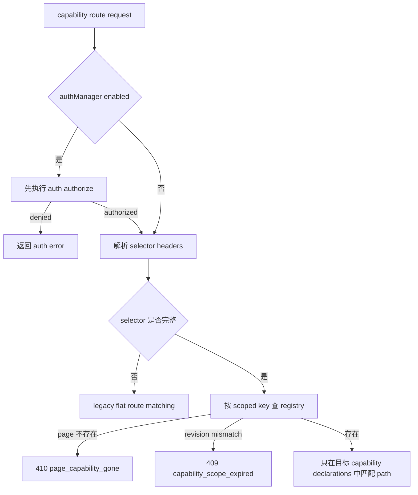

# Sprint Contract: R003-BF003

status: agreed

## Task Reference

- task_id: R003-BF003
- domain: backend
- assignee: xlfoundry-implementer
- evaluator: xlfoundry-evaluate
- created_at: 2026-08-26T08:40:00Z
- negotiation_rounds: 2
- xlfoundry_version: 5.15.0

## Implementation Scope

### 目标

在 Dart `ControlPlane` 中实现 scope-aware registry、selector dispatch、scope metadata 聚合和 `capability_scope_changed` 刷新事件，使 app/page capability 可以安全并存，并保证 auth、legacy flat dispatch、state 聚合和事件订阅清理边界明确。

### 范围内

- 修改 `dart/lib/src/control_plane.dart`，将 registry key 从裸 `capability.id` 升级为 scope-aware identity。
- 新增内部 `ScopedCapabilityKey` 或等价值对象：
  - app key: `(scope=app, capabilityId)`
  - page key: `(scope=page, pageId, capabilityId)`
  - `pageName` 和 `scopeRevision` 不参与唯一性。
- 保持 `register(Capability cap)` 签名兼容；旧 capability 未声明 scope 时通过 public `cap.scope` 归一化为 app。
- 支持 app capability 与 page capability 同 `id` 并存，支持不同 `pageId` 下 page capability 同 `id` 并存。
- 同一 app `id` 或同一 `(pageId,id)` page key 重复注册必须抛 `StateError`，且不能覆盖既有 handler。
- 保持 `unregister(String id)` 兼容，只解除 app scope 下该 `id`。
- 新增 `unregisterScoped({required CapabilityScope scope, required String capabilityId})`，精确移除目标 scoped key；不存在时 no-op。
- `_eventSubs` 必须与 registry 使用同一 scoped key，unregister/scoped unregister/stop 必须取消对应 subscription，不误删其他 app/page 同名能力。
- dispatch 读取 selector headers：
  - `X-DCP-Capability-Id`
  - `X-DCP-Capability-Scope`
  - `X-DCP-Page-Id`
  - `X-DCP-Scope-Revision`
- authManager 启用时，capability routes 必须在任何 scoped key lookup、pageId 存在性判断、revision 比较或 path match 之前先授权；授权失败返回 auth error，不泄露 410/409/404。
- 无 selector header 时保留 legacy flat route matching 与注册顺序 first-match-wins。
- 有完整 selector identity 时按 scoped key 定向查找，再在目标 capability 的 resources/commands 中匹配 path。
- selector 指定 page identity 但 registry 当前不存在时返回 `410 page_capability_gone`。
- selector 指定 `X-DCP-Scope-Revision` 且与当前 entry `scopeRevision` 不一致时返回 `409 capability_scope_expired`。
- selector 指定 capability identity 且目标存在但 path/method 不匹配时返回既有 `404 not_found`。
- `/hello.registeredCapabilities[]` 继续输出数组并保持注册顺序；每项保留 `id/resources/commands`，新增 `scope`、page 时的 `pageId`、有值时的 `pageName`、以及 `scopeRevision`。
- `resources[].path` / `commands[].path` 必须继续是 JSON array，不得改为 slash string。
- `/state` 和 `/hello` 顶层 state 只聚合 app scope capability；page scope capability state 不进入顶层。
- 旧 app state 兼容：`/state` 仍为扁平 object、无 `ok` 包裹；多个 app capability 同 key 仍后注册覆盖先注册。
- scope revision 最小语义：
  - 每次 registry 可见集合发生 register 或 unregister/scoped unregister 时内部 revision 单调递增。
  - entry 的 `scopeRevision` 是该 entry 最近一次进入当前 registry 镜像时的 revision。
  - 其他 entry 注册/解除导致全局 revision 变化后，旧 entry 的 `scopeRevision` 不被无故重写。
- register / unregister / scoped unregister 导致可见集合变化时广播 `capability_scope_changed` event；payload 至少包含 `change`、`scope`、`capabilityId`、page 时 `pageId`、有值时 `pageName`、`scopeRevision`。
- 更新 Dart tests：至少覆盖 scoped registry、selector dispatch、gone/expired、auth priority、state 聚合、hello metadata、scope changed event 和旧兼容。
- 产出 formal log `.dev-flow/R003/evidence/R003-BF003-unit-flutter-test.log`，`status: pass` 且 passed > 0；如当前 commit gate inline parser 需要，同时产出 `.dev-flow/R003/evidence/R003-BF003-unit-backend-test.log` alias，明确指向 formal unit/flutter log。

### 范围外

- 不修改 `protocolVersion=1`。
- 不把 `pageId/pageName` 拼进 capability id、route path 或 MCP tool name。
- 不实现 Python mirror selector 发送。
- 不实现 Kotlin scoped registry。
- 不实现 Flutter MethodChannel scope payload。
- 不自动监听 Flutter Navigator 或业务页面生命周期。
- 不新增 page state 顶层聚合结构或新 state endpoint。
- 不修改 `PROTOCOL.md`、fixtures、analysis/design/test 文档。

### 已知约束

- `CapabilityScope` / `ScopedCapability` / `Capability.scope` 由 R003-BF002 提供。
- legacy 无 selector 的 flat dispatch 仍可 first-match-wins；本任务只保证 selector 可以精确命中指定 page/app capability。
- `capability_scope_changed` 是刷新提示事件，不定义客户端局部 diff 语义。
- system route 优先级和 auth bootstrap 语义不得改变。

### 任务流程图

注册与 hello：

```mermaid
graph TD
  A[register Capability] --> B[读取 cap.scope]
  B --> C[生成 ScopedCapabilityKey]
  C --> D{key 是否已存在}
  D -->|是| E[抛 StateError]
  D -->|否| F[写入 registry 和 event subscription]
  F --> G[递增 registry revision 并写 entry scopeRevision]
  G --> H[广播 capability_scope_changed]
  H --> I[/hello registeredCapabilities 输出 scope metadata]
```

dispatch：



state 与 unregister：

```mermaid
graph TD
  A[/state 或 /hello 顶层 state] --> B[遍历 app scope entries]
  B --> C[聚合 app state]
  C --> D[跳过 page state]
  E[unregisterScoped page-a] --> F[移除 page-a scoped key]
  F --> G[取消 page-a subscription]
  G --> H[广播 capability_scope_changed removed]
```

### 评估者挑战记录

- Round 1 Q: auth gate 必须先于 selector scoped match，否则会通过 410/409/404 泄露 page capability 存在性。
  A: Contract 明确 authManager 启用时，capability route 在任何 scoped lookup、pageId/revision 判断或 path match 前先授权；测试必须覆盖 stale selector 下仍返回 auth code。
  Conclusion: addressed
- Round 1 Q: legacy 无 selector 请求不能被 page scope 破坏，selector 请求必须避免 first-match 歧义。
  A: Contract 区分无 selector legacy flat matching 与完整 selector scoped lookup，要求同路径 app/page/page 测试覆盖两条路径。
  Conclusion: addressed
- Round 1 Q: `/state` 和 `/hello` 顶层 state 只聚合 app，但 registeredCapabilities 必须包含 page metadata。
  A: Contract 将 state 聚合和 capability metadata 分离，并要求同 key app/page state 测试。
  Conclusion: addressed
- Round 1 Q: event subscription 必须按 scoped key 精确取消。
  A: Contract 要求 `_eventSubs` 与 registry 同 key，scoped unregister 后 page-a 事件不再 broadcast，app/page-b 保留。
  Conclusion: addressed
- Round 1 Q: scopeRevision 需要最小可测语义。
  A: Contract 固化 register/unregister 单调递增、entry 最近注册 revision、selector mismatch 409、page gone 410 和 auth 优先规则。
  Conclusion: addressed
- Round 1 Q: 测试与 evidence 路径必须固定。
  A: Contract 指定 formal `.dev-flow/R003/evidence/R003-BF003-unit-flutter-test.log`，并允许为当前 commit gate parser 生成 `unit-backend` alias。
  Conclusion: addressed

### SubagentExecutionEvidence

- implementer_perspective:
  - isolation: direct_subagent
  - provider: direct_subagent
  - subagent_role: xlfoundry-contract-negotiate/implementer-perspective
  - execution_id: xlf-subagent:R003-BF003:contract-implementer:01
- evaluator_perspective:
  - isolation: direct_subagent
  - provider: direct_subagent
  - subagent_role: xlfoundry-contract-negotiate/evaluator-perspective
  - execution_id: xlf-subagent:R003-BF003:contract-evaluator:01

## Hard Gates

- [ ] unit_test_pass: `.dev-flow/R003/evidence/R003-BF003-unit-flutter-test.log` 为 `status: pass`，0 failure，0 error，passed > 0。
- [ ] integration_test_pass: 本任务只声明 `unit/flutter`，未声明 integration layer；evaluate 可记为 N/A。
- [ ] api_contract_consistency: 对齐 `PROTOCOL.md` 中 scope metadata、selector header、错误体、`/state` 无 `ok` 包裹、path array 契约。
- [ ] auth_priority: authManager 启用且授权失败时，capability route 在任何 selector scoped match/revision 判断前返回 auth error，不泄露 410/409/404。
- [ ] legacy_dispatch_compatibility: 无 selector header 时保留 legacy flat route matching 与注册顺序 first-match-wins。
- [ ] scoped_registry_correctness: registry key 使用 `(scope,pageId?,capabilityId)`，支持 app/page 同 id 和不同 pageId 同 id 并存，重复同 key 拒绝。
- [ ] scoped_unregister_subscription_cleanup: unregister/unregisterScoped 精确移除 scoped key 并取消对应 event subscription，不误删同名其他 scope/page。
- [ ] app_only_state_aggregation: `/state` 与 `/hello` 顶层 state 只聚合 app capability；registeredCapabilities 仍包含 page metadata。
- [ ] scope_revision_semantics: register/unregister 单调递增；entry `scopeRevision` 表示最近进入 registry 镜像时 revision；stale selector 返回 409，gone page selector 返回 410。
- [ ] simplify_pass: 独立 simplify 完成，确认无无关重构和跨语言越界。
- [ ] architecture_md_consistency: 不改变 pipeline、协议版本、系统路由优先级、auth 边界或 zero business dependency。
- [ ] test_coverage: 自动化测试覆盖 Dart core registry 与 Dart core dispatch scenarios，以及 state/event/auth/golden 兼容路径。
- [ ] acceptance_criteria_met: 下方 Acceptance Criteria Checklist 全部 PASS。

## Acceptance Criteria Checklist

| # | acceptance_criteria | 验证方式 |
|---|---|---|
| 1 | registry 使用 scope-aware key，app 与 page 同 `id` 允许并存 | Dart unit test 注册 app `sample.shared` 与 page `sample.shared`，断言 `/hello.registeredCapabilities` 同时存在 |
| 2 | 不同 `pageId` 下相同 `id` page capability 允许并存 | Dart unit test 注册 `page-a/sample.panel` 与 `page-b/sample.panel`，断言两项均出现在 `/hello` |
| 3 | 同一 `pageId + id` 重复注册拒绝且不覆盖原 handler | Dart unit test 断言第二次 register 抛 `StateError`，dispatch 仍命中原 handler |
| 4 | `unregister(id)` 兼容 app | Dart unit test 注册 app + page 同 id，调用旧 `unregister(id)` 后只移除 app，不移除 page |
| 5 | scoped unregister 精确移除 page 且清理 subscription | Dart unit test 调用 scoped unregister page-a，断言 page-b 与 app 保留，page-a 后续 event 不 broadcast |
| 6 | selector headers 定向命中目标 page capability | Dart dispatch test 使用 `X-DCP-Capability-Id`、`X-DCP-Capability-Scope=page`、`X-DCP-Page-Id` 调用同路径 page A/B，断言命中指定 handler |
| 7 | gone 与 expired 错误稳定 | Dart dispatch test 断言 page 不存在返回 `410 page_capability_gone`，revision mismatch 返回 `409 capability_scope_expired`，错误体符合 `{ok:false, code, message}` |
| 8 | auth gate 优先于 scoped match | Dart auth dispatch test 在未授权/无效 token 下携带 stale page selector，断言返回 auth code，而不是 gone/expired/not_found |
| 9 | `/hello.registeredCapabilities` 输出 scope metadata | golden 或 unit test 断言 app/page/pageName/scopeRevision 字段、path array 形状、注册顺序 |
| 10 | `/state` 和 `/hello` 顶层 state 只聚合 app | Dart unit test 注册 app/page state 同 key，断言顶层只含 app state，不含 page-only key |
| 11 | `capability_scope_changed` event 发出 | Dart event test 注册与 scoped unregister 后监听 event bus 或 transport broadcast，断言 event type 与 payload 字段 |

## Scored Criteria

| 维度 | 权重(满分) | 阈值(最低通过分) | 确认 |
|------|----------|----------------|------|
| API 正确性 | 4/5 | 3/5 | YES |
| 错误处理 | 3/5 | 2/5 | YES |
| 代码质量 | 3/5 | 2/5 | YES |
| 安全性 | 3/5 | 2/5 | YES |
| 并发安全 | 3/5 | 2/5 | YES |
| 测试覆盖 | 3/5 | 2/5 | YES |

### 评分细则

- API 正确性：旧 API 兼容，新 scoped unregister 清晰可测，scope metadata 与 selector header 语义对齐协议。
- 错误处理：gone=410、expired=409、重复 key 抛注册期错误、auth priority 正确。
- 代码质量：scoped key 建模明确，不用 ad hoc 字符串拼接造成碰撞；重复 dispatch 逻辑可控。
- 安全性：未授权请求不得通过 selector 暴露 capability 存在性。
- 并发安全：unregister/stop/event subscription 不泄漏；保持现有单 isolate 运行假设。
- 测试覆盖：验收矩阵关键路径均有自动化测试，formal evidence log 可被 evaluate/commit gate 消费。

### 总分

pending/19 | 等级: pending
