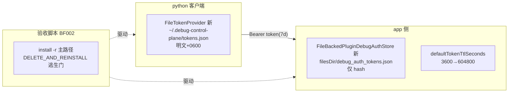

# token 持久化 设计报告

## 1. 目标与背景

AI 自动化编码验证循环（反复覆盖安装 + app/python 重启 + 长会话）中，debug auth
授权弹窗当前每次都要求人工 approve。根因：token 生命周期 = 进程生命周期
（app 侧 `InMemoryPluginDebugAuthStore`、python 侧无 provider 实现），且 TTL 1h。

本设计让 token 活得比进程长——授权弹窗只弹第一次。核心场景
SCN-AUTOLOOP-ONE-APPROVE（时间线：第 1 轮人 approve 一次 → 第 N 轮代码改动后
install -r → app/python 重启 → 旧 token 直接 200，零弹窗；7 天后过期自动回到
授权链；`DELETE_AND_REINSTALL=1` 逃生门等价首次）。

非目标（出界）：卸载清装场景、debug 构建预置 token、release 守卫、iOS/纯 Dart
路径、keyring/加密存储、wire 协议任何变更。

## 2. 总体方案

四端改动分布（Kotlin 纯 JVM core 零改动）：



两侧存储风险模型不同故策略不同：app 是被授权方（存 hash 索引，明文即焚红线
不变）；python 是持钥方（开发机文件明文 + 0600，用户已拍板）。

## 3. 模块与职责

### 3.1 app 侧（FF001）——flutter plugin Android 原生模块

- `FileBackedPluginDebugAuthStore(context, delegate)`：**装饰器**形态,内部
  `InMemoryPluginDebugAuthStore` 为工作集;pending 组方法纯透传（pending 不
  落盘——含 tokenPlaintext,落盘即踩红线,且 5 分钟 TTL 本就短命）;token 组
  写方法（putToken/markRevoked/markAllRevoked）透传后同步 persist。
- persist：固定 tmp 名 + `File.renameTo` 原子写;store 内单锁串行化;临界区
  内重新收集内存快照,写出的总是最新一致状态;org.json 手写（零新依赖）。
- load：升级时一次性懒加载;损坏（JSONException/IO/字段非法）→ logcat warn
  + 回退空（不 fail-fast,attach 路径不许抛）;`expiresAt < now` 的记录丢弃
  并回写（防自动化循环下死记录膨胀）。
- 接线（attach 惰性升级,方案 A）：`processAuthStore` 仍初始 InMemory;
  `onAttachedToEngine` 首次执行时若未被 host 注入,用
  `binding.applicationContext` 幂等升级为 FileBacked（迁移内存记录）。
  `setAuthStoreForHost` 语义不变（整体替换,测试注入不触文件）。
- 生命周期归宿主不变:store 绑进程（companion）,engine detach 不删文件。

### 3.2 python 侧（BF001）——python 包 mcp_plane

- `FileTokenProvider(path=None)`：默认
  `~/.debug-control-plane/tokens.json`;懒加载（`_loaded` 标志,首次 get/save/
  clear 读盘）;asyncio 单线程假设,不加锁（docstring 声明）。
- schema：`{"version": 1, "tokens": {device_id: {token, tokenId, expiresAt}}}`;
  metadata 来自 auth_claim 透传,只存 str 值。
- 0600：**tmp 以 `os.open(..., 0o600)` 创建**（绕 umask,无 0644 窗口）+
  `os.replace`（权限随 tmp）。
- expiresAt 判定：`fromisoformat(value.replace("Z", "+00:00"))`（py310 兼容）;
  解析失败/naive → 视为未过期（手机 401 是最终裁判）;读时判定不回写。
- 损坏回退空（静默,token 可再生）;clear_token 落盘重写（401 三码联动删行）。
- `server.py` main() 注入：`BridgeClient(pool=pool, token_provider=FileTokenProvider())`。

### 3.3 TTL（FF002）——plugin 行为层

`PluginDebugAuthManager.defaultTokenTtlSeconds` 3600 → 604800（提常量）。
默认值属 plugin 行为层,全宿主免配置;显式 ttlSeconds 通道语义不变（宿主覆盖）。
现有 fixtures 已排查零 3600 硬编码依赖,无需同步;新增一个 JVM 默认值回归用例。

### 3.4 验收脚本（BF002）——R004 test-override 副本

fork R003-BF008 `integration-android.sh` 至
`.dev-flow/R004/test-overrides/R004-BF002/`：
- 删除无条件 uninstall（仅 `DELETE_AND_REINSTALL=1` 执行）;安装统一 install -r;
- `APK_ALREADY_INSTALLED` 快速路径保留（HyperOS 对 install -r 仍弹安装授权,
  安装弹窗靠「APK 未变不装」压制——与 auth 弹窗消灭机制是两件事,注释写明分工）;
- 头部注释与 test-log 执行路径描述同步;
- python 侧端到端 runner：设备无独立 curl 通道（Dart plane loopback）,断言由
  python 发起（install -r → app 重启 → 旧 token Bearer 调敏感路由 → 200）。

## 4. 数据模型与接口

| 数据模型/接口 | 编号 | 变更类型 |
|---|---|---|
| `FileBackedPluginDebugAuthStore(context, delegate)` + attach 升级接线 | FF001 | 新增类 + plugin 接线 |
| `debug_auth_tokens.json`（version/tokens[],ISO-8601 Instant.toString） | FF001 | 新文件格式（app 私有） |
| `FileTokenProvider` Protocol 实现三方法 | BF001 | 新增类（Protocol 签名不变） |
| `tokens.json`（version/tokens{device_id:行}） | BF001 | 新文件格式（host 私有,0600） |
| `DEFAULT_TOKEN_TTL_SECONDS = 604800` | FF002 | 常量（原字面量 3600） |
| `integration-android.sh` install 语义 | BF002 | 脚本改造（fork 副本） |

wire 协议零改动：claim 响应 `expiresAt` 本是动态回显;token 格式 `dcp_` 前缀
不变;`DebugAuthTokenRecord` 结构不变。

## 5. 错误处理与降级

| 场景 | 行为 | 理由 |
|---|---|---|
| app 侧文件损坏/未知 version | warn + 回退空 store（重新授权） | attach 路径不抛;token 可再生 |
| app 侧 persist IO 失败 | logcat warn,内存态不回滚 | 下次写盘自愈;不因磁盘故障打断授权链 |
| python tokens.json 损坏/版本不符 | 静默回退空 | 同上;server 不崩 |
| python expiresAt 非法/naive | 视为未过期 | 解析 bug 不打断授权链,手机 401 是最终裁判 |
| 过期 token 使用 | app 401 token_expired → python clear_token 删行 → 重新授权链 | 既有联动,无需新增 |
| uninstall 清装 | filesDir 抹除 → invalid_token → 重新弹窗 | 明确出界不支持（逃生门场景） |

## 6. 安全考量

- **app 侧明文 token 永不落盘**（红线）：persist 数据源只有 tokens map
  （hash 记录）;pending（含 tokenPlaintext/pairingCode）仅内存。
- python 明文 + 0600：开发机文件,用户拍板接受;umask 竞态以 os.open 创建模式
  消除。
- 7 天 TTL 的安全代价（明文 token 在 python 侧存 7 天）已在 brainstorm 拍板;
  revoke/all 通道保留可随时掐断。
- 不引入加密/DataStore/keyring:依赖纪律优先,风险由 hash（app）/0600（python）
  + TTL + revoke 兜底。

## 7. 测试策略

- FF001-T（JVM,`@TempDir`）：load/persist 往返;截断 JSON 回退空;可空字段
  （revokedAt/clientLabel）往返;并发 persist 不损坏;过期记录加载即清。
- FF002 回归（JVM）：不传 ttlSeconds → expiresAt = now+604800;显式 ttl 通道
  覆盖默认不回归。
- BF001-T（pytest,tmp_path）：跨实例 roundtrip;`st_mode & 0o777 == 0o600`;
  过期（过去/未来/Z 后缀/非法）;clear 同步删盘;损坏回退空;metadata 并入。
- BF002 端到端 6 用例（见 §8 AcceptanceSpec）:2/3/6 真机 deferred 模式
  （沿用 R003 evidence 双写）;4/5 视 endpoint 可达性,不可达 skip(setup_required)。

## 8. AcceptanceSpec（稳定标识预清单）

验收 app 侧新增稳定标识（沿用 R002/R003 acceptance.* key 风格）:
`acceptance.auth.token_status_text`（显示 authorized/none,供 dump 断言）。

```yaml
acceptance_spec:
  r004_token_persistence:
    FF001:
      - debug_auth_tokens.json 存在且无明文 token 字样（dcp_ 前缀字符串不出现在文件内容）
      - 冷重启后旧 token Bearer 调 /hello → 200 authorized
      - install -r 后同上
      - uninstall 后旧 token → 401 invalid_token
    BF001:
      - tokens.json mode==0600
      - python 新进程 get_token 命中未过期 token（不发 /auth/request）
      - 401 token_expired 后 tokens.json 对应行消失
    FF002:
      - approve 不传 ttl → expiresAt - now ∈ [604790, 604810]s
    BF002_e2e:
      - case1 首次授权双侧落盘
      - case2 force-stop+start → 旧 token 200 [device]
      - case3 install -r → 旧 token 200 [device,主断言]
      - case4 python 重启免 auth
      - case5 过期自动重授权
      - case6 DELETE_AND_REINSTALL=1 等价首次 [device]
```

## 9. 实施顺序与依赖

```
阶段1(可并行): FF001(store+接线+单测) | BF001(provider+注入+单测)
阶段2: FF002(常量+回归用例)
阶段3: BF002(脚本 fork + runner + 真机回收 deferred)
```

S03 依赖 S01/S02:BF002 用例 3 失败即定位 S01 层,不兜底。
