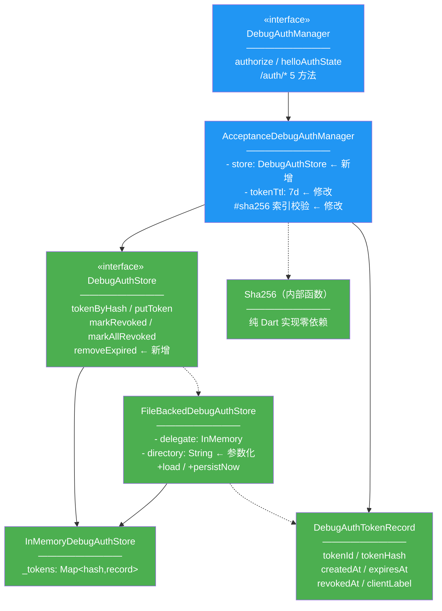
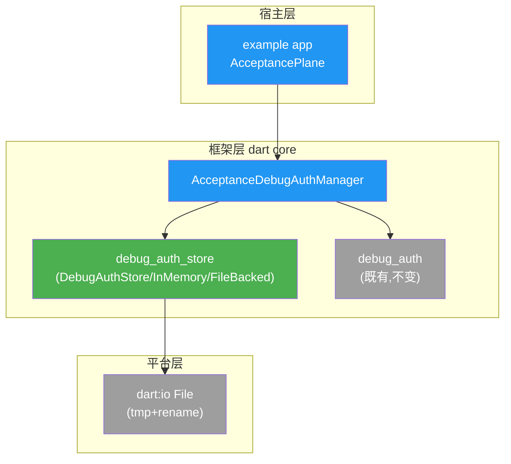
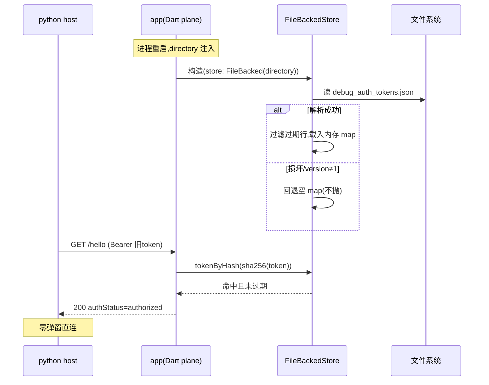
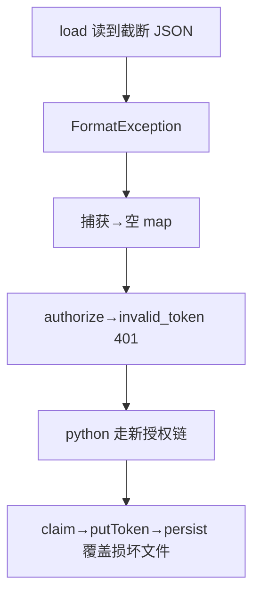

# dart plane token 持久化 — 设计报告（dart core + example 宿主）

> 关联分析：[dart-plane-token-persistence 分析](2026-09-01--dart-plane-token-persistence.md)
> 关联设计：[测试设计](2026-09-01--dart-plane-token-persistence-test.md)
> 同构参照：R004 Kotlin `FileBackedPluginDebugAuthStore`（已真机验证）

## 1. 目标

- BF001：dart core 提供 token 存储管理——`DebugAuthStore` 抽象 + `InMemoryDebugAuthStore` + `FileBackedDebugAuthStore` 装饰器（hash 落盘 / tmp+rename 原子写 / 损坏回退 / 过期清理）+ sha256 纯 Dart 实现。
- FF001：example `AcceptanceDebugAuthManager` 接受 store 注入；宿主（example 装配层）默认传文件持久化 store（documents 目录）；TTL 默认 15min → 7d（604800s，对齐 R004）。
- BF002：iOS 模拟器集成测试证明「app 冷重启后旧 token 200 authorized，零弹窗」。

效果对齐 Android 原生侧 R004 真机实测：授权弹窗只弹第一次。

## 2. 现状分析

**已有能力**：
- dart core `DebugAuthManager` 接口（`debug_auth.dart`）+ `NoOpDebugAuthManager`（不鉴权）；`DebugAuth` 静态工具（classifyRoute/bearerToken/各错误码）。**无任何存储实现**。
- example `AcceptanceDebugAuthManager`（`acceptance_plane.dart:83`）：内存 `_tokens` map（key=明文 token），TTL 15min；claim 生成 `tok_*`/`token_*` id；`/auth/*` 五方法完整。
- Kotlin 同构参照（`PluginDebugAuth.kt`）：`PluginDebugAuthStore` 接口（pending/token 双组，`tokenByHash` 索引）+ `InMemory` + `FileBacked`（filesDir 子目录 `debug_control_plane/debug_auth_tokens.json`，`{version:1, tokens:[...]}` schema，tmp+rename，损坏抛→回退空）。
- python 侧 `FileTokenProvider`（R004，0.5.0 已发布）持明文，与 app 侧 hash 配对。

**卡点**：
- dart core 缺 store 抽象与实现——授权门接口存在但 token 生命周期=进程生命周期。
- example 版 token map 以**明文做 key**且校验直接 `_tokens[token]` 命中——与「明文不落盘」红线不兼容，改造转为 hash 索引（sha256 后比对）。**明文持有的边界收敛**（评审 findings 1 修订）：`_activeToken` 明文字段与 `activeToken` 公开 getter 保留——它是 example UI 手动演示链（`simulateSensitiveRequest` 默认 Bearer、clear/expire 按钮）的便利 API；红线收敛为「**持久层与索引键无明文**」（文件只含 hash、map 键=hash），进程内存中的单个明文引用属 UI 演示必需（python 侧本就持同一明文，app 进程内不产生增量暴露）。
- dart core 无 sha256：flutter SDK 不带 `package:crypto`，pubspec 现仅依赖 flutter sdk（零新依赖红线）→ 纯 Dart 手写 SHA-256（~80 行标准算法 + 已知测试向量）。

**不需要改**：`control_plane.dart` / `http_codec.dart` / `http_sse_transport.dart` / Kotlin 全部 / python 全部 / PROTOCOL.md。

**基础设施就绪**：dart core 已 import `dart:io`（http_codec/http_sse_transport）；example pubspec 可加 `path_provider`（example 非 sdk 发布包，加依赖不受 dart core 零依赖红线约束）；dart/test 目录单测基建齐备。

## 3. 方案总览

### 项目结构（改造范围）

```
dart/
├── lib/
│   ├── debug_control_plane.dart        🔵 新增 export debug_auth_store.dart
│   └── src/
│       ├── debug_auth_store.dart       🟢 新增（BF001）：Store 抽象+TokenRecord+InMemory+FileBacked+sha256
│       └── （其余 8 文件 ⚪ 不变）
└── test/
    └── debug_auth_store_test.dart      🟢 新增（BF001 单测）
flutter_debug_control_plane/
└── example/
    ├── pubspec.yaml                    🔵 新增 path_provider 依赖
    ├── lib/src/acceptance_plane.dart   🔵 改造（FF001）：manager 注入 store + hash 索引 + TTL 7d
    └── test/acceptance_plane_test.dart 🔵 改造：既有用例适配 hash 校验
python/tests/
└── test_dart_plane_persistence.py      🟢 新增（BF002）：iOS 模拟器集成断言
.dev-flow/R005/test-overrides/          🟢 集成测试驱动脚本
```

### 类图（改造范围标色）



（pending 组不入 store：`/auth/request` 的 pending 状态是交互瞬间态，跨进程恢复无意义且拉长攻击面——Kotlin 版同设计。）

### 模块依赖图



图例：🟢/#4CAF50 新增，🔵/#2196F3 改造，⚪/#9E9E9E 不变；省略：transport/capability/控制面（不变，未触及）；阅读方式：上层调用下层，箭头=调用方向。

### 职责划分

| 模块 | 职责 | 编号 |
|---|---|---|
| `debug_auth_store.dart`（dart core） | token 记录的存取抽象、内存实现、文件持久化（原子写/损坏回退/过期清理）、sha256 | BF001 |
| `acceptance_plane.dart`（example） | 授权门行为（/auth/* 路由语义、pending 流转、审批回调）；token 校验改走 hash；TTL 默认 7d | FF001 |
| 集成测试（python + iOS 模拟器） | 证明冷重启免授权、损坏自愈、TTL 生效 | BF002 |

## 4. 数据模型与接口

### 数据模型

`DebugAuthTokenRecord`（BF001，Kotlin `DebugAuthTokenRecord` 同构）：

| 字段 | 类型 | 说明 |
|---|---|---|
| tokenId | String | `token_*` |
| tokenHash | String | sha256(token) hex（64 字符小写）——**明文永不出现** |
| createdAt / expiresAt | DateTime(UTC ISO8601) | TTL 7d 默认 |
| revokedAt | DateTime? | 吊销时间，null=有效 |
| clientLabel | String? | 审批来源标注 |

文件 schema（BF001 端内事实源，与 Kotlin 版同构、两端文件互不共享）：
`{ "version": 1, "tokens": [ {tokenId, tokenHash, createdAt, expiresAt, revokedAt|null, clientLabel|null} ] }`

### 接口契约

| 接口 | 签名 | 实现端编号 | 消费端编号 |
|---|---|---|---|
| DebugAuthStore | `TokenRecord? tokenByHash(String hash)` / `void putToken(TokenRecord)` / `void markRevoked(String tokenId, DateTime)` / `void markAllRevoked(DateTime)` / `void removeExpired(DateTime now)` | BF001 | FF001 |
| InMemoryDebugAuthStore | `DebugAuthStore` 的 map 实现 | BF001 | FF001 |
| FileBackedDebugAuthStore | `FileBackedDebugAuthStore({required String directory, DebugAuthStore? delegate})`；构造后惰性 load；写操作同步 persist | BF001 | FF001 |
| sha256 | `String sha256Hex(String input)`（库私有顶层函数，不导出） | BF001 | BF001 |
| AcceptanceDebugAuthManager | 构造参数 `+{DebugAuthStore? store, Duration tokenTtl = const Duration(days: 7)}`；store 缺省=内存版（dart core 不感知平台路径）；example 装配层（`AcceptancePlane` 构造）默认注入 `FileBackedDebugAuthStore(directory: documents 路径)` | FF001 | — |

wire 契约（`/auth/*`、`/hello` 响应体）：**零改动**（BF002 回归用例覆盖）。

## 5. 核心流程

### 正常流：app 冷重启 token 恢复



### 异常流：文件损坏自愈



### 写路径（claim/吊销后）

putToken/markRevoked/markAllRevoked → 更新 delegate 内存 map → `persist()`：序列化全部有效记录（含未过期未吊销）→ 写 `debug_auth_tokens.json.tmp` → `File.rename` 原子替换。同步执行（与 Kotlin 一致，消灭丢写窗口；Dart plane 单 isolate 语义下无并发写）。

## 6. 技术决策

| # | 决策 | 理由 | 备选否决原因 |
|---|---|---|---|
| D1 | store 用装饰器（FileBacked 包 InMemory） | 与 Kotlin 同构，行为心智一致；宿主可只换一行启用 | 平行实现（双份路由逻辑漂移风险） |
| D2 | sha256 纯 Dart 手写（库内私有） | 零新依赖红线；~80 行标准算法+测试向量可证 | package:crypto（破坏红线）；平台 channel（dart core 无 channel） |
| D3 | 红线收敛为「持久层与索引键无明文」：文件只含 sha256 hex、内存 map 键=hash；`_activeToken`/`activeToken` getter 保留明文（UI 演示链 `simulateSensitiveRequest`/clear/expire 按钮的便利 API） | 明文暴露面=进程内存单个引用，python 侧本持同一明文无增量暴露；公开 API 零破坏（controller/host/main 调用链不动） | 彻底去除明文（`activeToken` 改 tokenId 语义）——波及 controller/main 五处调用链，UI 演示功能受损，收益不成比例 |
| D4 | 存储目录构造参数化，默认 InMemory | dart core 不感知平台路径；path_provider 只进 example | core 默认找 documents（引路径依赖，破坏参数化） |
| D5 | TTL 默认 7d 提常量 `defaultTokenTtl = Duration(days:7)` | 对齐 R004 FF002（604800s）；覆盖一个开发周 | 保持 15min（自动化循环过短，R004 已论证） |
| D6 | pending 组不入持久化 | pending 是审批瞬间态；跨进程恢复无意义；Kotlin 同设计 | 持久化 pending（攻击面+复杂度无收益） |
| D7 | 同步 persist（非 async 队列） | 单 isolate 顺序一致；消灭丢写窗口 | 异步写（崩溃窗口丢 token） |

第三方依赖清单：dart core **+0**；example +`path_provider`（hosted，非发布包不受红线约束）。

## 7. 验收标准

| # | 条件 | 命令/操作 |
|---|---|---|
| A1 | store 单测全绿（roundtrip/损坏回退/过期清理/原子写红线：文件无明文/sha256 向量） | `cd dart && flutter test`（或 dart test） |
| A2 | 既有 example 测试零回归（hash 校验适配后全绿） | `cd flutter_debug_control_plane/example && flutter test` |
| A3 | iOS 模拟器：首次授权后杀进程重启，python 旧 token `/hello` 200 authorized | BF002 集成脚本（test-overrides） |
| A4 | iOS 模拟器：手工损坏 tokens 文件后重启，401→新授权链可达→claim 后文件修复 | BF002 集成脚本 |
| A5 | TTL 断言：claim 响应 expiresAt-now ∈ [604790,604810]s | BF002 集成脚本 |
| A6 | wire 回归：no-token 401 / forged 401 invalid_token / claim 无明文泄漏 | BF002 集成脚本（复用 R004 脚本 S4） |
| A7 | 红线检查：落盘文件 grep 无明文 token 串；dart pubspec 无新依赖 | 集成脚本 + `git diff dart/pubspec.yaml` |

## 8. 暂不实现

- plugin 的 `ios/` 原生 plane（Keychain 存储）——独立需求，本 RC 的 Dart plane 持久化已覆盖 iOS 场景价值。
- Web 平台 store（dart:io 不可用）——store 参数化后天然不支持，文档标注。
- 卸载清装场景（OS 抹沙箱=正确逃生门行为）。
- token 加密存储 / keychain / DataStore——红线（零新依赖+hash 已够）。
- pending 跨进程恢复——见 D6。
