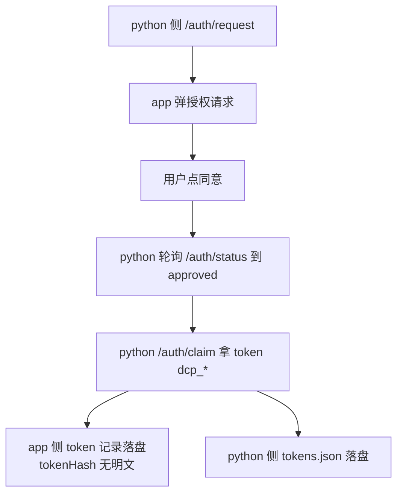
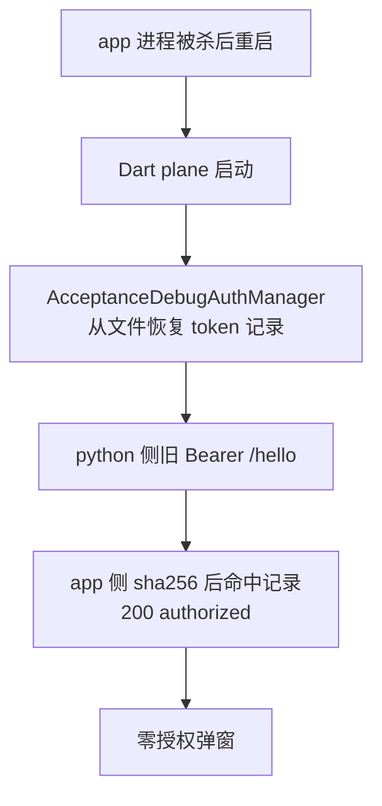

# dart plane token 持久化 — 功能分析

## 概述

R004 补齐了 Android plugin 侧（`FileBackedPluginDebugAuthStore`）与 Python 侧（`FileTokenProvider`）的 token 持久化；Dart plane 路径（iOS 模拟器 / 纯 Dart 宿主）上 app 侧 token 仍是进程内存态——app 冷重启后 token map 清空，python 侧旧 token 失配，重新触发授权弹窗。本 RC 给 dart core 包补上与 Kotlin 侧同构的 token 存储管理能力（内存 store + 文件持久化装饰器），example 验收 app 接入，使 Dart plane 宿主获得与 Android 原生 plane 一致的「弹窗只弹第一次」体验。

## 一、交互链

### 链 1：Dart plane 宿主首次授权（与现状一致，无变化）

作为自动化调试循环（python MCP host），我想在首次连接 Dart plane 时完成一次授权，以便后续请求免授权直连。

### 链 2：app 冷重启后免授权（本 RC 新增能力）

作为自动化调试循环，我想在 app 冷重启 / 覆盖安装后拿着旧 token 直连，以便循环不被授权弹窗打断。

## 二、逻辑树

### 事件流：app 冷重启 token 恢复

| 时刻 | 事件 | 处理 | 产生的新事件 |
|------|------|------|-------------|
| t0 | plane 启动 | `AcceptanceDebugAuthManager` 构造时注入 `FileBackedDebugAuthStore(directory)` | store 首次访问触发 load |
| t1 | store.load() | 读 JSON 文件；version≠1 或解析失败 → 回退空 map（不抛）；过期记录（expiresAt ≤ now）丢弃 | 内存 token map 就绪 |
| t2 | python Bearer /hello | token → sha256 hex → tokenHash 命中 + 未过期未吊销 | 200 authorized |
| t3 | claim 新 token | putToken 后同步 persist：tmp 写入 → rename 原子替换 | 文件更新 |
| t4 | markRevoked / markAllRevoked | 更新内存后 persist | 文件更新（revokedAt 落盘） |
| t5 | 文件损坏（截断/非法 JSON） | load 回退空 map；authorize 走 invalid_token → python 重走授权链 | 自愈：重新授权一次 |

### 状态流转

| 实体 | 触发事件 | 前状态 | 后状态 |
|------|---------|--------|--------|
| TokenRecord（文件行） | claim | 不存在 | {tokenId, tokenHash, createdAt, expiresAt, revokedAt:null} |
| TokenRecord | markRevoked | revokedAt:null | revokedAt:now |
| TokenRecord | load 时发现过期 | 任意 | 丢弃（不进内存、不回写） |
| 内存 tokens map | persist | 与文件不一致 | tmp+rename 后与文件一致 |

## 三、功能编号与网络定位

### 本次新增节点

| 编号 | 功能节点 | 前缀含义 | 简介 |
|------|---------|---------|------|
| BF001 | dart core token 存储管理（`InMemoryDebugAuthStore` + `FileBackedDebugAuthStore` 装饰器） | 后端基础（dart core 是平台基础包，存储属基础设施，按实现端归 BF） | 与 Kotlin `PluginDebugAuthStore` 同构的 store 抽象 + 内存实现 + 文件装饰器（原子写/损坏回退/过期清理）；含 sha256 工具（纯 Dart 手写，零新依赖） |
| FF001 | example `AcceptanceDebugAuthManager` 接入 store 注入 + TTL 7 天对齐 | 前端基础（Flutter example 宿主接线） | 构造函数接受可选 store；默认文件持久化（documents 目录，path_provider 只进 example）；TTL 默认 15min → 7d（604800s） |
| BF002 | dart plane 持久化集成测试（iOS 模拟器） | 后端基础（跨栈测试基础设施） | python 断言脚本 + pytest 用例：app 冷重启后旧 token 200；损坏文件回退；TTL 生效断言 |

五项原子检查：BF001（trigger=token 生命周期事件；responsibility=token 记录的存取与持久化；result=token 记录可跨进程恢复；acceptance=冷重启后旧 token 命中；independently_absent=移除后内存态仍可用，FF001 退回内存实现）✅。FF001/BF002 同理通过。

### UI 功能稳定标识预清单

无新增 UI 元素（复用 example 既有 `acceptance.auth_dialog.*` 等 R002 标识；本 RC 是行为增强非 UI 变更）。

### 前置依赖

| 依赖节点 | 依赖方式 | 是否已有 |
|---------|---------|---------|
| R004 `FileTokenProvider`（python 侧） | 运行时配对（python 持明文、app 持 hash） | ✅ 已发布 0.5.0 |
| `DebugAuthManager` 接口（dart core） | FF001 实现它 | ✅ 已有 |
| `AcceptanceDebugAuthManager`（example） | FF001 改造它 | ✅ 已有 |

### 边界接口

| 接口/协议 | 定义方 | 消费方 | 敏感度 |
|-----------|--------|--------|--------|
| `DebugAuthStore` 抽象（dart core 新增） | BF001 | FF001 / 未来任意 Dart plane 宿主 | 低（内部 API，0.x 可变） |
| 文件 schema `{version:1, tokens:[{tokenId,tokenHash,createdAt,expiresAt,revokedAt}]}` | BF001 | BF001 自身（各端文件独立，不跨端共享） | 中（明文永不出现；升级需版本号） |
| `/auth/*` wire 契约 | 既有（R001） | 不变 | 红线：零改动 |

## 四、结论

- 开发顺序：BF001（store + sha256 + 单测）→ FF001（example 接线 + TTL）→ BF002（iOS 模拟器集成测试）。
- 复杂度集中在：BF001 的原子写（tmp+rename 语义在 dart:io 与 Kotlin 的对齐）、sha256 纯 Dart 实现的正确性（需用已知向量验证）。
- 暂不实现：plugin 的 ios/ 原生 plane（独立需求）；Web 平台（dart:io 不可用，store 注入路径参数化后天然不支持，文档标注）；清装场景（OS 行为，天然回到首次授权）。
- 不需拆分：功能节点 3 个，远低于 15 阈值。
- architecture.md 变更点识别：无需变更（token Bearer 传递约束 L28 不变；持久化不新增架构层）。

### 范围分类记录（classify verdict）

single（隐式 1 slice）。信号：场景 2（首次授权/冷重启恢复）、模块 2（dart core + example）、状态实体 1（TokenRecord）、共享契约 1（DebugAuthManager）、无独立异常恢复链。owner 唯一：本 slice 拥有 SCN-DART-TOKEN-PERSIST、BF001/FF001/BF002。
