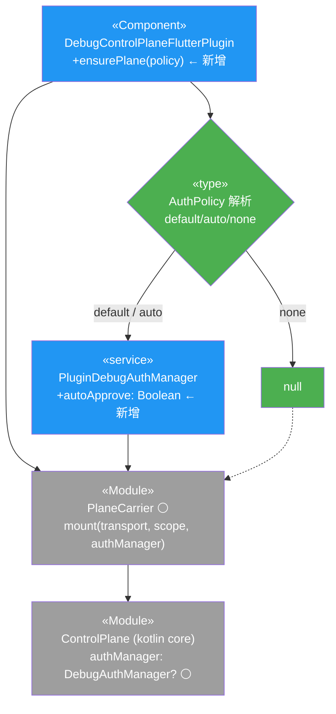
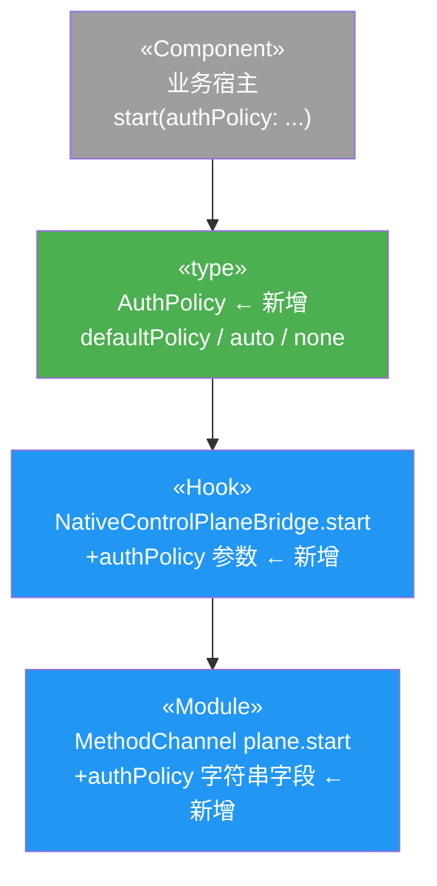
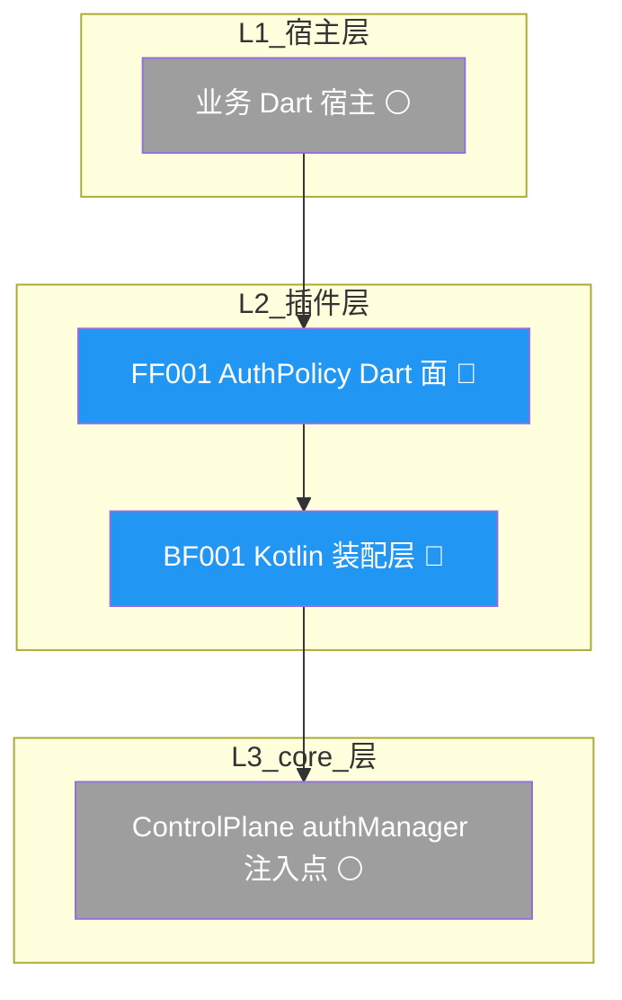
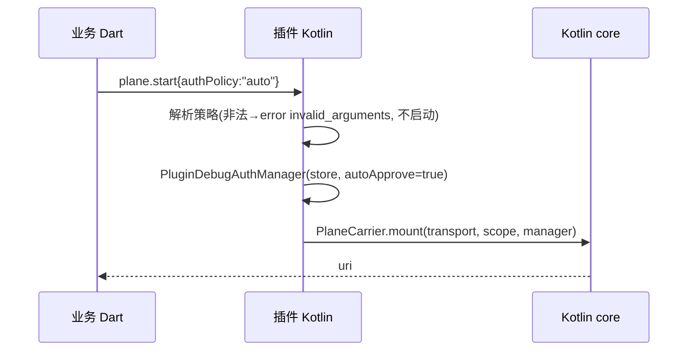
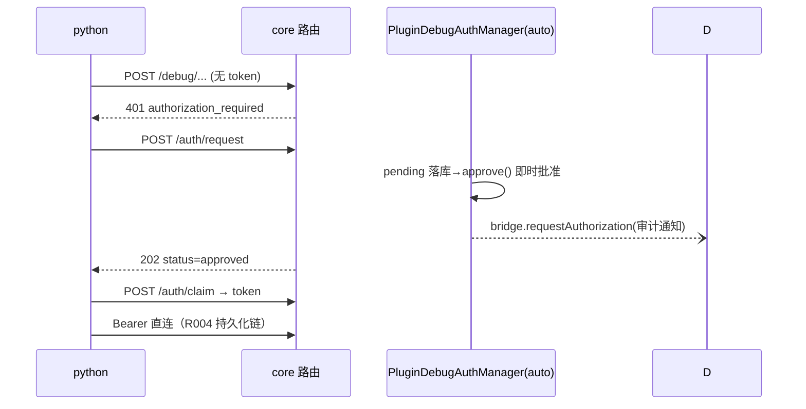

# Android 插件授权策略装配 API — 设计报告

> 关联设计：[R006 功能分析](2026-09-04--android-plugin-auth-policy.md) · [R006 测试设计](2026-09-04--android-plugin-auth-policy-test.md)
> 说明：本 RC 改造横跨插件 Kotlin 装配层与 Dart API 面两层，属同一模块（flutter_debug_control_plane）的两端接线，按纯配置类合并为单份 design（`-design.md` 后缀），第 3 节方案总览内分 Kotlin 侧与 Dart 侧两个子图。

## 1. 目标

- **BF001**：插件 Kotlin 装配层新增 `authPolicy` 通道——`plane.start` channel 参数 → `ensurePlane` 三策略装配 → core 既有 `authManager` 注入点。
- **FF001**：Dart API 面新增 `AuthPolicy` 类型 + `start()` 透传参数 + 接入文档——「授权策略」从不可见实现细节变为显式装配声明。
- **BF002**：三策略装配的跨栈验证（JVM 单测 + 真机 e2e auto 直连）。
- 体验一致性目标（用户明确要求）：`authPolicy` 生效后，Android 插件宿主与纯 Dart 宿主**行为完全同构**——同策略同表现，不存在「同一个 SDK 业务表现不同」。

## 2. 现状分析

**已有能力（全部复用，零改动）**：
- Kotlin core `ControlPlane.kt:455` `authManager ?: return null`——null 即全放行，`/hello` 无 `authRequired`（与 Dart core `control_plane.dart:370` 同语义镜像）。
- `PlaneCarrier.mount(transport, scope, authManager = null)`（NativeControlPlaneBridge.kt:326）——注入点已存在，只是被插件调用方焊死为恒非 null。
- `PluginDebugAuthManager`（R004）：授权链完整（pending/approve/claim/token 持久化/TTL），`approve(requestId, ttl, label)` 签发逻辑独立可复用。
- python 端 401→request→poll→claim 链（bridge_client.py:460/:488/:676 错误码识别）。

**卡点（本 RC 解开）**：
- `DebugControlPlaneFlutterPlugin.kt:113` `onAttachedToEngine` 无条件 `authManager = PluginDebugAuthManager(...)`——宿主无声明策略的通道。
- `ensurePlane()`（:375，内 :393 调用 `PlaneCarrier.mount`）恒传 authManager 挂载。
- Dart `start()` 参数表只有 address/port/appMeta。

**不需要改的文件**：`/auth/*` wire（PROTOCOL.md 冻结）、kotlin core 全部、dart core 全部、python 全部、example 既有授权 UI 链（default 策略原样）。

## 3. 方案总览

### 3.1 项目结构（改造范围）

```
flutter_debug_control_plane/
├── lib/
│   ├── src/
│   │   ├── auth_policy.dart                    🟢 新增（FF001：AuthPolicy enum + 序列化）
│   │   ├── channel_protocol.dart               🔵 改造（+kAuthPolicy* 常量）
│   │   ├── native_control_plane_bridge.dart    🔵 改造（start() +authPolicy 参数透传）
│   │   └── flutter_debug_control_plane.dart    🔵 改造（export auth_policy）
├── android/src/main/kotlin/.../flutter/
│   ├── ChannelProtocol.kt                      🔵 改造（+AUTH_POLICY 常量 + 合法值集）
│   ├── PluginDebugAuth.kt                      🔵 改造（PluginDebugAuthManager +autoApprove）
│   └── DebugControlPlaneFlutterPlugin.kt       🔵 改造（ensurePlane 按 policy 装配 + fail-fast）
├── android/src/test/kotlin/.../                🟢 新增（BF002 JVM：三策略装配测试）
├── test/                                       🟢 新增（FF001 Dart：参数序列化测试）
├── example/integration_test/                   🟢 新增（BF002 e2e：auto 策略直连）
└── README.md / GETTING_STARTED.md              🔵 改造（FF001 接入文档）
```

### 3.2 Kotlin 装配侧类图



### 3.3 Dart API 面类图



### 3.4 模块依赖图



图例：🟢/`#4CAF50` 新增 · 🔵/`#2196F3` 改造 · ⚪/`#9E9E9E` 不变 · 🔴/`#F44336` 删除（无删除项）。utils/配置/入口文件省略。

### 3.5 职责划分

| 组件 | 职责 | 不负责 |
|---|---|---|
| FF001 Dart 面 | 类型定义、参数透传、非法值 Dart 侧拦截、文档 | 授权逻辑（零判定） |
| BF001 Kotlin 装配层 | 策略解析、authManager 装配、autoApprove 标志、fail-fast | 审批细节（复用 approve()） |
| core（既有） | null 放行 / 非 null 拦截判定 | — |

## 4. 数据模型与接口

### 4.1 AuthPolicy 类型（FF001）

| 值 | 语义 | 装配结果 |
|---|---|---|
| `defaultPolicy`（缺省） | 授权门 + 宿主 UI 审批（=现状） | `PluginDebugAuthManager(store)` |
| `auto` | 授权门 + 插件自动审批 | `PluginDebugAuthManager(store, autoApprove=true)` |
| `none` | 无授权门，全放行 | `null` |

channel 序列化：小写字符串 `"default" / "auto" / "none"`；参数**可选**，缺席 = `"default"`（向后兼容）。

### 4.2 接口契约

| 接口 | 变更 | 实现端功能编号 | 消费端 |
|---|---|---|---|
| Dart `NativeControlPlaneBridge.start({address, port, appMeta, authPolicy})` | +可选参数 | FF001 | 业务宿主 |
| MethodChannel `plane.start` 参数表 | +可选 `authPolicy: String` | BF001（Kotlin 侧）/ FF001（Dart 侧序列化） | 插件两端 |
| Kotlin `ensurePlane(scope, port, appMeta, authPolicy)` | +参数，按策略装配 | BF001 | plugin 内部 |
| `PluginDebugAuthManager(bridge, store, ..., autoApprove: Boolean = false)` | +构造参数 | BF001 | ensurePlane |
| `/auth/*` wire | **零改动（冻结）** | — | — |
| `/hello` wire | **零改动**（none 下 `authRequired` 缺席是 core 既有语义） | — | — |

### 4.3 autoApprove 行为规约（BF001）

`autoApprove=true` 时 `requestAuthorization()` 在 pending 落库后、返回 202 前，直接调用既有 `approve(requestId, ttl=null, clientLabel)` 路径——status 即 `approved`，python poll 首轮即命中；宿主 UI 通道（`bridge.requestAuthorization`）**仍然发出**（审计可见，宿主可选忽略）。不新签发逻辑、不改 pending 生命周期（TTL/expired 判定原样）。

## 5. 核心流程

### 5.1 装配流程（正常）



### 5.2 auto 策略授权链（python 视角）



异常路径：`authPolicy` 非法字符串 → Dart 侧 `ArgumentError` 拦截（枚举不可构造非法值）+ Kotlin 侧 `invalid_arguments` fail-fast（防御 channel 直调）双保险；plane 不启动，不静默回退。

## 6. 技术决策

| # | 决策 | 理由 |
|---|---|---|
| D1 | 三值 enum 而非 bool `enableAuth` | `auto`（要 token 生命周期+免 UI）是真实场景，bool 压扁语义 |
| D2 | auto 的审批在 Kotlin 侧（autoApprove 构造标志） | Dart 侧轮询批要求业务写代码违背零配置；审批逻辑不分裂两层 |
| D3 | 不做 dev-only 门禁（BuildConfig.DEBUG） | debug 包可连生产环境，门禁不可靠；`auto` 显式声明本身就是审计点（吸收 review W2：brainstorm 待确认项「dev-only 是否接受」→ 决策为不接受，显式声明取代） |
| D4 | 审计通知仍发（autoApprove 下 UI 通道不静默） | 宿主可观测自动化授权事件；成本为零（既有 bridge 调用） |
| D5 | 非法值 fail-fast 双保险（Dart ArgumentError + Kotlin invalid_arguments） | 防「以为关了其实开着」；channel 是公共协议面，不能只信一端 |
| D6 | python 编排归属：BF002 e2e 脚手架承担 401→request→poll→claim 编排，不动 mcp_plane 库 | 库层加自动编排是独立能力（超出本 RC），example driver 先例已证明脚手架模式可行（吸收 review W1） |
| D7 | `defaultPolicy` 命名避 `default`（Dart 保留字） | channel 字符串层仍用 `"default"`，两层映射显式声明 |

第三方依赖：零新增。

### 宪法修订（architecture_md_updates: true）

`.dev-flow/architecture.md`「鉴权设计约束」节补一条分层表述：

> - 授权门分层：core 强制提供授权门与路由拦截（不变量）；装配策略（default/auto/none）是宿主经插件 API 显式声明的安全决策权，缺省 secured（default）。

原句「敏感调试能力必须统一经过授权门」保留（core 不变量成立）；本条澄清策略选择层归属宿主。

## 7. 验收标准

| # | 条件 | 验证 |
|---|---|---|
| AC1 | 不传 authPolicy 的既有宿主行为与 0.5.1 逐字节一致（default） | JVM + 既有 plugin 测试全绿零回归 |
| AC2 | `none` 装配后 `authManager=null`：无 token 请求敏感路由 200，`/hello` 无 `authRequired` | JVM 单测 |
| AC3 | `auto` 装配后 `/auth/request` 响应即 `status=approved`，claim 得 token，Bearer 直连 200 | JVM 单测 + 真机 e2e |
| AC4 | 非法策略值：Dart `ArgumentError` / Kotlin `invalid_arguments` 且 plane 未启动 | JVM 单测 + Dart 单测 |
| AC5 | 两宿主一致性：`none` 下插件宿主与纯 Dart 宿主（不传 authManager）`/hello` 响应形态一致（authRequired 均缺席） | e2e 断言 |
| AC6 | `/auth/*`、`/hello` wire 字节零改动 | 协议 fixtures 对照测试（既有） |
| AC7 | python 侧零代码改动下 auto 策略 e2e 走通 | 真机 e2e（BF002，W1 编排归属脚手架） |

## 8. 暂不实现

- python mcp_plane 库内置 401 自动编排（独立能力，本 RC e2e 脚手架承担；若业务高频需要再立 RC）。
- `authPolicy` 运行时动态切换（start 后不可变；重声明需 plane.stop→start——既有生命周期复用，不新增 API）。
- 纯 Dart 宿主的 `AuthPolicy` 类型导出（dart core 已有 `authManager` 注入面，无需对齐包装）。
- iOS 专属处理（无原生面，天然走纯 Dart 路径）。
