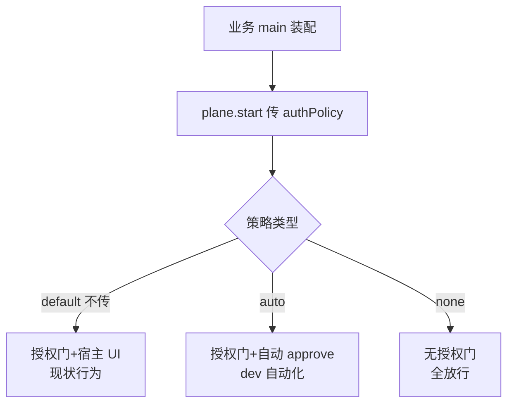
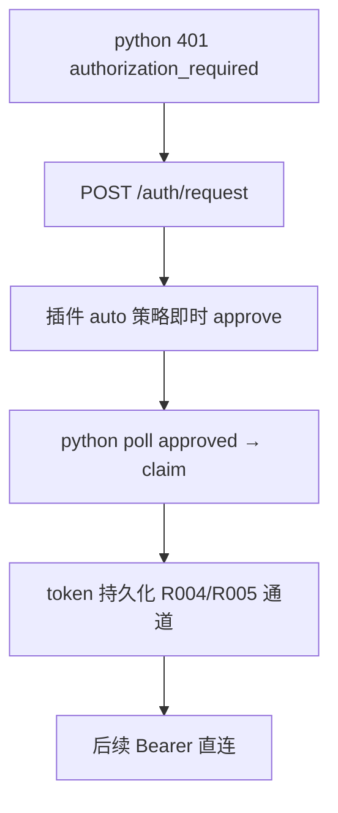

# Android 插件授权策略装配 API — 功能分析

## 概述

业务宿主「不配置授权弹窗」时期望行为可预期，实际发现 Android 插件宿主与纯 Dart 宿主授权行为不一致。经架构勘察，问题本质**不是「缺少开关」，而是插件装配 API 面缺失授权策略维度**：core 层（Kotlin/Dart）的 `authManager` 是可选注入、null 语义明确；插件层把授权决策硬编码为实现细节（`onAttachedToEngine` 无条件挂 `PluginDebugAuthManager`），宿主在 `plane.start(address, port, appMeta)` 的 API 面上没有声明安全策略的通道。本 RC 为插件装配 API 补上显式的 `authPolicy` 维度，类型化、默认安全、不传=现状（向后兼容）。

## 一、交互链

### 链 1：业务宿主声明授权策略（本 RC 新增能力）

作为业务 App 开发者，我想在启动 debug plane 时显式声明授权策略，以便不写授权 UI 也能获得可预期的接入行为（自动化调试循环直连可用）。

### 链 2：python 自动化循环直连（auto 策略下的目标体验）

作为 python MCP 自动化循环，我想在宿主声明 auto 策略后首次连接自动完成授权链，以便后续请求免授权直连。

## 二、逻辑树

### 事件流：plane.start 装配（策略生效点）

| 时刻 | 事件 | 处理 | 产生的新事件 |
|------|------|------|-------------|
| t0 | Dart `plane.start({authPolicy})` | MethodChannel 透传 policy 参数到 Kotlin | channel call |
| t1 | Kotlin `ensurePlane` | 按 policy 解析为 `authManager` 装配：default/auto → `PluginDebugAuthManager`（auto 带自动 approve 前置）；none → null | plane mount |
| t2 | `PlaneCarrier.mount(transport, scope, authManager)` | authManager=null 时 core 走无门路径（`control_plane` null 放行，既有语义） | /hello authRequired 缺席 |
| t3 | python 401 → /auth/request（auto 策略） | PluginDebugAuthManager 自动 approve pending | status=approved |
| t4 | python claim | 既有 token 签发+持久化链（R004/R005）零改动 | Bearer 直连 |

### 状态流转

| 实体 | 触发事件 | 前状态 | 后状态 |
|------|---------|--------|--------|
| 装配态 authPolicy | plane.start | 未声明 | default / auto / none（一经 start 不可变，restart 可重声明） |
| pending 授权请求 | auto 策略 + request | pending | approved（无宿主 UI 参与） |
| /hello authState | none 策略 mount | authRequired: true | 字段缺席（core 无门语义） |

异常流：策略值非法（channel 层未知字符串）→ start 返回 `invalid_arguments` error，plane 不启动（fail-fast，不静默回退 default——静默回退会制造「以为关了其实开着」的假象）。

## 三、功能编号与网络定位

### 本次新增节点

| 编号 | 功能节点 | 前缀含义 | 简介 |
|------|---------|---------|------|
| BF001 | 插件 Kotlin 装配层 authPolicy 通道 | 后端基础（channel 协议+装配逻辑属插件基础设施） | ChannelProtocol 常量 + `ensurePlane` 按策略装配 authManager（default=现状/auto=自动 approve/none=null 挂载）+ 非法值 fail-fast |
| FF001 | Dart 侧 plane.start authPolicy 参数 | 前端基础（Dart API 面/类型定义） | `AuthPolicy` 类型（默认 default）+ bridge 透传 + README/GETTING_STARTED 接入文档 |
| BF002 | authPolicy 装配跨栈测试 | 后端基础（测试基础设施） | JVM 单测（三策略装配+非法值）+ 真机/模拟器 e2e（auto 策略 python 直连） |

五项原子：BF001（trigger=plane.start 装配；responsibility=策略解析与 authManager 装配；result=类型化策略生效的 plane；acceptance=三策略行为可观察；independently_absent=移除后 default 行为仍可用）✅。FF001/BF002 同理通过。

### UI 功能稳定标识预清单

无新增 UI 元素（auto/none 均无 UI 面；default 复用宿主既有授权 UI 通道）。

### 前置依赖

| 依赖节点 | 依赖方式 | 是否已有 |
|---------|---------|---------|
| core 可选 authManager（Kotlin `PlaneCarrier.mount` authManager 参数 / Dart `ControlPlane.authManager`） | 装配点透传 | ✅ 已有（本分析勘察确认） |
| PluginDebugAuthManager（R004 持久化） | default/auto 复用 | ✅ 已有 |
| python 401→request→claim 自动链 | auto 策略消费方 | ✅ 已有（bridge_client.py:676） |

### 边界接口

| 接口/协议 | 定义方 | 消费方 | 敏感度 |
|-----------|--------|--------|--------|
| MethodChannel `plane.start` 参数表（+authPolicy） | 插件 channel 协议（PROTOCOL.md 之外的内层协议） | Dart bridge ↔ Kotlin plugin | 中（向后兼容：参数可选） |
| `/auth/*` wire 协议 | PROTOCOL.md | python/app | **冻结（零改动）** |
| `/hello` authState | PROTOCOL.md | python | 低（none 策略下字段缺席是 core 既有语义） |

## 四、结论

- **问题重定义**（吸收 2026-09-04 讨论洞察）：不一致的本质是插件装配 API 面缺失授权策略维度——授权是装配时决策（assembly-time decision），不是插件实现细节。core 的 Strategy 注入设计是对的，插件层应把该维度透传给宿主，而非吞掉。
- **宪法校准建议**（design 阶段标注 `architecture_md_updates: true`）：「敏感调试能力必须统一经过授权门」建议分层表述——core 强制提供门与路由拦截（不变量，已满足）；装配策略（default/auto/none）是宿主显式声明的安全决策权，默认 secured。此表述下 `none` 不违宪（core 能力未削弱，策略显式可审计）。
- 开发顺序：BF001（Kotlin 装配层）→ FF001（Dart API 面+文档）→ BF002（跨栈测试）。
- 复杂度集中：BF001 的 auto 策略实现点（PluginDebugAuthManager 自动 approve 前置的落点与单测隔离）。
- 暂不实现：python 侧改动（零需要——401 链已就绪）；iOS/纯 Dart 宿主（API 已明确，无需改动）。
- 需求拆分：不需要（3 功能节点，远低于 15 阈值）。
