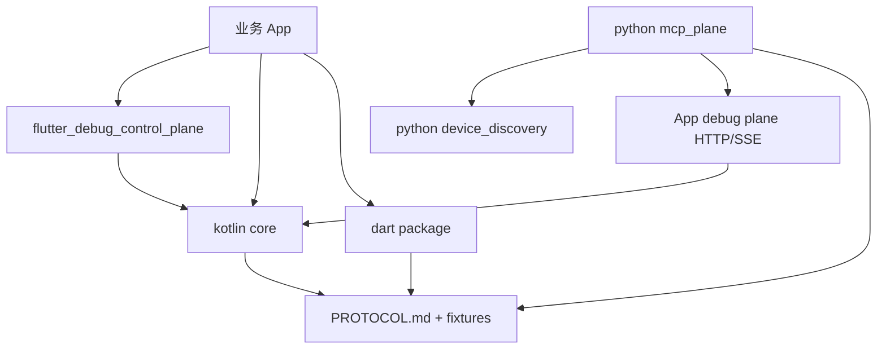

# 功能地图

## 模块依赖图

## 能力关系

- `ControlPlane`：注册 capability、聚合 state、派发 resource/command、广播 event；scope-aware registry 聚合 app/page 双 scope。
- `Transport`：承载 HTTP/SSE wire contract，屏蔽上层路由逻辑。
- `Capability`：业务侧实现的调试能力声明与处理入口，含 scope/pageId/scopeRevision 元数据。
- `ScopedCapabilityKey`：Kotlin `BridgeCapabilityIdentity` = Dart `_ScopedCapabilityKey` = Python 同构 key，page 级注册互不冲突。
- `SelectorDispatch`：`X-DCP-Capability-*` selector 头转发；page capability gone 后 410 `page_capability_gone` + refresh 提示。
- `BridgeClient`：Python 端 device_id 到 App debug plane HTTP 请求转发。
- `CapabilityMirror`：把 `/hello.registeredCapabilities` 映射成 MCP tool manifest，镜像 scope 元数据并刷新 stale page tool。
- `McpServer`：把 Python adapter 暴露为 MCP stdio server。

## 已归档能力

- R001：App debug plane 授权门，Python BridgeClient token 透传和授权错误处理。
- R002：Flutter 真实宿主验收 App、App 侧授权弹窗/请求日志、Python acceptance runner、Android native bridge 真机验收路径。
- `0.3.0`：Kotlin/Dart/Flutter/Python 四端对齐发布，协议版本仍为 `protocolVersion=1`。
- R003：app/page 双 scope capability 模型、三方同构 scoped key、scoped selector dispatch（gone→410+refresh）、Page Scope Demo 验收页、ci-check-all `[9]` 跨语言守卫、Android 真机三阶段验收（含 410 gone 直证）。
