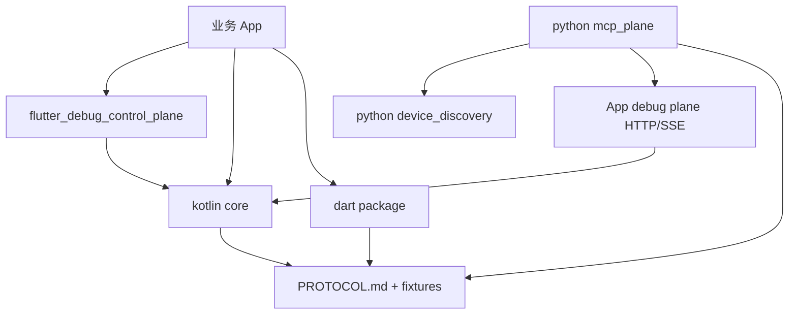

# 功能地图

## 模块依赖图

## 能力关系

- `ControlPlane`：注册 capability、聚合 state、派发 resource/command、广播 event。
- `Transport`：承载 HTTP/SSE wire contract，屏蔽上层路由逻辑。
- `Capability`：业务侧实现的调试能力声明与处理入口。
- `BridgeClient`：Python 端 device_id 到 App debug plane HTTP 请求转发。
- `CapabilityMirror`：把 `/hello.registeredCapabilities` 映射成 MCP tool manifest。
- `McpServer`：把 Python adapter 暴露为 MCP stdio server。

## 当前需求关注

- App debug plane 授权门。
- Python BridgeClient token 透传和授权错误处理。
- Kotlin/Dart/Flutter/Python 协议字段和错误码一致性。

