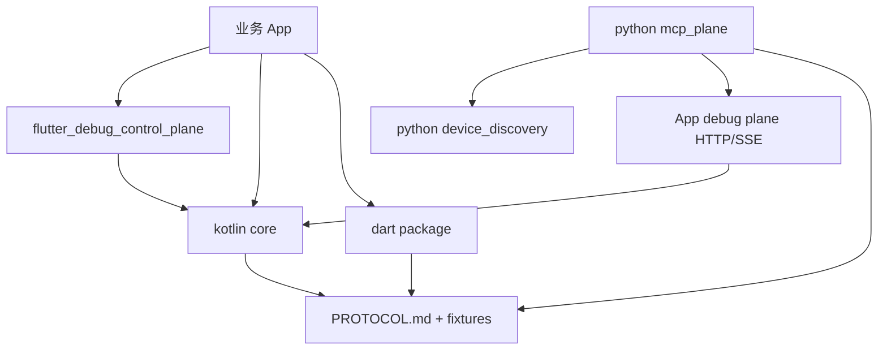

# 功能地图

## 模块依赖图

## 能力关系

- `ControlPlane`：注册 capability、聚合 state、派发 resource/command、广播 event；scope-aware registry 聚合 app/page 双 scope。
- `Transport`：承载 HTTP/SSE wire contract，屏蔽上层路由逻辑。
- `Capability`：业务侧实现的调试能力声明与处理入口，含 scope/pageId/scopeRevision 元数据。
- `ScopedCapabilityKey`：Kotlin `BridgeCapabilityIdentity` = Dart `_ScopedCapabilityKey` = Python 同构 key，page 级注册互不冲突。
- `SelectorDispatch`：`X-DCP-Capability-*` selector 头转发；page capability gone 后 410 `page_capability_gone` + refresh 提示。
- `BridgeClient`：Python 端 device_id 到 App debug plane HTTP 请求转发。
- `CapabilityMirror`：把 `/hello.registeredCapabilities` 映射成 MCP tool manifest，镜像 scope 元数据并刷新 stale page tool。
- `McpServer`：把 Python adapter 暴露为 MCP stdio server。
- `FileBackedPluginDebugAuthStore`：app 侧 token 持久化装饰器（hash 记录落 filesDir，原子写/损坏回退/过期清理；明文永不落盘），attach 惰性升级 InMemory。
- `FileTokenProvider`：python 侧 token 持久化（~/.debug-control-plane/tokens.json 0600，claim 落盘 / Bearer 复用 / 401 三码联动清行）。
- `TokenTtl`：默认 7 天（DEFAULT_TOKEN_TTL_SECONDS=604800，显式 ttlSeconds 覆盖通道不变）。
- `DebugAuthStore`：dart core token 存储抽象（恰 5 方法）+ InMemory（map 键=tokenHash）+ FileBacked 装饰器（惰性 load/损坏回退/过期丢弃/tmp+rename 原子写），sha256 纯 Dart FIPS 180-4 手写，与 Kotlin PluginDebugAuthStore 同构。
- `ExamplePersistMount`：example AcceptanceDebugAuthManager store 注入（缺省 InMemory，main() 装配层挂 FileBacked documents 目录）+ 校验 hash 索引化 + TTL 7d 对齐；widget 测试零影响（挂载点在装配层非 startDartPlane）。
- `AuthPolicyAssembly`：插件装配授权策略三值通道（BF001+FF001）——`plane.start` 可选 `authPolicy`（default=现状/auto=落库即 approve+审计通知/none=mount null 走 core 放行，与纯 Dart 宿主同构）；非法值双端 fail-fast（Dart ArgumentError / Kotlin invalid_arguments，plane 不启动）；策略 start 后不可变（JOIN 不重建）。
- `AuthPolicyE2eScaffold`：R006 真机 e2e 脚手架（BF002）——fork R004 驱动 + `R006_AUTH_POLICY` 编译常量独立 driver + 纯 urllib E1-E6 断言；真机不在场 deferred 双写 device_required，设备在场重跑同一命令回收。

## 已归档能力

- R001：App debug plane 授权门，Python BridgeClient token 透传和授权错误处理。
- R002：Flutter 真实宿主验收 App、App 侧授权弹窗/请求日志、Python acceptance runner、Android native bridge 真机验收路径。
- `0.3.0`：Kotlin/Dart/Flutter/Python 四端对齐发布，协议版本仍为 `protocolVersion=1`。
- R003：app/page 双 scope capability 模型、三方同构 scoped key、scoped selector dispatch（gone→410+refresh）、Page Scope Demo 验收页、ci-check-all `[9]` 跨语言守卫、Android 真机三阶段验收（含 410 gone 直证）。
- R004：token 跨进程持久化（app FileBacked store + python FileTokenProvider 0600）、TTL 默认 7 天、install -r 验收脚本（uninstall 仅逃生门）；授权弹窗只弹首次。
- R005：Dart plane 持久化补齐（dart core DebugAuthStore 三件套 + sha256 手写 + example 接线 + main() 装配层挂载）、iOS 模拟器 I1-I5 集成验证（冷重启旧 token 200 零弹窗）；Kotlin/Dart 两端 store 同构但文件相互独立。
- R006：插件装配授权策略维度（授权=装配时决策非实现细节）——authPolicy 三值装配 API（default/auto/none）+ 宪法授权门分层修订（core 门不变量 / 宿主策略决策权缺省 secured）；两宿主行为完全同构（none 下 /hello 均无 authRequired）。
